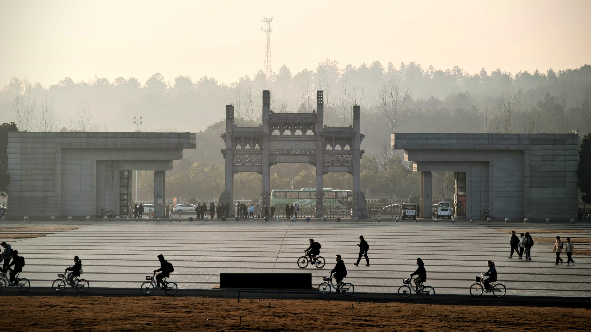

# 活在肥宣

Survive-HFUT
你的薰化路 301 号指南

## 版权信息

[![CC BY-SA 4.0][cc-by-sa-shield]][cc-by-sa]

This work is licensed under a [Creative Commons Attribution-ShareAlike 4.0
International License][cc-by-sa].

[![CC BY-SA 4.0][cc-by-sa-image]][cc-by-sa]

[cc-by-sa]: http://creativecommons.org/licenses/by-sa/4.0/
[cc-by-sa-image]: https://licensebuttons.net/l/by-sa/4.0/88x31.png
[cc-by-sa-shield]: https://img.shields.io/badge/License-CC%20BY--SA%204.0-lightgrey.svg

未做特别声明的内容，均按照[CC-BY-SA 4.0](https://creativecommons.org/licenses/by-sa/4.0/deed.zh)协议进行分发。

::: warning 注意事项
CC-BY-SA协议允许您自由地共享（在任何媒介以任何形式复制、发行本作品），演绎（修改、转换或以本作品为基础进行创作，在任何用途下，甚至商业目的）。

但惟须遵守以下条件：

1. **署名** — 您必须给出[适当的署名](https://creativecommons.org/licenses/by-sa/4.0/deed.zh#)，提供指向本许可协议的链接，同时[标明是否（对原始作品）作了修改](https://creativecommons.org/licenses/by-sa/4.0/deed.zh#)。您可以用任何合理的方式来署名，但是不得以任何方式暗示许可人为您或您的使用背书。
2. **相同方式共享** — 如果您再混合、转换或者基于本作品进行创作，您必须基于[与原先许可协议相同的许可协议](https://creativecommons.org/licenses/by-sa/4.0/deed.zh#) 分发您贡献的作品。
3. **没有附加限制** — 您不得适用法律术语或者 [技术措施](https://creativecommons.org/licenses/by-sa/4.0/deed.zh#) 从而限制其他人做许可协议允许的事情。

:::

做出特别声明的内容，版权按声明执行。