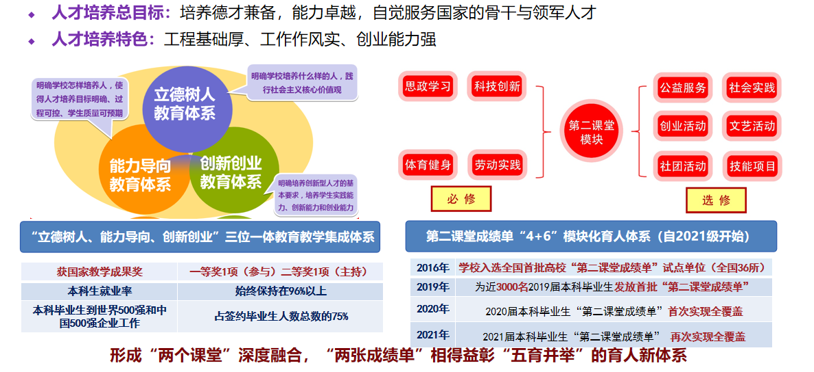
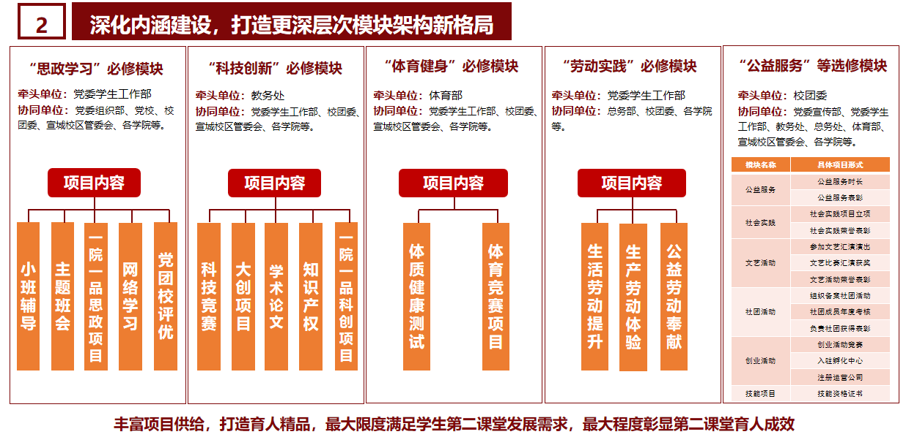
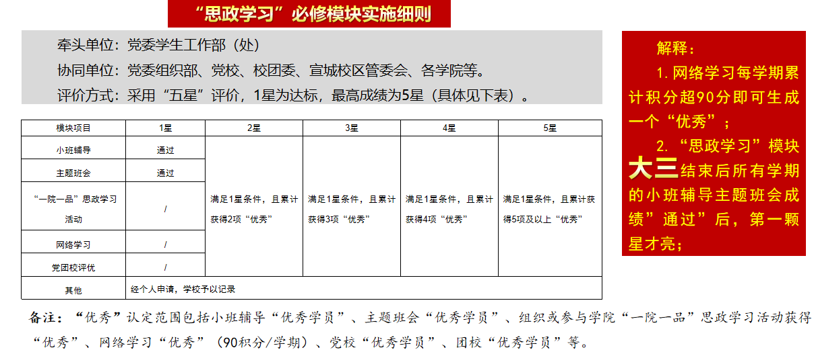
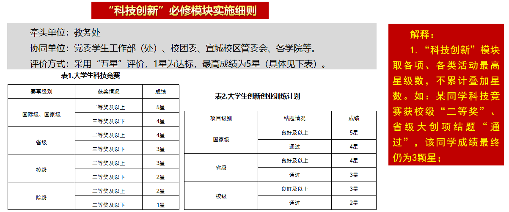
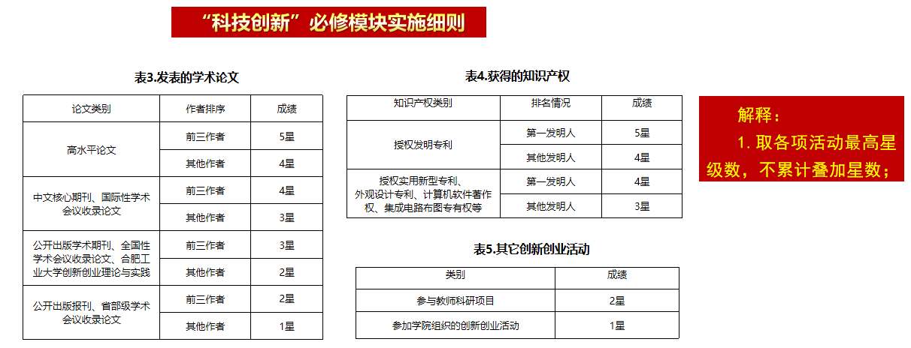
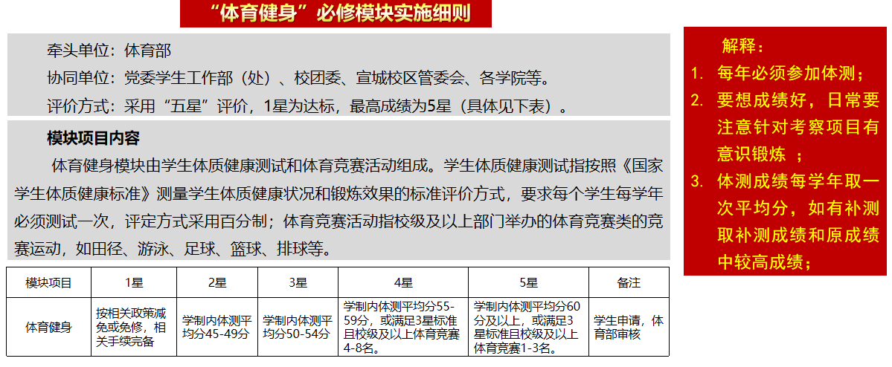
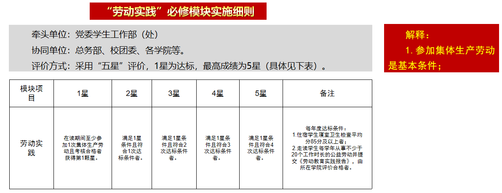
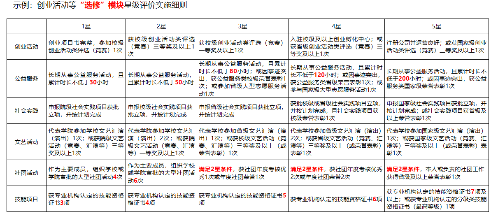
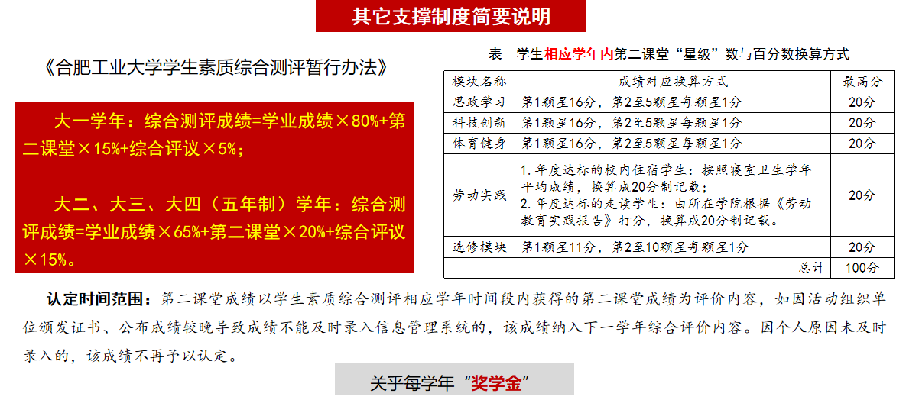
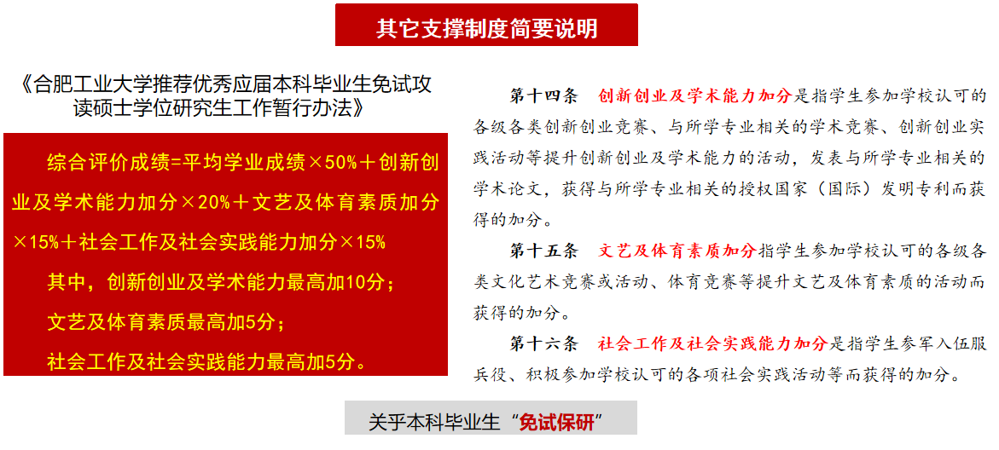

# 第二课堂

“第二课堂成绩单”系统，是学校为促进学生全面发展而构建的一套与第一课堂同等重要的育人体系。该体系自 2012 年启动探索，实现了从活动发布、过程审核到成绩认证、数据统计的全流程信息化管理。系统核心是“4+6”模块化育人体系，包含“思政学习”、“科技创新”、“体育健身”、“劳动实践”四个必修模块，以及“创业活动”、“公益服务”、“社会实践”、“文艺活动”、“社团活动”、“技能项目”六个选修模块，各模块成绩采用“星级制”记录。作为学生毕业的硬性指标，第二课堂成绩必须达标方可毕业，并放入个人档案，同时也是综合素质测评、评奖评优、推优入党及研究生推免的重要参考 [^1][^2]

## 要求

成绩可通过微信小程序的"第二课堂成绩单"查看。

毕业要求必修模块每个至少一星，选修至少有一个一星

暑期[三下乡](./sanxiaxiang.md)等社会实践通过结项验收后，通常也会涉及第二课堂成绩单认定，具体以当年通知和所在系要求为准。

:::tip
这个非常容易达到，学校有非常多的简单活动让你拿星星，所以根本不用愁
:::

## 介绍

:::details 多图

:::

[^1]:
    高校思政网.网络教育优秀作品推选 | 合肥工业大学：以学生全面发展为导向的高校“第二课堂成绩单”建设探索与实践[EB/OL]. (2025-03-11)\[2025-08-21].  
    <https://mp.weixin.qq.com/s/FxtA_ghHOtRDWnsC4sp0qA>.

[^2]:
    合肥工业大学.第二课堂教育研究与实践[EB/OL]. (2021-09)\[2026-08-20].  
    <https://dektjy.hfut.edu.cn/_upload/article/files/03/a2/d512126c4f5abca14aa2e5b18098/41c28421-f228-4437-a547-be57ccf49ff7.pdf#12#6>.
