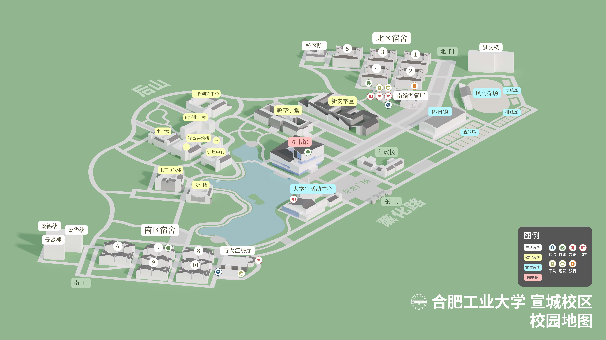

# 🦢 校园

## 校园地图

自动售货机地图见[自动售货机地图](../life/README.md#自动售货机)

## 主要建筑

### 图书馆

宣城校区的唯一一个图书馆，有阅览座位 3300 余席、休闲座位 360 席、电子阅览室座位 144 席、研讨间 20 个。

#### 开放时间

| 功能       | 时间段       |
| ---------- | ------------ |
| 图书馆开放 | 7:30 - 22:15 |
| 图刊借阅   | 8:00 - 22:00 |
| 电子阅览室 | 8:00 - 22:00 |
| 研讨间     | 8:10 - 22:00 |
| 报刊阅览   | 8:00 - 22:00 |

#### 楼层

校史馆在第十层。

#### 网站

- [总馆网站](https://lib.hfut.edu.cn)
- [宣城校区图书馆网站](https://xclib.hfut.edu.cn)

#### 照片

### 敬亭学堂

原来的第一教学楼，一共有五层。

新生们的晚自习教室应该就在这栋楼。

#### 照片

### 新安学堂

原来的第二教学楼，一共有五层。

内部布局错综复杂，不少同学反映容易迷路（

#### 照片

### 大学生活动中心

一般大型的讲座宣传，文艺汇演等都在这里举办。

校园电影院也在这儿，就是大报告厅。

据传校园书店正在建设中。

#### 照片

### 体育馆

体育馆一共三层，虽然不大，但也提供了不少设施。

#### 楼层

| 楼层 | 设施                       |
| ---- | -------------------------- |
| 一层 | 乒乓球馆、羽毛球馆、武术馆 |
| 二层 | 健身房                     |
| 三层 | 室内篮球场、排球场         |

#### 羽毛球馆

#### 乒乓球馆

#### 武术馆

### 风雨操场

标准四百米跑道，中间是足球场。

看台下有校区警务站、舞蹈房。

入口处有一台自动体外除颤器（ AED ）设备。

周围有篮球场、网球场和排球场。

### 景明湖

### 实验楼组团

已经建成的实验楼有：综合实验楼（一、二），生化楼，化学化工楼，计算中心，工程训练中心，文理楼，电子电气楼。

#### 综合实验楼

#### 计算中心

#### 工程训练中心

#### 生化楼

#### 化学化工楼

#### 文理楼

#### 电子电气楼

### 青弋江餐厅

位于南区宿舍旁边，共有三层。

#### 一层

#### 二层

#### 三层

### 南漪湖餐厅

位于北区宿舍旁边，共有三层，其中第三层面积较小。

#### 一层

#### 二层

#### 三层

### 北区宿舍

### 南区宿舍

位于景明湖的南边，离教学区较远。

## 小动物

关注合工宣猫喃犬吠公益组织：

QQ 群：648535023
微信公众号：合工宣猫喃犬吠

