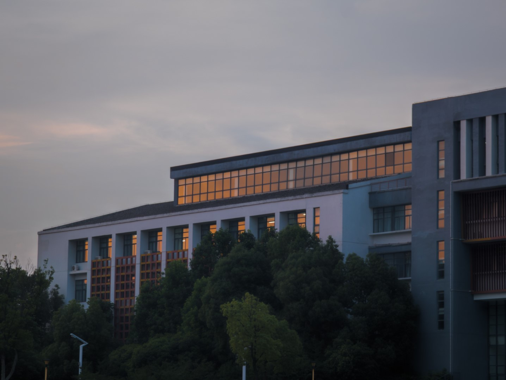
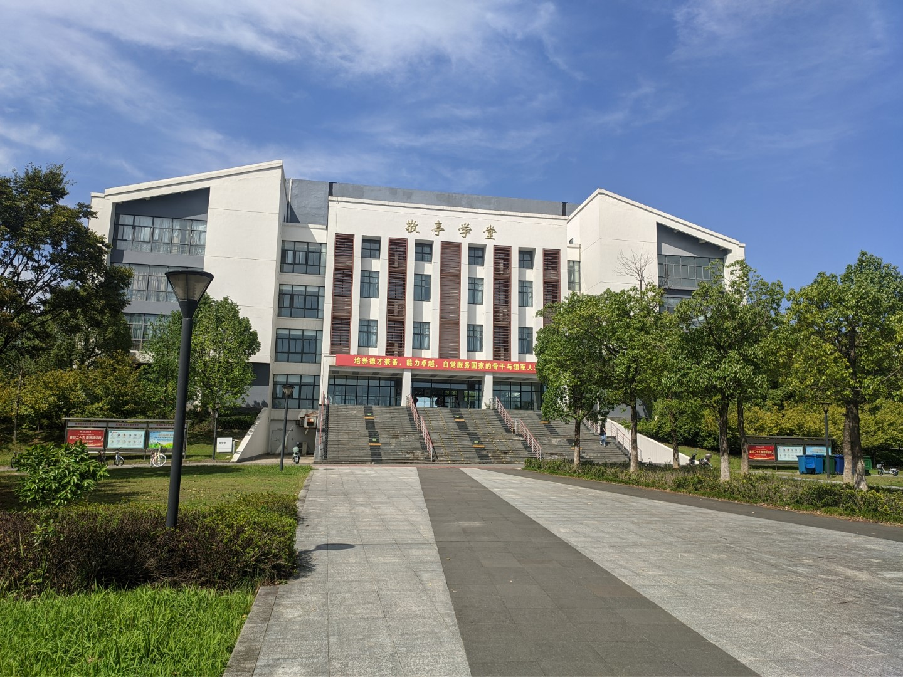
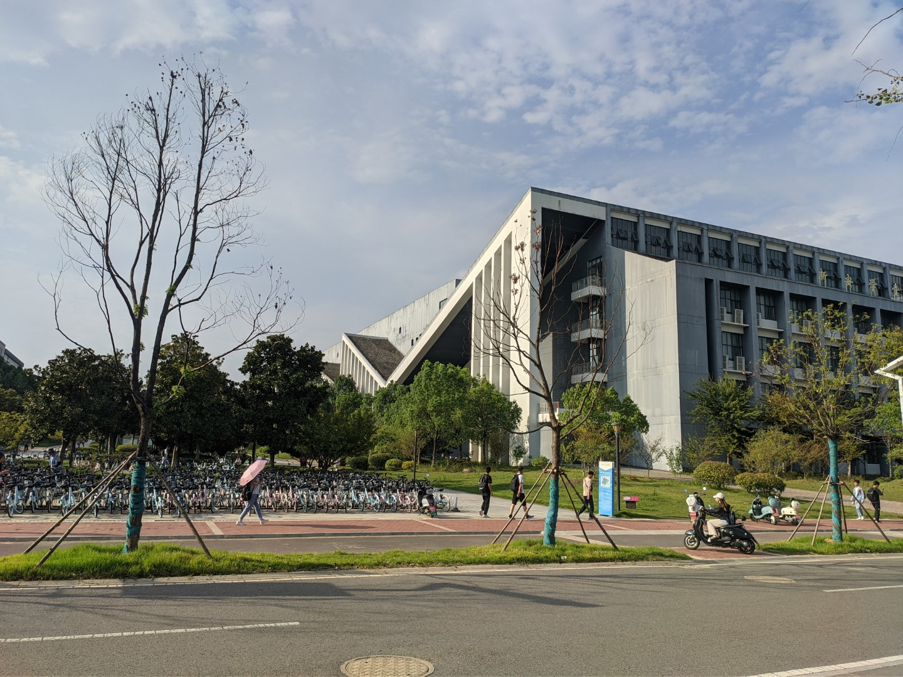

# 教学楼

## 敬亭学堂

原来的第一教学楼，一共有五层

内部布局错综复杂，第一次来的话建议提前五分钟找教室

### 教室分布规律

门牌号偶数位于北侧，奇数位于南侧

## 新安学堂

原来的第二教学楼，一共有五层。

新安的天井、走廊、屋顶、黑砖白墙青瓦等，无处不展示着徽派建筑的大气与精妙

:::info 相关阅读
[合肥工业大学宣城二期教学楼——徽派文化元素的探索 / 华南理工大学建筑设计研究院陶郅工作室 | 建筑学院 (archcollege.com)](http://www.archcollege.com/archcollege/2018/03/39655.html)
:::

