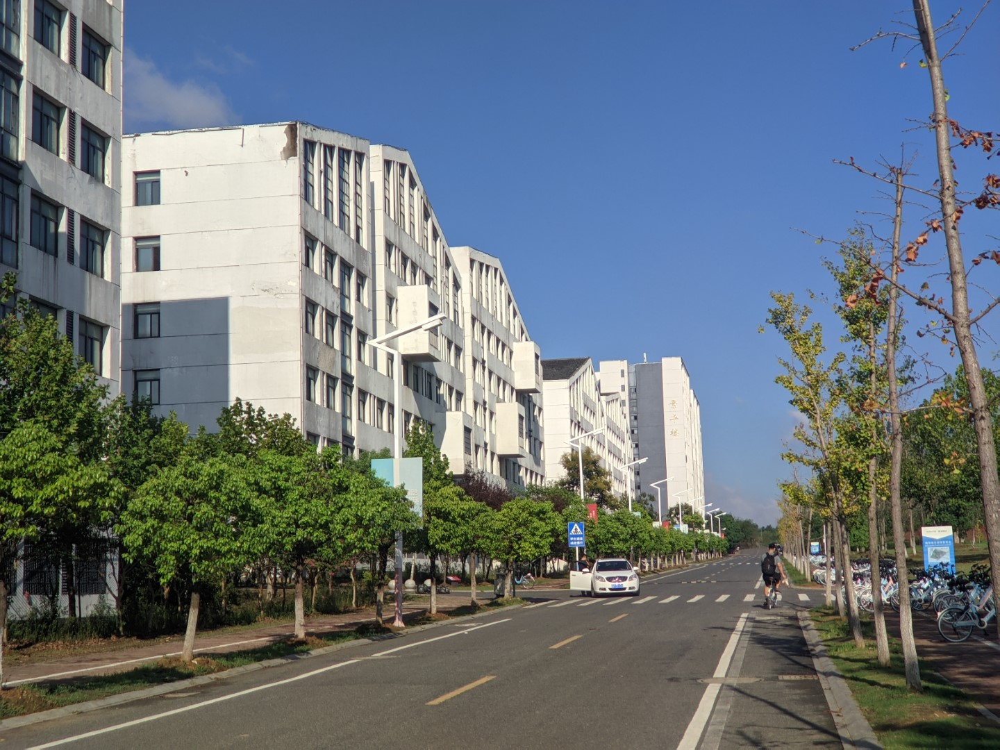
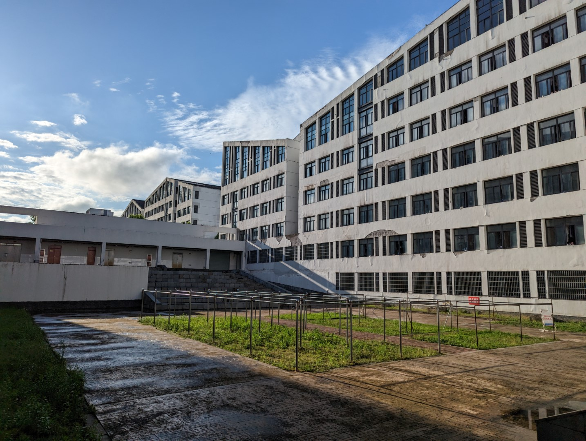

# 宿舍

关于宿舍内的详细介绍（面积、限电情况等）详见[生活§宿舍](../life/dormitory)

学校宿舍楼分配采取轮换制度，两年的新生在北区，接下来两年的新生在南区。目前 2024 级和 2021 级在北区，2022 级和 2023 级在南区。2024 级新生部分女生因北区宿舍不够被分配到了南区

宿舍分配会优先考虑**安徽人+南/北方人**的搭配，并会适当考虑生活习惯上的差异

## 北区宿舍

靠近操场、体育馆、两个学堂和南漪湖餐厅

## 南区宿舍

位于景明湖的南边，离教学区较远。

