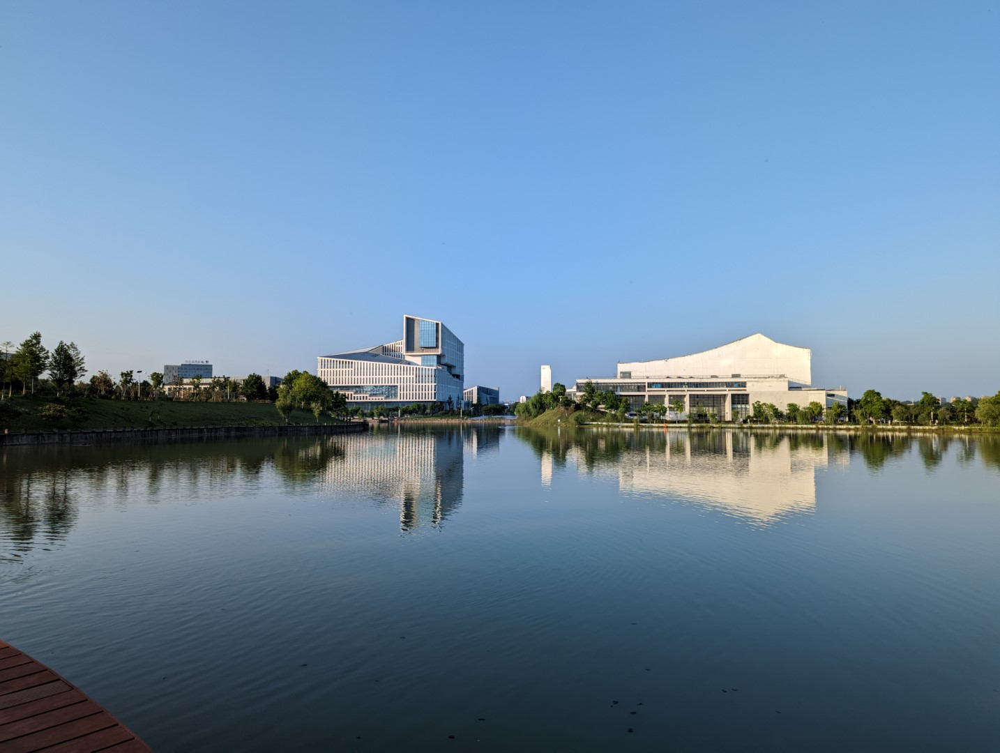
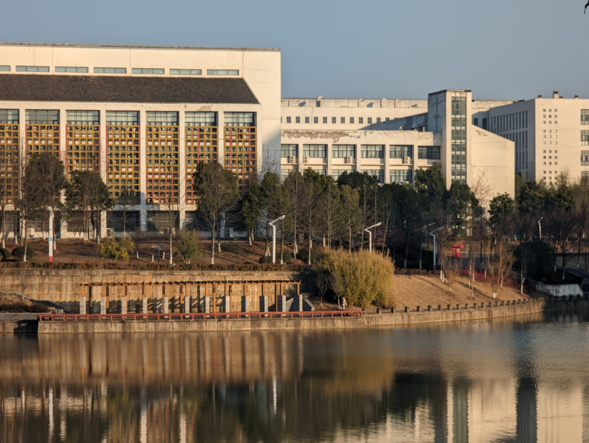

# 校园

## 其他建筑

### 校门

东门牌坊古朴庄重，恢弘大气，“合肥工业大学”六字沉稳严肃。

主体牌坊的设计来源于歙县的“许国石坊”，是徽州牌坊建筑艺术最杰出的代表，是徽州乃至全国唯一一座八柱三间阁楼冲天柱式组合的石牌坊。

### 景明湖

### 实验楼组团

已经建成的实验楼有：综合实验楼（一、二），生化楼，化学化工楼，计算中心，工程训练中心，文理楼，电子电气楼。

#### 综合实验楼

#### 计算中心

#### 工程训练中心

#### 生化楼

#### 化学化工楼

#### 文理楼

#### 电子电气楼

## 小动物

关注合工宣猫喃犬吠公益组织：

QQ 群：648535023
微信公众号：合工宣猫喃犬吠

