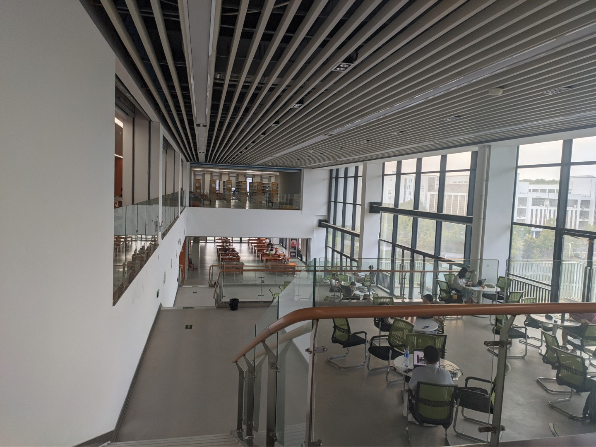

# 图书馆

合肥工业大学图书馆始建于 1945 年，经过 75 年的发展，已建设成为一座大型综合性高校图书馆，形成了以理工类文献为重点，哲学、社会科学、文学艺术等各学科文献协调发展，纸质和电子文献互补的多类型、多载体的馆藏文献体系。图书馆由屯溪路校区馆、翡翠湖校区馆和宣城校区馆构成，现有馆舍 8.2 万平方米，阅览座位 6000 余席。馆藏图书 378.18 万册，电子图书 471.61 万册；订购中外文数据库 210 个，中外文电子期刊 7.9 万种；订阅中外文现刊 1061 种。

宣城校区图书馆馆舍面积 37612.8 平方米，实行借阅藏一体化管理。现有馆藏纸质图书 34.8 万册、期刊 691 种、阅览座位 3300 余席、休闲座位 360 席、电子阅览室座位 144 席、研讨间 20 个、精品课程录播室一个。已实现读者自助借还（RFID）、阅览座位信息化管理、自助打印复印扫描、电子报刊阅读、刷卡存包等服务功能，为读者提供信息查询、书刊借阅、文献传递、检索技能培训、教学参考资料获取、主题研讨等服务，办理委托借阅合肥校区图书，满足读者的文献信息资源需求。[^1]

## 开放时间

| 功能       | 时间段       |
| ---------- | ------------ |
| 图书馆开放 | 7:30 - 22:15 |
| 图刊借阅   | 8:00 - 22:00 |
| 电子阅览室 | 8:00 - 22:00 |
| 研讨间     | 8:10 - 22:00 |
| 报刊阅览   | 8:00 - 22:00 |

## 楼层

图书馆大楼有 11 层，第二至六层是书刊报纸借阅区，藏书分布在第三至五层，第二层是综合服务区，第七层有信息化设备和电子阅览室，第八层有培训教室，一至六层观光电梯旁有图书馆的楼层指南，二至五层观光电梯旁有该层的藏书平面布局图，一至五层和七层都有存包柜。涉及读者借阅服务的主要功能分布如下所示：[^1]

## 图书借阅

书籍检索可以连接校园网，通过[合肥工业大学图书馆书目检索系统](http://210.45.242.5:8080/opac/search_adv.php#/index)查找，搜索书名、作者等，然后通过索书号找到对应楼层的对应书架。馆内阅读完毕可以将书放回原处或放到每层楼的小推车处（请不要随手扔在桌上或是随意插到某个书架里），若需要带离馆外，则需要到图书馆二楼自主借书机器刷卡借阅（默认密码为身份证号后六位，有 X 的往前顺移一位），还书时可到二楼借书机或一楼北面 24 小时还书机处，还书不需要校园卡。

若有屯溪路校区图书馆藏书借阅需求，可咨询服务台。当然，如果你在合肥两校区内，也是可以自由借阅的，但需要自行归还。

## 物品存放

每层楼都有储物柜，可以通过刷卡存取物品，其中第一次刷卡为存，第二次刷卡为取，只有这两次保证能刷到同样的柜子。超过 48 小时存放的物品会被移至二楼服务台后的架子上，贵重物品由服务台保管。若有物品遗失，建议先联系服务台。

## 空调温度

通常空调温度为楼层越高，温度越低。

## 电子阅览室

7 楼电子阅览室提供免费校园网服务。

## 研讨间

研讨间提供一个学习讨论的环境，可以在服务台办理借用，必须多人到场。

## 打印机

自助文档打印可以通过 2 楼服务台的电脑，或者 7 楼电脑，亦或自行在电脑安装自助打印程序并连接校园网，上传打印文档。默认密码为学号。上传后，在服务台两台机器之一刷卡扣费即可。可打印 A4 和 A3，也可以进行扫描、复印操作。

在读证明、成绩单、四六级成绩证明等都可以通过 2 楼大厅中间的打印机打印（或敬亭一楼东门、新安二楼北门附近，行政楼也有），每人有一定免费额度。

## 一站式服务中心/勤工助学中心（104 办公室）

0563-3831050

### 具体业务 [^2]

- 物业投诉建议
- 学生公寓服务
- 公共楼宇服务
- 工程维修服务
- 人脸采集
- 校园卡业务
- 信息化服务与咨询
- 教室借用审核
- 学生证补办
- 四六级成绩单发放
- 奖助学金咨询
- 助学贷款办理
- 勤工助学申请
- 就业创业指导
- 征兵服务
- 档案转接
- 学生活动审批
- 活动室借用
- 失物招领
- 报刊分发
- 自助打印
- 成绩单打印
- 在读证明打印
- 四六级成绩证明打印
- 校园卡补办

## 网站

- [总馆](https://lib.hfut.edu.cn)
- [宣区图书馆](https://xclib.hfut.edu.cn)

[^1]:
    合肥工业大学图书馆.合肥工业大学图书馆读者指南宣城校区 2021 版 [2025-04-15].  
    <https://xgzx.hfut.edu.cn/_upload/article/files/92/42/82cfd57840fa853513a3c1b0ca7a/77421448-5d61-4cdd-a573-22458981da57.pdf>

[^2]:
    合肥工业大学宣城校区学生工作办公室.宣城校区一站式服务中心试运行公告 (2024-02-29)\[2025-04-15].  
    <https://xgzx.hfut.edu.cn/96/1d/c689a38429/page.htm>
