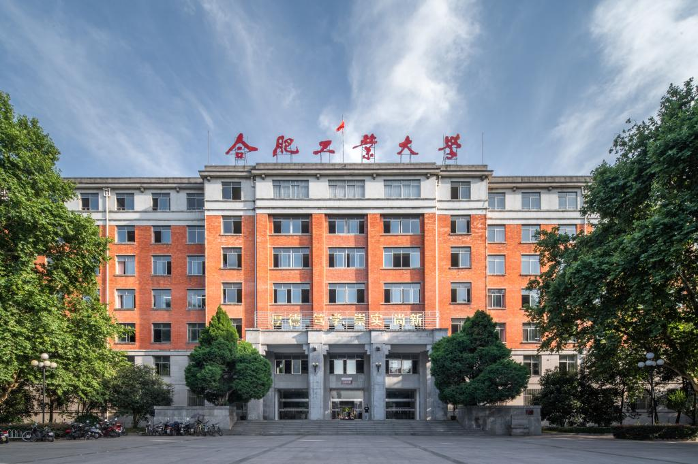

# 主教学楼

屯溪路校区的标志性建筑，始建于 1958 年，为苏联式建筑风格，是当年安徽省最高的建筑，如今已被列为合肥市文物保护单位和安徽省文物保护单位。[^1]

[^1]:
    百度百科.合肥工业大学屯溪路校区[DB/OL]. (2026-02-15)\[2026-04-29].  
    <https://baike.baidu.com/item/%E5%90%88%E8%82%A5%E5%B7%A5%E4%B8%9A%E5%A4%A7%E5%AD%A6%E5%B1%AF%E6%BA%AA%E8%B7%AF%E6%A0%A1%E5%8C%BA>
