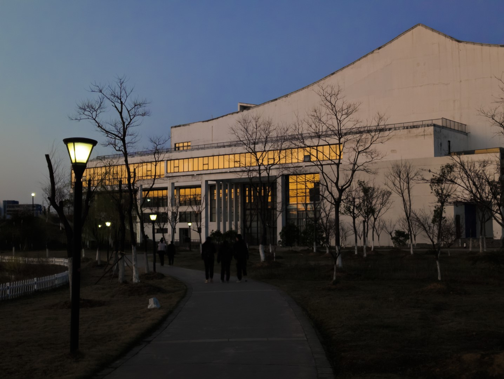
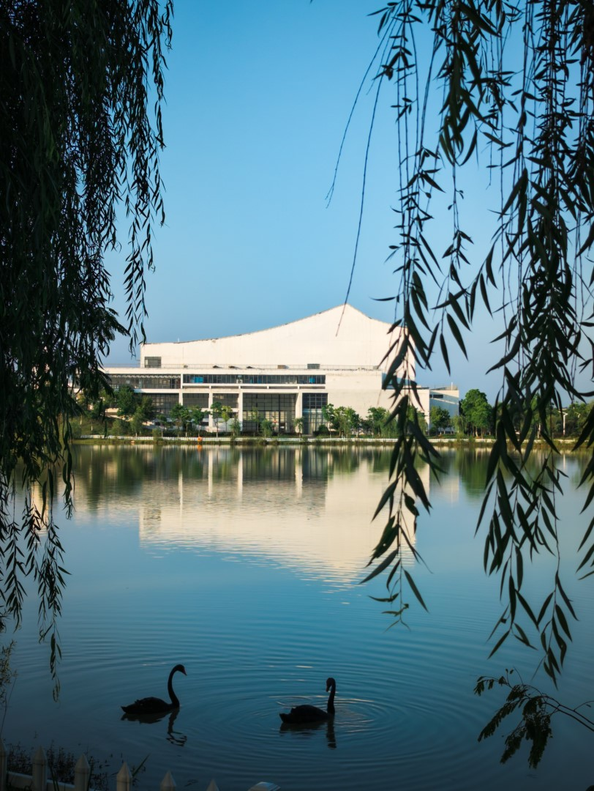

# 大学生活动中心

大学生活动中心是合肥工业大学宣城校区重要的综合性公共建筑，集学生活动、行政办公与校园服务于一体，在校区生活中扮演着核心角色。该中心属于校区二期建设工程的一部分，于 2012 年 12 月 12 日正式开工建设，其礼堂部分于 2017 年 1 月完成竣工规划核实。建筑整体采用与校区风格统一的徽派元素，白墙灰瓦，风格别致，成为校园内一道亮丽的风景线。

作为校园文化活动的核心场所，大学生活动中心承载了丰富多样的功能。内部设有大礼堂和大报告厅，是举办开学典礼、毕业典礼、优秀学生颁奖典礼、文艺晚会及各类大型会议的主要场地。同时，这里也是各类社团招新、文艺演出和学术讲座的举办地，一楼招聘大厅则是校区举办毕业生双选会等就业活动的重要场所，充分体现了其在校园文化与学术活动中的枢纽地位。

此外，大学生活动中心还集中了重要的学生服务与行政办公功能。学生工作办公室（213 室）负责社团活动、学生会及党建相关事务，学生教育管理办公室（214 室）负责日常行为规范咨询，就业办公室（224 室）则提供就业指导、简历修改等服务。中心三楼设有心理咨询中心，配备预约接待室、个体咨询室、团体辅导室、沙盘室、宣泄室等十余间功能室，为学生的心理健康提供专业支持，预约可以参考[《关于大学生心理健康教育与咨询中心开放的通知》](https://xgzx.hfut.edu.cn/9c/a5/c689a40101/page.htm)。在开学季，这里也是新生集中报到的地点，全方位服务于学生的校园生活。

