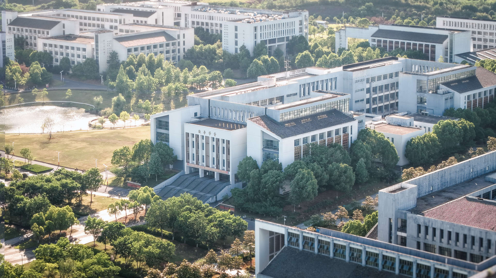
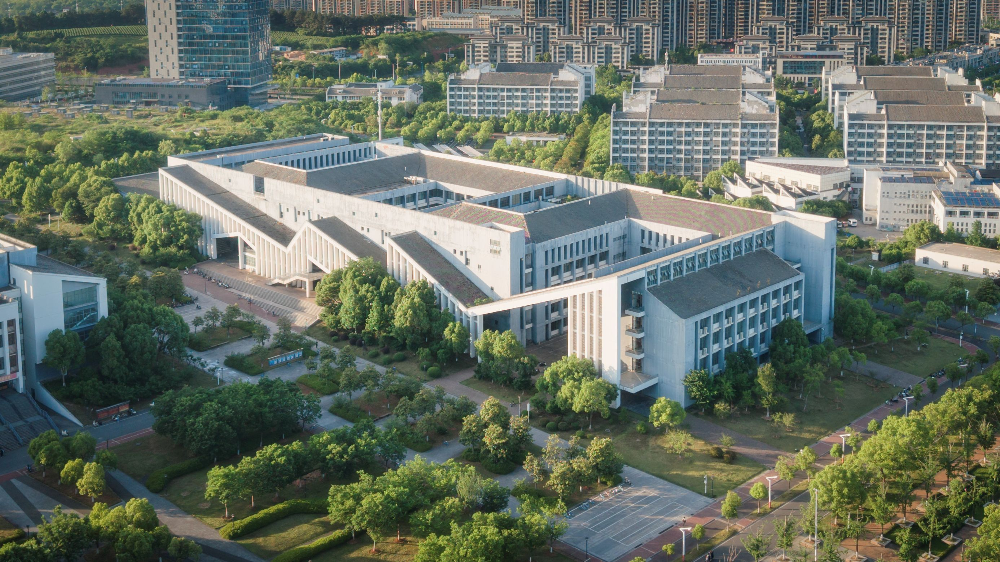
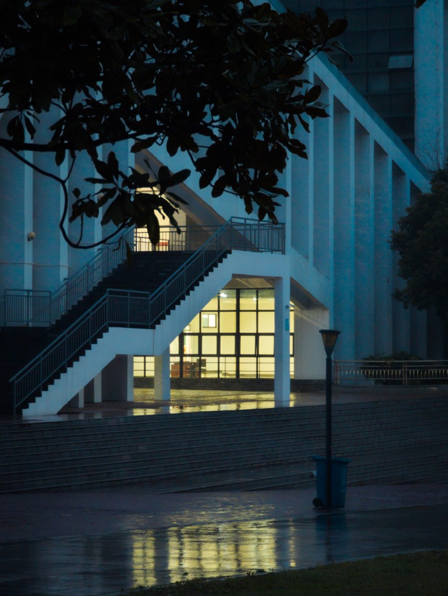

# 教学楼

## 敬亭学堂

敬亭学堂是合肥工业大学宣城校区的一号教学楼，在校区内有“一教”之称。因宣城名胜敬亭山而得名，建筑面向景明湖，与新安学堂相邻，风格儒雅宁静。

敬亭学堂属于宣城校区一期工程，校区一期工程于 2012 年建成并投入使用。一期教学楼建筑面积为 24000 平方米，整体为日字形平面。学堂共五层，内部布局较为复杂。该楼可满足大量学生的日常教学需求，两栋教学楼合计可容纳 12000 名学生

敬亭学堂一共有五层，其中五层只有南侧有几间教室。内部布局错综复杂，第一次来的话建议提前五分钟找教室

### 教室分布规律

门牌号偶数位于北侧，奇数位于南侧

## 新安学堂

新安学堂是宣城校区的二期教学楼，与敬亭学堂相邻，是校区内最复杂的建筑，以结构美著称。其名称取自徽文化的新安画派。

新安学堂属于校区二期工程，总建筑面积达 36750 平方米，比一期教学楼更大。建筑共六层，东侧毗邻学生生活区，西侧与一期教学楼（敬亭学堂）相邻。建筑设计融合徽派文化元素，采用粉墙黛瓦的色彩基调，通过体块组合化解大体量建筑的尺度问题。建筑平面以 100 至 150 人的教室为主要功能，南北向为主、东西向为辅串联成四个庭院。新安学堂内部设有众多绘图教室，是校区内重要的教学场所。

一共有六层，六层只有西侧有几间教室。内部布局相较敬亭更为错综复杂

### 相关阅读

- [合肥工业大学宣城二期教学楼——徽派文化元素的探索 / 华南理工大学建筑设计研究院陶郅工作室](http://www.archcollege.com/archcollege/2018/03/39655.html)
- [合肥工业大学宣城二期教学楼 / 华南理工大学建筑设计研究院](https://www.gooood.cn/xuancheng-phase-ii-teaching-building-hefei-university-of-technology-china-by-architectural-design-and-research-institute-of-scut.htm)

