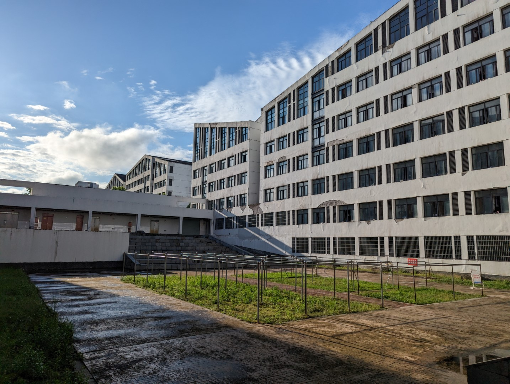

# 宿舍

关于宿舍内的详细介绍（面积、限电情况等）详见[生活§宿舍](../../life/dormitory/index)

北区为 1\~5 号楼，南区为 6\~10 号楼

学校宿舍楼分配采取轮换制度，两年的新生在北区，接下来两年的新生在南区。目前 2024 级和 2021 级在北区，2022 级和 2023 级在南区。2024 级新生部分女生因北区宿舍不够被分配到了南区

宿舍分配会优先考虑**安徽人+南/北方人**的搭配，并会适当考虑生活习惯上的差异

## 北区宿舍

靠近北门、操场、体育馆、两个教学楼和南漪湖餐厅

每个宿舍楼分为南楼和北楼，南楼和北楼每层各有 27 间宿舍，共六层；在宿舍楼二楼有自习室

1、3、4、5 号楼为男生宿舍，2 号楼为女生宿舍

## 南区宿舍

位于景明湖的南边，离教学区较远

根据建筑结构不同，内部情况较为复杂，可参考下表

| 楼栋号 | 是否分南北栋 | 宿舍所在层数 | 每层宿舍间数 | 自习室位置 |
| :----: | :----------: | :----------: | :----------: | :--------: |
|   6    |      是      |     1~6      |    21-37     |     2F     |
|   7    |      否      |     2~6      |    36-39     |   3F、5F   |
|   8    |      否      |     2~6      |    36-39     |   4F、5F   |
|   9    |      是      |     1~6      |    21-37     |     2F     |
|   10   |      是      |     1~6      |    36-37     |     2F     |

6 ~ 9 号楼为男生宿舍，10 号楼为女生宿舍

