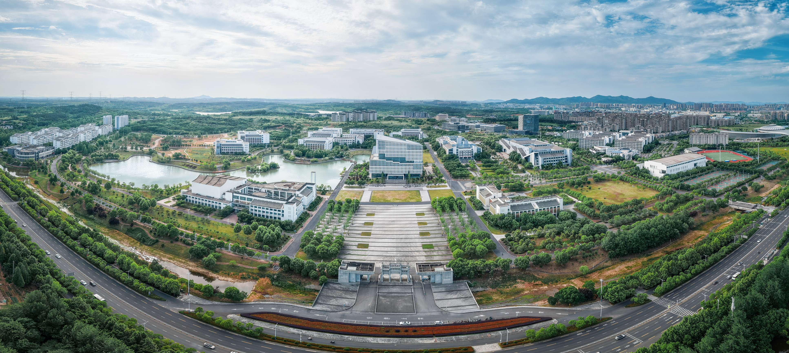

# 宣城校区

合肥工业大学宣城校区位于安徽省宣城市市区南部，为合肥工业大学坐落于江南的校区，风景秀丽，环境宜人，设施现代化。[^1]

## 历史沿革

2011 年，经教育部批准，合肥工业大学、宣城市人民政府共同建设合肥工业大学宣城校区。宣城校区的建设是贯彻落实国家教育改革和发展规划纲要、推动皖江示范区建设的重要举措，是国家优质教育资源与地方资源相结合的典型范例，开创了高等教育合作办学的新模式。2012 年合肥工业大学宣城校区首届招生，宣城校区与合肥校区按两个代码，面向全国一本线以上招生，学生完成学业后，按照合肥工业大学学籍管理规定等有关要求，符合毕业条件的颁发同一合肥工业大学本科学历证书，达到学位授予条件的颁发同一学士学位证书。[^2]

## 地理位置

宣城校区坐落在有"中国文房四宝之乡"之称的宣城市区南部。宣城地处皖东南，毗邻苏浙，地近沪杭，地处长三角地理中心和沪宁杭合四大都市圈辐射交汇中心，是长三角中心区 27 个城市之一。拥有 2300 多年建城史的宣城，素有"宣城自古诗人地""上江人文之盛首宣城"之称，是中国唯一的文房四宝之城，是徽文化发源地和徽商故里，也是新四军军部驻地和中国探空火箭发祥地。敬亭山被誉为"江南第一诗山"，享誉中外的宣纸是"纸中国宝"。[^2]

## 校区规模

宣城校区规划占地面积 3135 亩，总建筑面积约 60 万平方米，一次规划，分期建设。宣城校区建筑设计融合徽派建筑元素，通过依山就势的生态布局，构建一个水转山绕、人杰地灵的现代大学校园。目前校区一期工程、二期工程已基本完工，初步达到比较优越的办学条件，教学楼、实验楼群、计算中心、工程素质教育中心、分析测试中心、体育场馆等教学设施齐全，图书馆、学生宿舍、学生食堂、校区医院及综合服务区基础设施完备。[^1][^2]

## 院系设置

宣城校区设有 12 个系，所设本科专业涉及工、理、经、管、文、法 6 个学科门类：

| 系别           | 学科门类   |
| -------------- | ---------- |
| 机械工程系     | 工学       |
| 材料工程系     | 工学       |
| 计算机与信息系 | 工学       |
| 电气与自动化系 | 工学       |
| 能源化工系     | 工学       |
| 城市建设工程系 | 工学       |
| 生态环境系     | 工学       |
| 物流管理系     | 管理学     |
| 经济与贸易系   | 经济学     |
| 文法系         | 法学、文学 |
| 英语系         | 文学       |
| 食品科学系     | 工学       |

其中，国家级本科一流专业建设点 12 个，安徽省本科一流专业建设点 3 个，安徽省特色专业建设项目 1 个，与合肥校区实现差异化发展。[^2]

## 办学成果

宣城校区办学以来，坚持立德树人为根本任务，办学平稳有序，办学质量可靠，社会影响不断扩大。校区学子在各类科技竞赛、创新创业活动中不断取得优异成绩，近三年共获得国家级以上奖项 340 余项、省级奖项 2000 余项。其中，获中国国际"互联网+"大学生创新创业大赛金奖 1 项、银奖 3 项；"挑战杯"全国大学生创业计划竞赛金奖 1 项。自 2016 年首届学生毕业以来，毕业生去向落实率持续保持在 95% 以上，升学率已突破 40%。目前在校本科生近 1.1 万人。[^2]

## 南北区

习惯上以图书馆与东门的中线将宣城校区分为南北两部分（也有一种说法指的是宿舍和食堂的组团建筑区域）

由于[教学楼](./colleges)（新安学堂和敬亭学堂）均靠近北区，住在南区的同学可能需要更多时间才能到达教学楼，因此在大一时买辆电动车或自行车可能会是一个不错的选择

[^1]:
    百度百科。合肥工业大学宣城校区[DB/OL]. (2024-10-16)\[2025-03-06].  
    <https://baike.baidu.com/item/%E5%90%88%E8%82%A5%E5%B7%A5%E4%B8%9A%E5%A4%A7%E5%AD%A6%E5%AE%A3%E5%9F%8E%E6%A0%A1%E5%8C%BA/5010408>

[^2]:
    合肥工业大学宣城校区。校区简介\[2025-09].  
    <https://xc.hfut.edu.cn/1981/list.htm>
