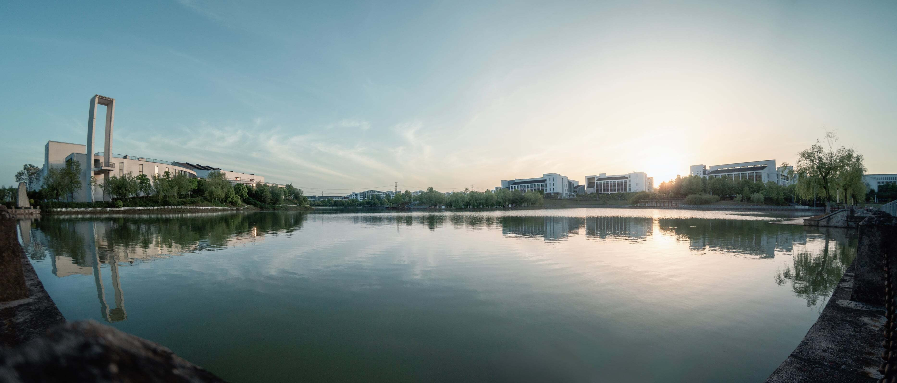
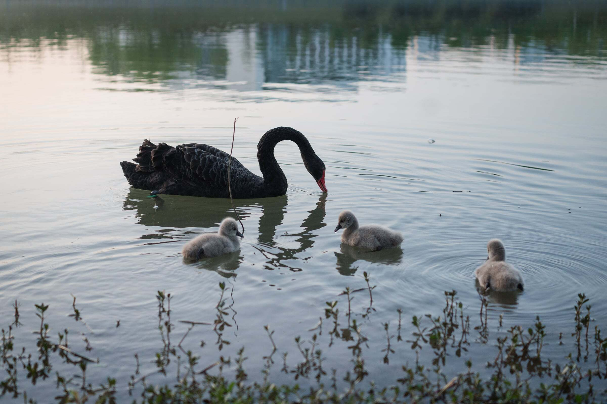

# 景明湖

景明湖坐落在宣城校区景明生态谷的中心位置，“景明”二字源自范仲淹的“春和景明”。景明湖畔是学习、交流和休憩的重要场所，旖旎的自然风光与置身其中的学子融为一体，构成温馨和谐、充满生机的校园美景。[^1]

## 天鹅

湖中心设有天鹅岛，平时不对外开放。但若运气好可以遇到喂天鹅的大爷，跟他说明来意后一般可上岛喂天鹅

岛上有不少黑天鹅，它们偶尔也会游到图书馆旁的亲水平台或南区食堂附近的岸边嬉戏玩耍

## 相关规定

- [《宣城校区景明湖管理规定》](https://xcbwb.hfut.edu.cn/97/8b/c1617a38795/page.htm)

[^1]:
    合肥工业大学新闻文化网.合肥工业大学“校园十景”评选结果揭晓. (2025-09-16)\[2026-05-04].
    <https://news.hfut.edu.cn/info/1011/74306.htm>
