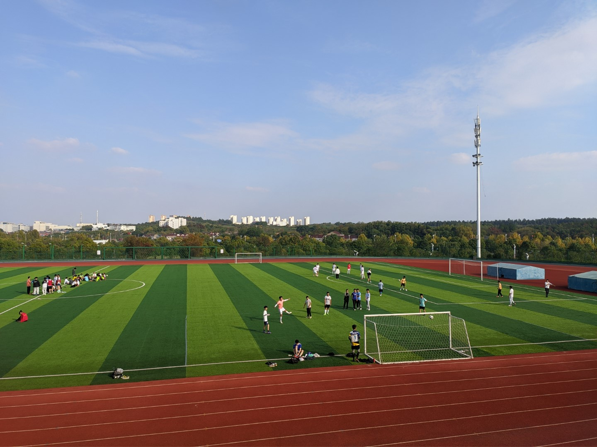

# 风雨操场

标准四百米跑道，中间是足球场，现设立了用于室外体测（50m 跑，800m/1000m 跑）的签到机与智能摄像头。

看台一层内有校区警务站、舞蹈房、器材室，入口处有一台自动体外除颤器（ AED ）设备。

看台二层内有体测室，用于进行室内体测（身高体重，肺活量，立定跳远，坐位体前屈，仰卧起坐/引体向上），室内室外体测成绩由机器全自动评判。

周围有篮球场、网球场和排球场。

靠近校园东北角的区域有健身器材、儿童游乐设施等。

