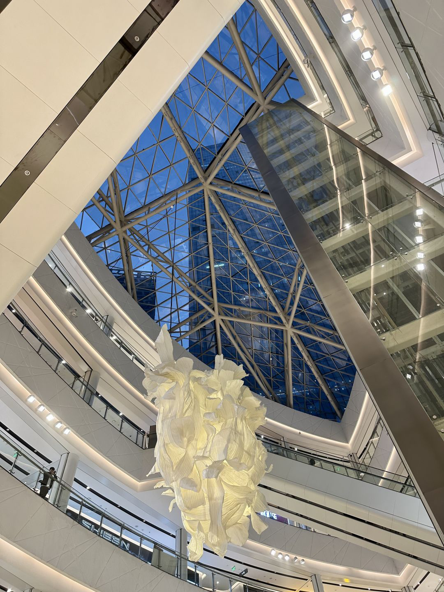

# 合肥

合肥市，简称“合”，古称庐州、庐阳，是安徽省辖地级市、省会、特大城市，也是合肥都市圈核心城市。合肥位于中国华东地区、安徽省中部、长江三角洲西翼，环抱巢湖，全市总面积 11445 平方千米。这里属亚热带季风性湿润气候，四季分明，地貌以丘陵岗地为主，兼有低山残丘与低洼平原。合肥地域是中华文明的重要发祥地之一，因东淝河与南淝河均发源于此而得名。[^1]

## 商业中心

### 淮河路步行街

合肥老城区的商业中心。离屯溪路校区较近，离翡翠湖校区很远。地铁直达“四牌楼”或“大东门”。

此处含有大量商场、大型店铺、美食街等。

### 天鹅湖

合肥新城区的商业中心，离翡翠湖校区较近，离屯溪路校区较远。地铁直达“天鹅湖”/“图书馆”/“合肥大剧院”。

银泰in77商场坐落于此，商场-1楼有大量美食，但是价格相比普通小吃街偏贵，也更为高档。商场1楼有许多数码产品店，较高层有许多高档(价格上也是如此)美食。

### 中环城/星达城

均在翡翠湖校区附近。移步至[合肥校区附近](./surroundings)以查阅更多信息

## 公园

### 翡翠湖公园

请移步至[合肥校区附近](./surroundings)以查阅更多信息

### 骆岗公园/滨湖湿地公园/滨湖森林公园

请移步至[合肥景点](./tourist_attractions)以查阅更多信息

[^1]:
    百度百科.合肥市[DB/OL]. (2026-04-26)\[2026-05-01].  
    <https://baike.baidu.com/item/%E5%90%88%E8%82%A5%E5%B8%82/6501395>
