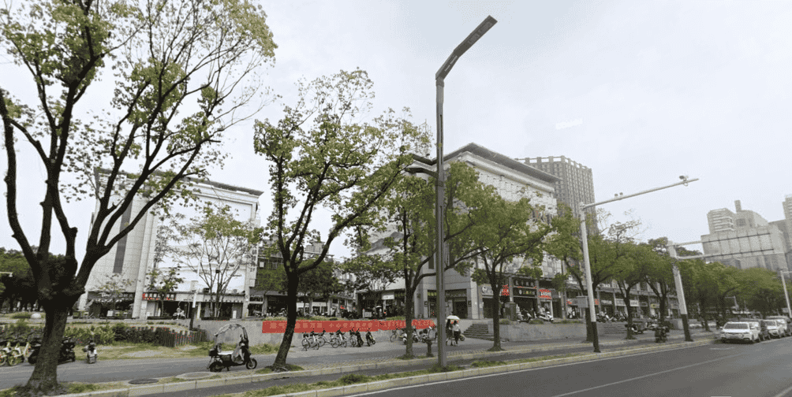
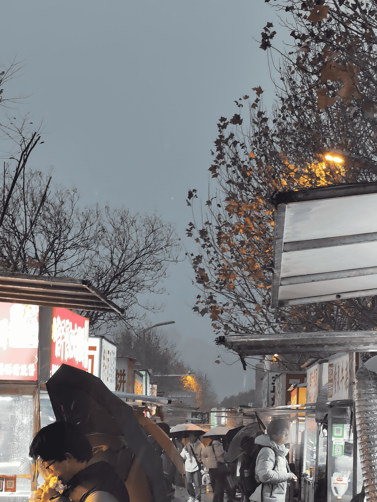

# 学校附近

## 翡翠湖校区

### 吃喝玩乐

翡翠湖校区的大北门和小北门附近均含有大量吃喝玩乐的地方。

#### 大北门附近

出大北门的斜对面(↗️)拥有一整条繁华的商业街，并且包含许多层，以美食为主。你不仅可以在这里找到蜜雪冰城、好想来零食店、塔斯汀、杨国福麻辣烫等知名大牌餐饮店，还有许多烧烤、夜市、饭店等。在三楼更是有一整层的“簋街美食城”，含有来自五湖四海的各种美食。

#### 小北门附近

小北门因离宿舍近，是工大学子们觅食的主力。小北门正对面拥有大量摊贩前来摆摊，同时古茗、麦当劳等餐饮店坐落于此。每逢晚上，这里会成为学校附近最热闹的地方。其中有一些摊位早已在同学之间耳熟能详，成为“翡翠湖必吃榜”的一部分。

#### 不邻近学校但不远的地方

- 星达城：中型商场。有麦当劳/达美乐/老乡鸡/卡旺卡/詹记/……

- 中环城：中大型商场。有肯德基/海底捞/必胜客……

- 翡翠湖：公园。环境优美，是散步、幽会的好地方。

### 交通

- 公交：翡翠湖校区的公交站在大北门和小北门之间。出大北门左转或出小北门右转走约 1 分钟就能到公交站。

- 地铁：翡翠湖校区附近有两个地铁站，其中“大学城北”使用率最高，出大北门右转步行约 5 分钟即可到达。“工大翡翠湖校区”站紧邻东南门，但离教学和生活区较远，因此使用率并不高。

## 屯溪路校区（待补充）

### 吃喝玩乐

#### 东门附近

东门因离宿舍近，所以配套的吃喝会多一点。

#### 北门附近

（待补充）

#### 不邻近学校但不远的地方

- 包公园：公园。环境优美，是散步的好地方。但是因为人偏多所以并不适合幽会。

### 交通

- 公交：屯溪路校区的公交站紧邻北门

- 地铁：“合工大南区”地铁站在北门和东门之间的十字路口处，离东门较近。
