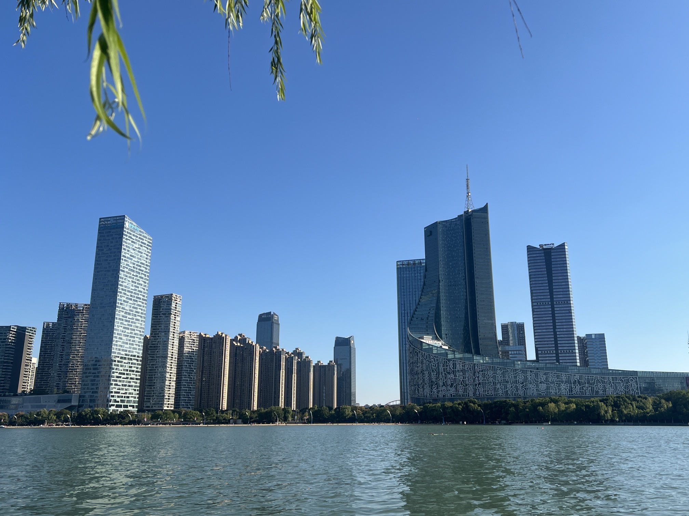
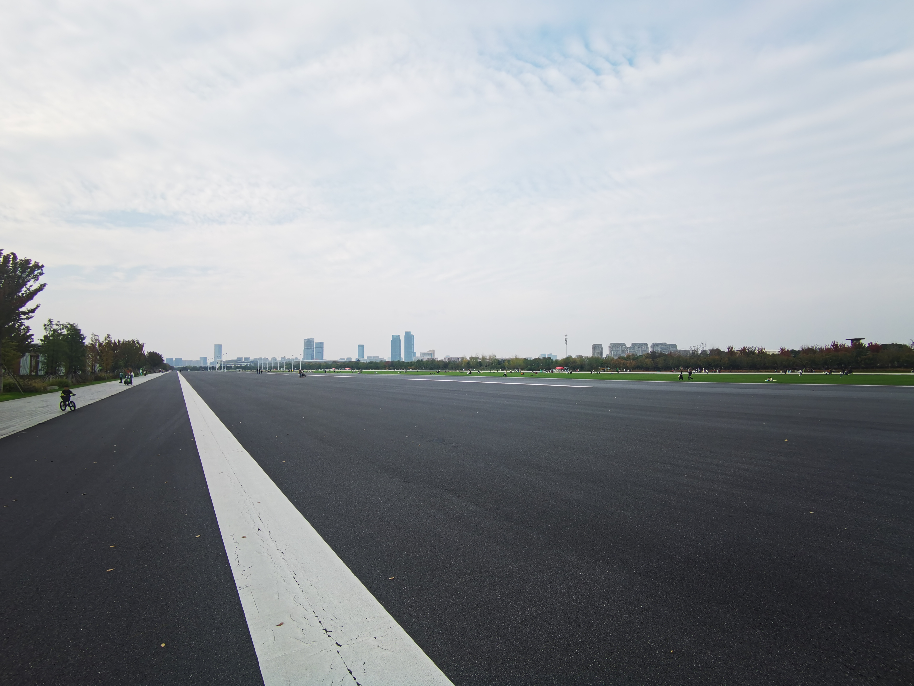
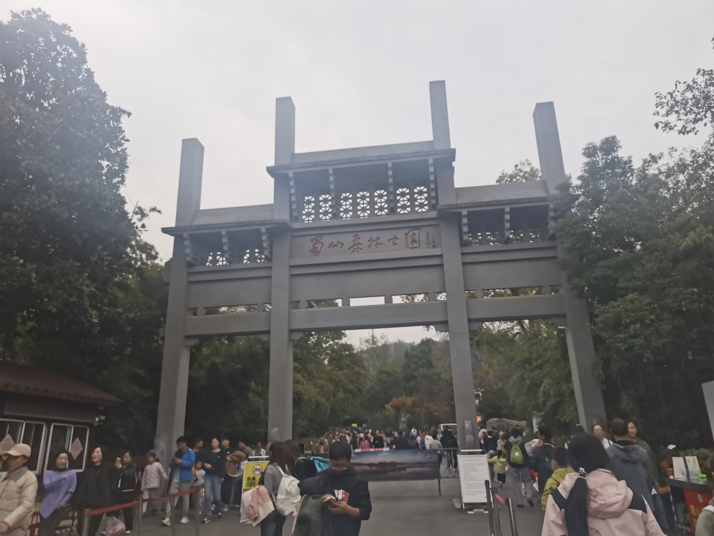
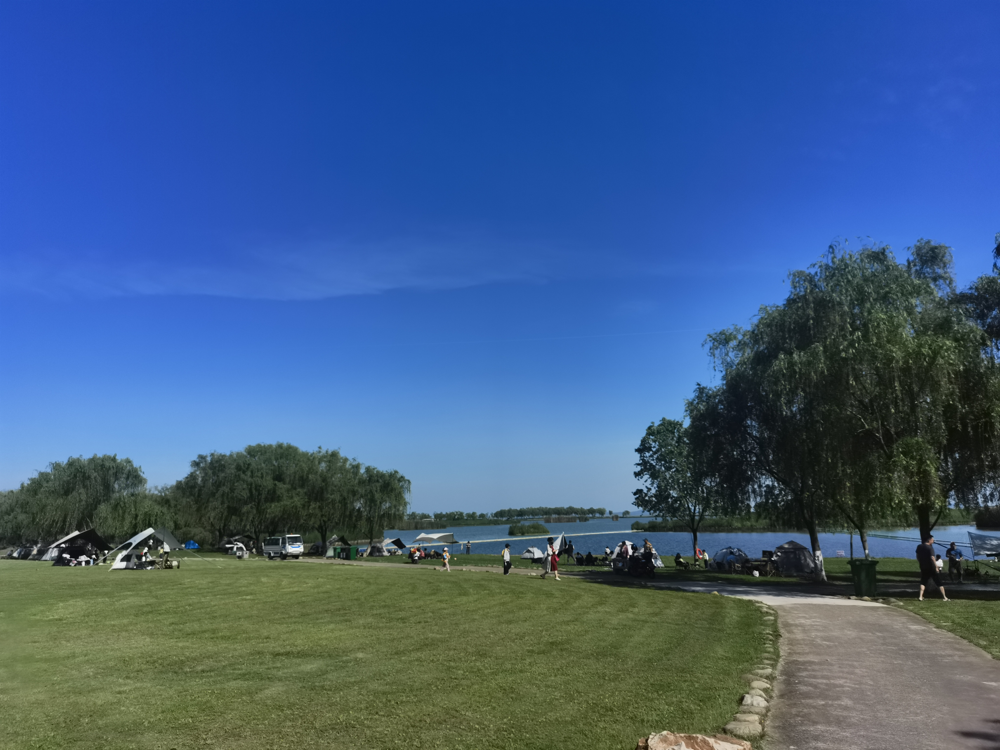
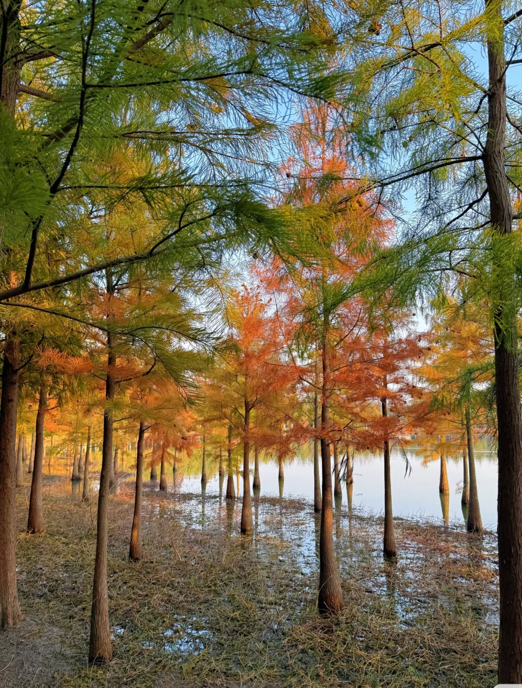

# 景点

:::tip

作为新兴科创城市，合肥并没有很多历史古迹。合肥的景点主要以自然景观和人造景点为主。

:::

:::tip

此处主要介绍景点。如果你想寻找合肥的吃喝玩乐场所，请移步至[合肥市介绍](../hf)。如果你想寻找学校附近的吃喝玩乐场所，请移步至[合肥校区学校附近](./surroundings)。

:::

## 天鹅湖

天鹅湖坐落于合肥市新城区的中心区域。在这里，合肥市近些年的飞速发展触手可及。湖附近拥有合肥市最好的城市建设，高楼大厦林立，高档商场遍布于此，各大公司的高楼也坐落于此。这里还有壮观的安徽省电视台大楼。如果你想一览这座新一线城市的繁华，天鹅湖是最好的去处。

## 骆岗公园

骆岗公园是现如今全世界最大的城市公园，由前骆岗机场改建而来。这里环境优美，干净整洁，绿化水平高。这里还有大片草坪，是散步，放风筝以及幽会的好去处。

## 蜀山

蜀山是合肥市内最高的山。翡翠湖校区所处的”蜀山区“由此得名。爬上蜀山，城市的大部分景观尽收眼底。同时蜀山底部有大量餐饮店和文创产品店。

## 环巢湖景点

巢湖是我国五大淡水湖之一。在岸边看巢湖一望无际，仿佛来到了海边。以下景点均处于巢湖附近

### 岸上草原/安徽滨湖国家湿地公园

建议在阳光明媚的天气游览此景点。此处适合露营。

### 合肥滨湖国家森林公园

环境清幽，适合散步。

