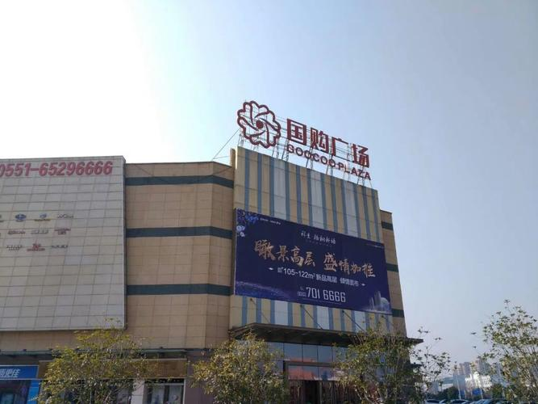
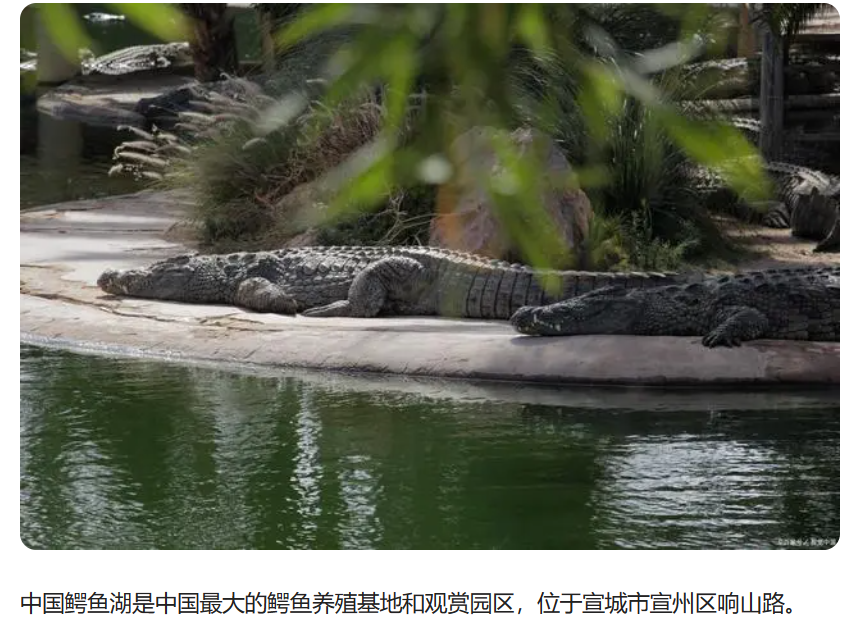
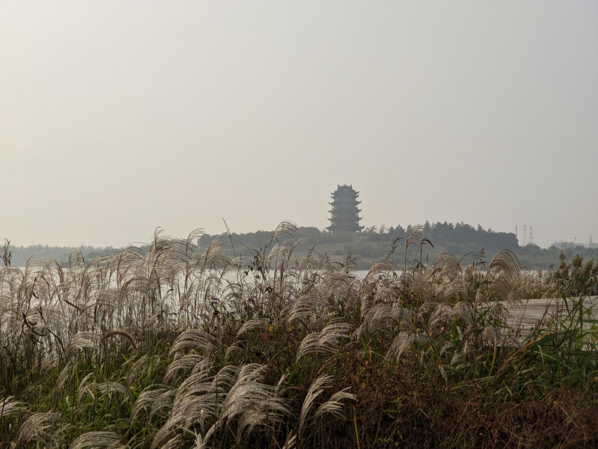
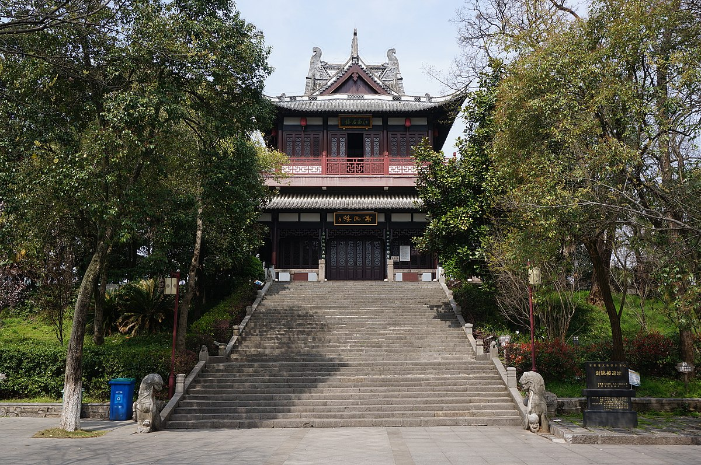
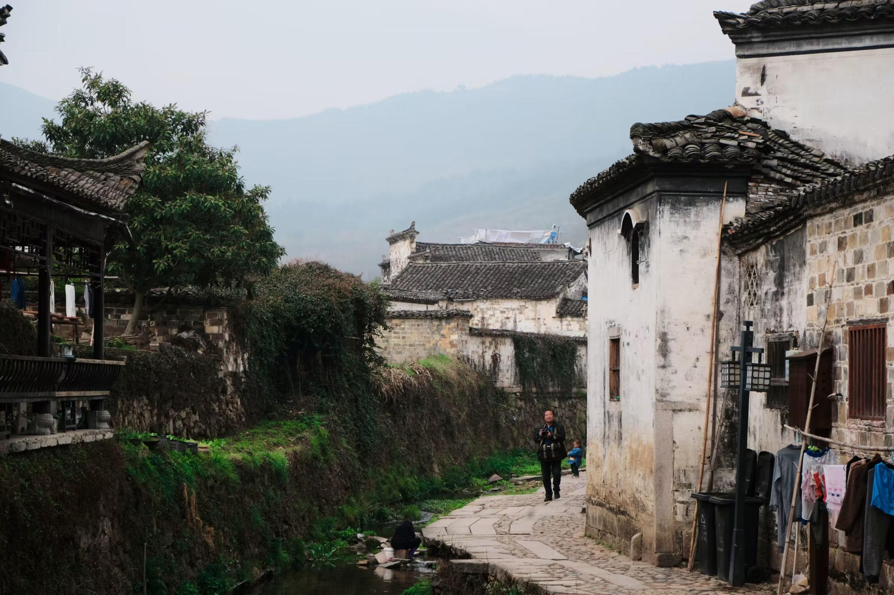
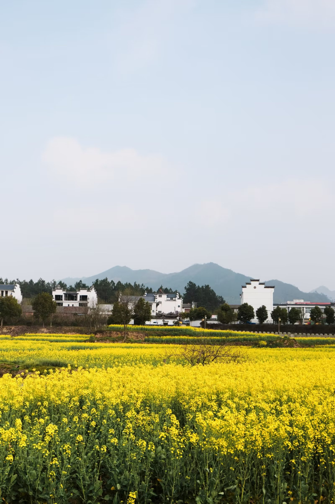

# 宣城

宣城地域与南京合肥等大城市都是比较近的，但是宣城城市规模比较小，来自中大城市的同学可能会不太适应。

## 宣州区

### 敬亭山

> 相看两不厌，只有敬亭山。

带学生证免费（半小时车程，见过骑自行车去，可以看日出）

### 万达广场

宣城市区较为繁华的地方

可坐公交或者打车，打的一般十几块，或者骑半小时左右的自行车也不是不行

- 肯德基
- 麦当劳
- 喜茶
- 霸王茶姬
- 古茗
- 瑞幸
- 名创优品
- ...

附近有个银桥湾夜市也不错

### 国购广场

消费水平比万达低一点，比万达远一点

### 中国鳄鱼湖

扬子鳄基地不大，一小时就能转完

扬子鳄是中国特有的鳄鱼，展厅里可以近距离观察鳄鱼（超级近，但鳄鱼都不动），建议春天来，鳄鱼比较活跃

学生票半价

### 宛陵湖

离学校比较近，周长约 6km ，可以去散步、跑步、骑行等，初春景色最佳。宣城博物馆就在宛陵湖畔。

### 梅溪公园

> 安求一时誉，当期千载知。

梅溪公园是宋朝诗人梅尧臣故里，宗族后代有梅兰芳等名人。

### 谢朓楼

> 弃我去者，昨日之日不可留；
> 乱我心者，今日之日多烦忧。
> 长风万里送秋雁，对此可以酣高楼。

## 泾县

### 查济古镇

保存得很好的一个古镇，是我国现存规模最大的明清古村落。

### 桃花潭

> 桃花潭水深千尺，不及汪伦送我情。

