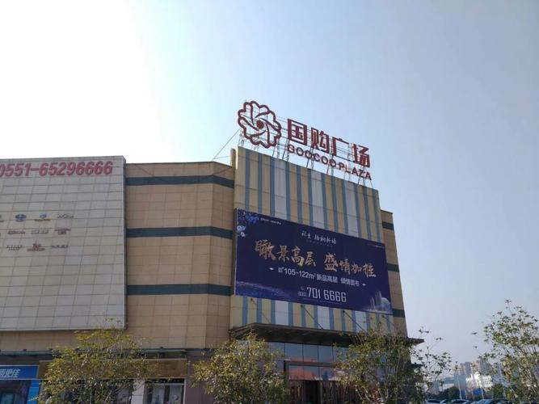
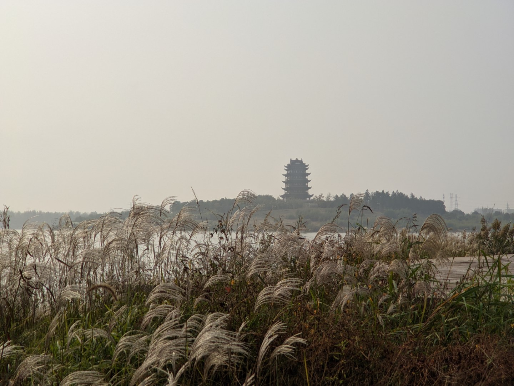
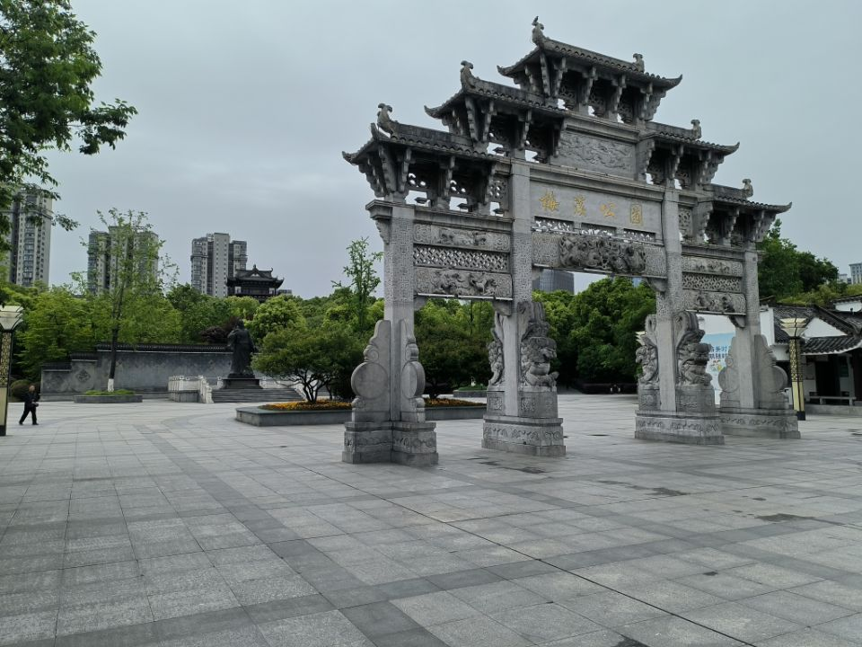
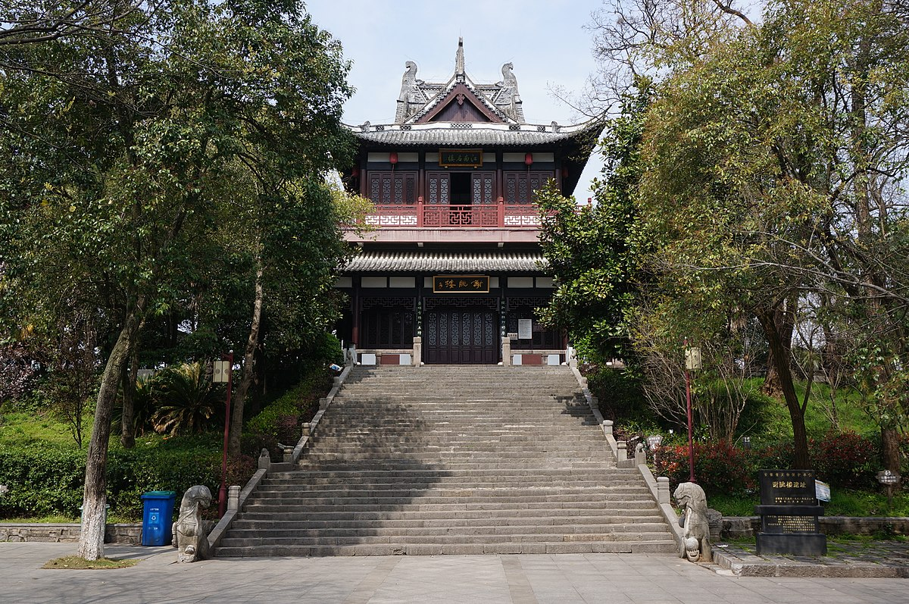

# 宣城

宣城市，简称“宣”，古属吴越，是千年郡府地，现为安徽省辖地级市。宣城位于安徽省东南部、长江下游南岸，毗邻苏浙，地近沪杭，东邻杭州市、湖州市，北连马鞍山市及江苏省南京市、常州市、无锡市，西接池州市、芜湖市，南邻黄山市。这里地处皖南山区与沿江平原的结合地带，属北亚热带湿润季风气候，四季分明，雨量充沛。[^1]

宣城地域与南京、合肥等大城市都是比较近的，但是相比之下城市规模较小，来自中大城市的同学可能会不太适应。

## 商业中心

### 万达广场

宣城市区较为繁华的地方

可坐公交或者打车，打车一般 8~20 块，或者骑半小时左右的自行车

万达广场南边有个银桥湾夜市也不错

### 国购广场

消费水平比万达低一点，距离学校比万达远一点

## 公园

### 宛陵湖

离学校比较近，周长约 6km ，可以去散步、跑步、骑行等，初春景色最佳。宣城博物馆就在宛陵湖畔。

### 梅溪公园

> 安求一时誉，当期千载知。

梅溪公园是宋朝诗人梅尧臣故里，宗族后代有梅兰芳等名人。

### 谢朓楼

> 弃我去者，昨日之日不可留；  
> 乱我心者，今日之日多烦忧。  
> 长风万里送秋雁，对此可以酣高楼。

[^1]:
    百度百科.宣城市[DB/OL]. (2026-04-04)\[2026-05-01].  
    <https://baike.baidu.com/item/%E5%AE%A3%E5%9F%8E%E5%B8%82/212001>
