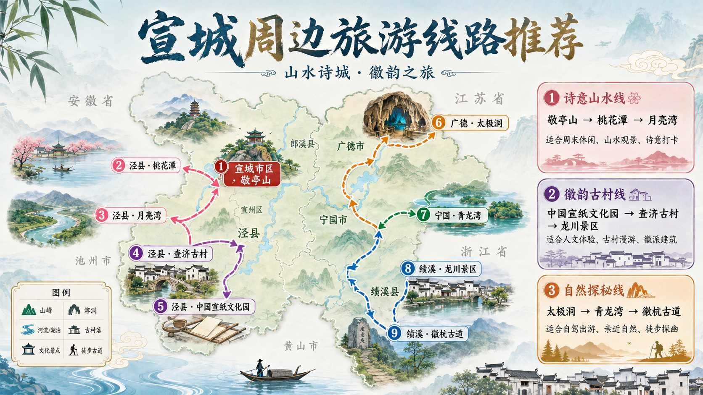
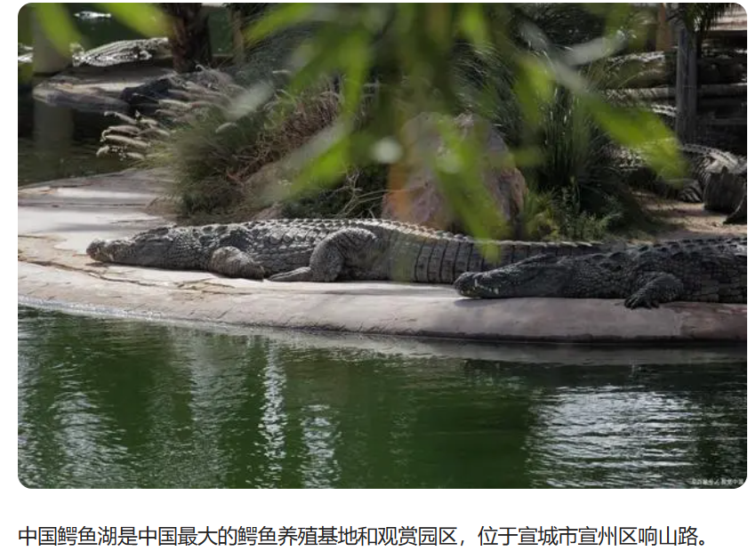
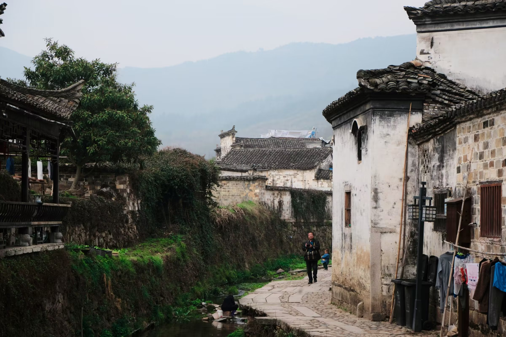
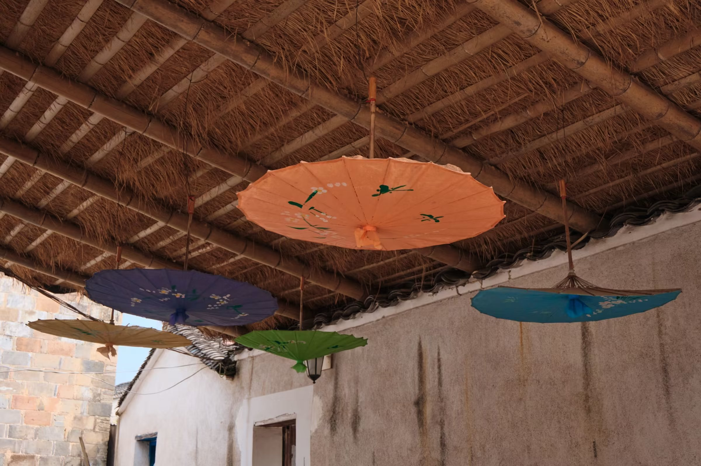
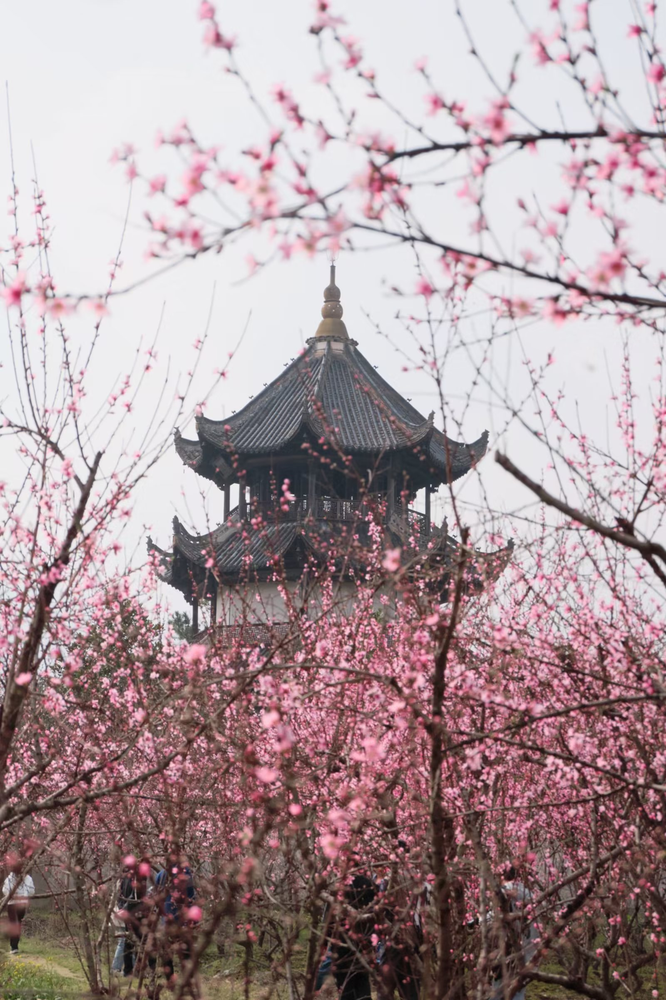
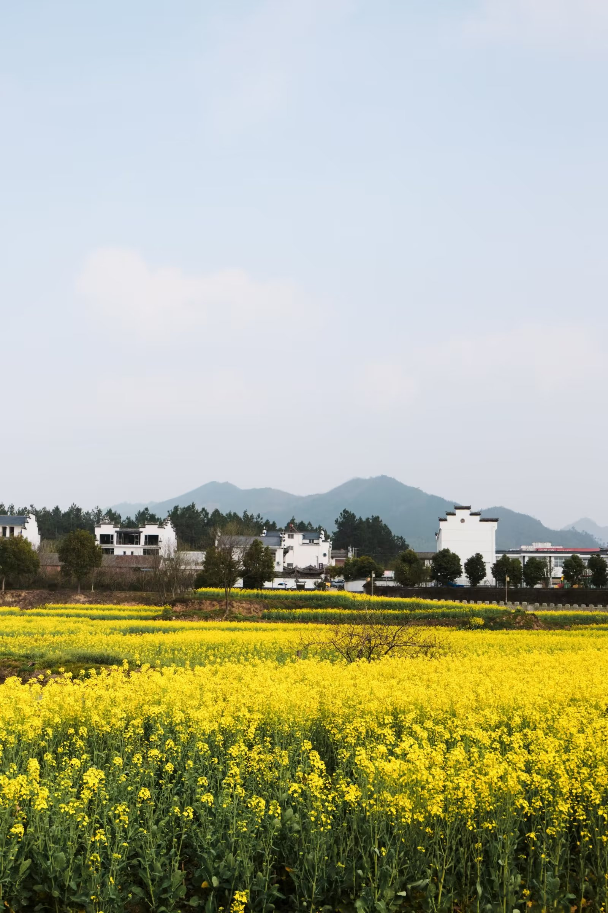

# 景点

:::tip

宣城所有的国有 A 级旅游景区均对合肥工业大学宣城校区在校学生实行免票政策，只需凭学生证即可进入[^1]

:::

## 敬亭山

> 相看两不厌，只有敬亭山。

带学生证免费（半小时车程，见过骑自行车去，可以看日出）

### 中国鳄鱼湖

扬子鳄基地不大，一小时就能转完

扬子鳄是中国特有的鳄鱼，展厅里可以近距离观察鳄鱼（超级近，但鳄鱼都不动），建议春天来，鳄鱼比较活跃

学生票半价

## 泾县

### 皖南川藏线

又称“江南天路”，是安徽省内著名的自驾路线。精华路段东起宁国市青龙乡，西至泾县蔡村镇，全长约 120 公里，穿越原始森林，风光险峻秀美。

#### 核心景点

- **储家滩**：湖面平静如镜，晨雾、落日景色极佳。
- **桃岭公路**：著名的“六道弯”，是整条路线最惊险挑战的路段。
- **方塘红杉林**：深秋时节红杉转红，如同水上森林。
- **月亮湾**：位于泾县蔡村镇，适合夏日玩水、漂流和露营。

:::warning

桃岭公路段山高路陡，弯路极多，驾车或骑行务必注意安全，减速慢行。新手司机建议结伴同行。

此外，**周末或节假日人流量极大，极易发生拥堵**，建议错峰出行。

:::

### 中国宣纸文化园

宣城被称为“中国文房四宝之乡”，而泾县则是宣纸的产地。在这里可以亲眼看到宣纸传承千年的制作工艺，甚至亲自参与“捞纸”过程。

### 查济古镇

保存得很好的一个古镇，是我国现存规模最大的明清古村落。

### 桃花潭

> 桃花潭水深千尺，不及汪伦送我情。

[^1]:
    宣城市文化和旅游局.宣城市国有 A 级旅游景区对本市学生免费开放公告[DB/OL]. (2026-01-28)\[2026-05-01].  
    <https://wjw.xuancheng.gov.cn/News/show/1696822.html>
