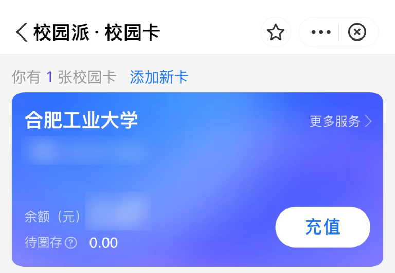

# 校园卡

:::tip

此页的主要内容为**学校官方发的、可用于食堂超市支付和开宿舍门禁等功能的实体卡片**。如果你想要找的是可插入手机作为电话卡使用的“校园卡”，请参考[此页](./calling_card.md)

:::

## 用途

- 校内付款（食堂、便利店、校医院、~~洗澡~~等）
- [图书馆](../campus/library)借书还书
- 进出宿舍、校门
- 学期初刷卡注册

## 充值

1. 支付宝搜索**校园派**小程序
2. 首次充值时需选择合肥工业大学并填写学号

:::tip
偶尔可能出现无法充值的提示，多点几次就行了
:::

