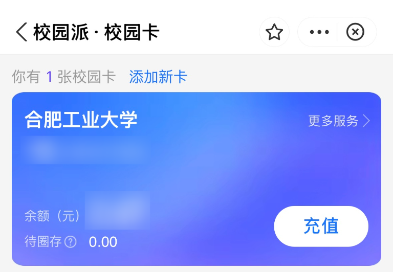

# 校园卡

:::tip

此页的主要内容为**由学校官方发放的、合肥宣城两校区通用的、可用于食堂超市支付和开宿舍门禁等的实体卡片**<mark>（又称饭卡、学生卡、一卡通）</mark>。如果你想要找的是可插入手机作为电话卡使用的<mark>「校园流量卡」、「校园电话卡」</mark>，请参考[此页](./calling_card.md)

:::

校园一卡通平台是我校智慧校园的重要组成部分，是校园金融支付和身份识别的基础平台，系统功能已涵盖了与师生工作学习生活相关的各项服务，实现了食堂餐饮、商家超市、~~热水淋浴~~^已转为呱呱物联微信小程序^、~~水费~~^已转为趣智校园微信小程序^、电费、图书借阅等各种服务系统的消费支付功能，以及教学楼、图书馆、学生宿舍、办公楼等门禁系统身份识别功能。持卡人具有的各类权限功能由校内各相关单位按学校管理规定确定并赋予，基本实现“一卡在手，走遍校园”[^1]

## 发展历程

::: timeline 2003
合肥工业大学开始“校园一卡通”项目建设[^1]
:::

::: timeline 2014
校园一卡通平台进行一期升级，向全校进行拓展[^1]
:::

::: timeline 2020
系统延伸至宣城校区，宣城校区校园卡系统以合肥本部校园卡系统为主，与本部对接、合并、互通[^2]，即<mark>两个校区的校园卡可互通使用</mark>，至此实现全校区覆盖，信息互联互通[^1]
:::

## 用途

- 校内付款（食堂、便利店、校医院等）
- [图书馆](../campus/xc/library)进出、借书和还书
- 进出宿舍、校门
- 每学期初刷卡注册
- 与虚拟卡绑定后刷卡洗澡或取水

:::tip

- 校园卡在一段时间内消费达到一定数额（约 30 元）后会要求输入密码[^4]，默认为身份证号后六位（有 X 的往前顺移一位）
- 在支持扫码支付的食堂窗口付款时，也可以打开慧新易校 APP 使用绑定的校园卡刷付款条形码，就像使用支付宝和微信支付一样[^5]

:::

## 充值

### 支付宝充值

:::tip

- 充值<mark>并非实时到账</mark>，一般需要等待 1~5 分钟。饭点期间因访问量大可能无法充值或需要等待更久才会到账，因此别忘了提前充值
- 长时间未到账可联系相关工作人员

:::

1. 支付宝搜索<mark>校园派</mark>小程序
2. 首次充值时需选择合肥工业大学并填写学号

充值后显示“待圈存”，在消费机上贴卡后自动写卡入账[^2]

### 圈存机上充值

需要与入学时学校发放的中国农业银行卡绑定才可充值^[宣区:需要验证]^。圈存机充值功能仅限学生使用[^4]

### 现金充值

在屯溪路校区馨园食堂可现金充值[^4]

## 挂失

使用[慧新易校 APP](../life/digital/app#慧新易校)进行挂失与解挂、查询流水、修改密码等操作[^3]

## 补办

:::tabs key:campus
== 屯溪路校区

携带身份证原件到屯溪路校区电教楼一楼用户服务大厅办理[^4]

== 翡翠湖校区

携带身份证原件到翡翠湖校区综合服务楼负一楼网络中心办理，其中教师卡和临时卡外不能使用自助补卡机[^4]

== 宣城校区

- 若忘记慧新易校密码，持证件和校园卡到[一站式业务服务学生社区](../campus/xc/library#一站式服务中心-勤工助学中心-104-办公室)办理[^3]
- 持证件前往位于图书馆 104 的[一站式业务服务学生社区](../campus/xc/library#一站式服务中心-勤工助学中心-104-办公室)自助或人工补办校园卡[^3]
  - 自助补卡机上补办的校园卡需至“信息服务”窗口人工柜台激活公寓门卡
  - 补办校园卡免收制卡成本费用

:::

## 技术细节

:::details

通过读卡工具检测可见，该卡为 Mifare Classic 1k（S50 类型），UID 可读，ATQA 为 `00 04`，SAK 为 `28`，支持 ISO/IEC 14443-4 协议但不支持 ISO/IEC 18092（NFC Forum Type 4 标签）。结合 SAK 值为 `28` 可判断该卡实为 CPU 卡模拟 M1 协议，常见于国内门禁或一卡通系统。根据芯片特征及市场常见方案，推测该卡为复旦微电子 FM1208 系列 CPU 卡。

该卡在 M1 模拟层中保留了若干关键扇区：扇区 0 存储厂商信息与 UID，扇区 9 和 10 存储了实际用于门禁鉴权的数据。除扇区 9 和 10 外，其余扇区的 KeyA 和 KeyB 均为默认密钥 `ffffffffffff`，可自由读写。而扇区 9 和 10 的 KeyA 同样为 `ffffffffffff`，具备完整读写权限；KeyB 则基于特定算法生成，控制区块及访问权限，但目前尚未明确该设计的具体用途。

在实际门禁场景中，使用 CUID 卡复制该卡的 M1 部分（包括 UID 及扇区 9、10 的数据）后，可成功模拟原卡并通过宿舍门禁系统。进一步调试发现，门禁设备仅通过 KeyA (`ffffffffffff`) 读取扇区 9 和 10 的加密数据进行鉴权。因此，将这两个扇区的 KeyB 也改写为 `ffffffffffff`，即可将卡片还原为“未加密”状态（仅对使用 KeyA 验证的设备有效），便于后续读写或模拟操作。

尽管使用 CUID 实体卡可以完美复制该卡的 M1 模拟层并通过门禁，但尝试使用手机 NFC 直接模拟该卡时，实测不可行。主要原因可从三个层面分析：

### 1. 射频物理层不兼容（主因）

在手机 NFC 处于 M1 卡模拟模式时，使用 Proxmark3 对空中信号进行嗅探，发现门禁读卡器持续发送 WUPA（0x52）与 REQA（0x26）唤醒指令，但手机的 NFC 控制器自始至终未返回任何应答帧（ATQA），通信完全未建立。

这与手机的 NFC 控制器设计有关。主流手机的 NFC 芯片（NXP PN54x/PN55x 系列等）在 M1 卡模拟模式下通常采用主动负载调制（Active Load Modulation），而非真实 M1 卡的无源负载调制。主动负载调制会自行生成副载波，其信号波形、幅度和相位响应与真实 M1 芯片存在差异。部分对射频特征敏感的门禁读卡器（尤其是功率较低、天线较小的嵌入式读卡器）无法正确唤醒手机 NFC 控制器，或唤醒阈值不匹配，导致手机在磁场中完全“沉默”。

### 2. 协议层时序与帧边界问题

即使使用 Proxmark3（其射频模拟电路比手机更接近真实 M1 芯片）进行 M1 模拟测试，仍无法成功通过该门禁。通过 Proxmark3 内部 trace 分析发现，防冲撞流程的前半段——WUPA/ATQA 握手、UID 读取（`93 20`）——均可正常完成，但门禁读卡器发送 `93 70`（选中 UID）命令时，Proxmark3 的模拟固件频繁出现帧边界解析错误，将该帧截断或误判为新的读 UID 请求，导致防冲撞永远无法进入 SAK 确认及后续的扇区认证阶段。

这表明门禁读卡器在 ISO 14443-3 协议的某些帧上可能存在非标准时序或编码方式，对模拟设备的协议解析精度要求极高。手机 NFC 控制器的固件在 M1 模拟方面通常只实现了标准协议的最小必要子集，对这类边缘情况的兼容性远不如实体卡硬件。

### 结论

受限于手机 NFC 控制器的射频物理特性、M1 模拟的协议兼容性边界，使用手机直接模拟该卡通过门禁系统不具备可行性。当前最稳定的替代方案为使用超薄 CUID 贴纸卡复制 M1 模拟层数据，并粘贴于手机背部或壳内，以实体卡片形式实现便携使用。

尽管该卡具备 CPU 功能，可能内置更复杂的加密与逻辑控制，但逆向分析客户端读卡/写卡程序以研究其 CPU 层行为难度较大，且对实际门禁模拟并无显著收益，因此目前仅聚焦于其 M1 模拟层的处理与复制。

:::

[^1]:
    合肥工业大学信息化建设与管理办公室.校园卡[DB/OL]. \[2025-07-22].  
    <https://it.hfut.edu.cn/fwzn/xyk.htm>

[^2]:
    合肥工业大学宣城校区管委会.关于校园卡互通切换的通知[DB/OL]. (2020-08-18)\[2025-07-22].  
    <https://xc.hfut.edu.cn/75/15/c105a29973/page.htm>

[^3]:
    合肥工业大学宣城校区信息化建设和发展中心.一卡通服务[DB/OL]. \[2025-07-22].  
    <https://xcxxzx.hfut.edu.cn/87/list.htm>

[^4]:
    合肥工业大学信息化建设与管理办公室.常见问题[DB/OL]. \[2025-08-10].  
    <https://it.hfut.edu.cn/cjwt.htm>

[^5]:
    妄想泡泡.重大研究成果——从此不用带饭卡[DB/OL]. (2026-04-29)\[2026-04-30].  
    <https://tieba.baidu.com/p/10677460955?fr=frs>
