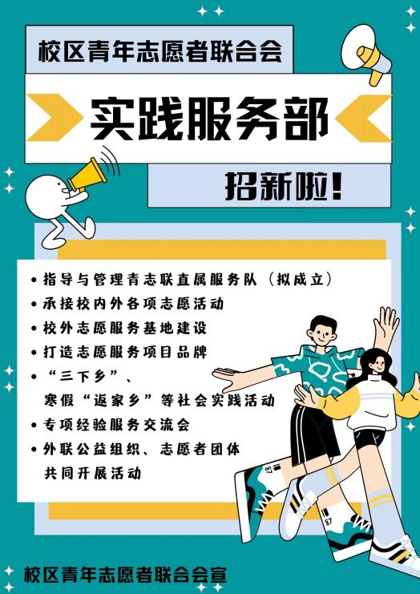
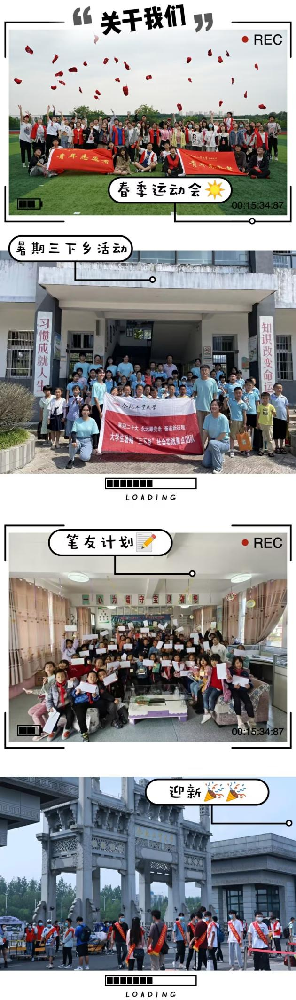
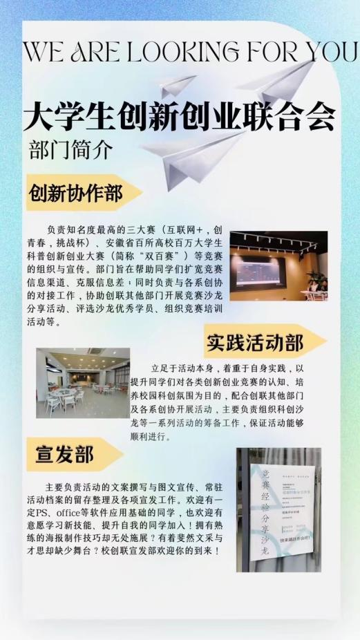
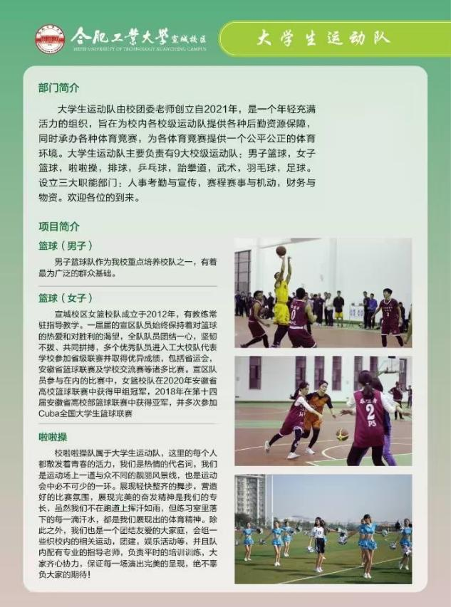
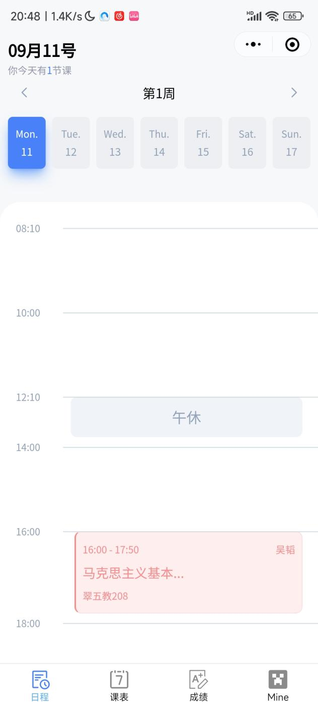
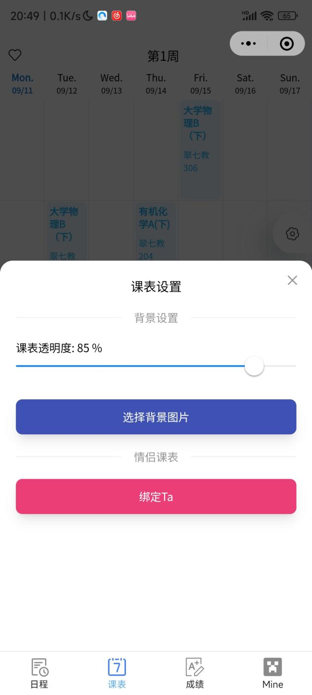
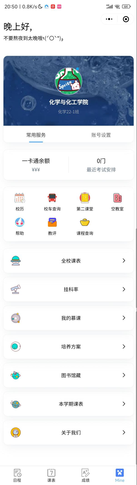

# 生活相关

## 校区环境

宣区校园环境优美，主打一个亲近自然，布局请移步[校园地图](\l)，以下是风景展示

## 宿舍环境

宣区宿舍都为标准四人间，上床下桌，自带阳台，每层楼都有卫生间，淋浴间，开水器，热水收费，洗澡是隔间，有隔板和帘子，宿舍限电八百瓦，卫生间有公共洗衣机，和给吹风机用的插座，非节假日11点停电（如果停电后可以需要用电可以用空调电，就是用超长插座（3米左右）接空调插座，但是务必注意消防安全）洗衣机如果嫌弃公用的可以寝室一起买，放在阳台。

## 宣城景点

宣城地域与南京合肥等大城市都是比较近的，但是宣城自身比较小，来自大城市的同学可能会不太适应。学校附近较近的餐馆街有北门对面的翡翠豪庭那条街（不知道叫啥），和十字路口那的移民巷（又叫东交民巷，已经听说已经没什么人了，我没去过）

一般可以周末去玩的有

敬亭山：带学生证免费（半小时车程，见过骑自行车去，听说日出）

宣城万达广场（附近有个银桥湾夜市也不错，可坐公交或者打的，打的一般十几块，或者半小时左右自行车也不是不行）

国购广场（消费水平比万达低一点，可坐公交或者打的，或者半小时左右，自行车没试过，比万达远一点）

鳄鱼湖：学生票半价

## 学生组织介绍

学生组织分为系级的和校级的，包括运动队，艺术团，学生会，青志联等等，学生组织也是有招新的，各位新生可以多留意一下，有的会宣讲，有的会贴海报，以下是去年的部分校级组织的招新（还有个社团联合会，但我没找到都来自于学生会和青志联qq官方账号）

### 学生会 {#学生会 .unnumbered}

### 大艺团 {#大艺团 .unnumbered}

### 青志联 {#青志联 .unnumbered}

二维码是去年的

### 创协 {#创协 .unnumbered}

### 大艺团 {#大艺团-1 .unnumbered}

### 运动队 {#运动队 .unnumbered}

### 校全媒体 {#校全媒体 .unnumbered}

负责各个学校官方号的运营，包括拍照摄影文案等等。

### 社联 {#社联 .unnumbered}

管理社团事务的

以上都为校级别学生组织

### 系级别 {#系级别 .unnumbered}

系级别有系学生会，青协，系运动队，团委，心协等等

## 社团介绍

学校社团招新统一于百团大战，去年为10月1日上午，一般在十月初，以下为名单（存在部分社团消失，比如天文社，也有部分社团正在筹备建立，比如游戏开发社）

![\[Thumb\]640320823010-972f0a19-b945-37cd-a0c3-c31db](./media/image65.jpeg)

## 老乡群统计

老乡群集合

甘肃老乡群149021381

宁夏老乡群211532886

广西老乡群261973916

内蒙老乡群 183140555

青海老乡群138919359

江西老乡群119547332

山西老乡群216330227

贵州老乡群414734844

黑龙江老乡群202973043

云南老乡群467295105

陕西老乡群250251829

湖南老乡群365188743

河北老乡群329036230

天津老乡群272320624

辽宁老乡群254134589

吉林老乡群104773507

河南老乡群261814057

山东老乡群242792031

江苏老乡群104330281

浙江老乡群250366224

福建老乡群563514587

广东老乡群567910252

湖北老乡群306502831

重庆老乡群154399272

四川老乡群250882040

安徽省内市老乡群

马鞍山老乡群196962839

淮南老乡群274446907

定远老乡群544567229

亳州老乡群469204736

合肥老乡群259550801

淮北老乡群261930026

宿州老乡群278537058

蚌埠老乡群336740921

阜阳老乡群238582692

六安老乡群712027786

芜湖老乡群235899822

铜陵老乡群331793561

安庆老乡群279673384

黄山老乡群115473777

## 生活费

看你自己，一个月600能活，大多数同学1000到1500，2000以上属于比较多了，~~如果达到五位数请包养我~~，如果家庭条件困难，请联系导员申请助学金，也可以兼职做家教（可以找学长学姐要群），两小时能赚150\~300。千万不要因为没钱辍学，读书改变命运。

## 校园网

校园网是学校建设的网络，属于非盈利项目（赔钱的那种，不存在专你钱），许多事务需要校园内网进行。每月免费40G（以前是20G）超出额度1元2G，法定节假日和寒暑假免费（这时因为用的人多会很卡），每天额度20G，宿舍桌子后有网线（宿舍内wifi有些地方会比较差，建议插网线，没网线的笔记本可以买扩展坞），教学楼图书馆有WiFi（信号强），校园网插口存在问题可以报修，如果是整栋楼有问题，建议反应到学校信息化建设中心。

## 课表小程序

学校课表可以官网查看，但是官网的太过复杂，且麻烦，于是就有了学长开发了课表小程序，课表小程序使用最多的一般是由本校的学长开发的HfutSpace。主要功能包括查看课表以及[查看成绩排名。]{.underline}（这个功能官网做不到）

### Hfutspace {#hfutspace .unnumbered}

一、查看课表

在界面1与界面2均可以查看开课教室以及上课时间。并且在界面1与界面2下点击课程名称都可以看到更加详细的信息（界面3），在界面3下还可以查看同班同学（界面4）或者查询挂科率（界面5）。

界面1 界面2

界面3

界面4 界面5

同时，在界面2下点击齿轮图标还可以进行一些课表的设置。（不要问我情侣课表怎么搞，自己去找个男/女朋友和TA试试）

界面2下点击选择学期，可以查看不同学期的课表。

二、查看成绩

小程序内可以查看自己的总排名、单科分数以及单科排名。（因为只会计入使用小程序的同学的成绩，所以可能会出现专业人数不够或者排名不准的情况）

3.  其他功能

大部分没什么好说的或者看名字就知道内容，那这部分我就挑一些我觉得有用的功能来说。

1.  最近考试安排：能看到最近考试的数量，点击进去可以看到每门考试的地点，起止时间以及给你剩下的复习时间。

2.  校历：包含每学年的入学时间、校运动会时间、考试周以及部分节假日信息。不过导员也会发每学年的校历，所以并不一定要在小程序上看。

3.  校车查询：这个功能对于宣城校区的同学而言大多数情况下是没用的，因为只能查询屯溪路校区与翡翠湖校区之间的校车。当然，如果宣城校区的同学有机会能去合肥校区参与活动的话，也可以乘坐校车在两个校区之间游览游览，特别是要尝尝屯溪路校区的食堂。

4.  第二课堂：点击后会跳转到合工大的"第二课堂成绩单"小程序。第二课堂事关毕业，不过通常来说学校都巴不得你毕业，所以不用担心。想要达到毕业的标准很简单，但如果要当二课战神想要星星点灯的话就得多多参加各类活动了。

### 肥工小宇宙 {#肥工小宇宙 .unnumbered}

开发这款小程序的学长现在正在开发一款集成HfutSpace小程序以及合工大论坛为一体的app，目前还处于测试阶段，欢迎各位同学加群了解。群号为：813152217。

## 10.志愿活动 {#志愿活动 .unnumbered}

志愿服务是不以获得报酬为目的，自愿奉献时间、智力、体力、技能等，帮助他人、服务社会的公益行为。

首先关于志愿时长：

志愿服务时长记录起止点为志愿服务开始时间和结束时间，以1小时为最小计数单位，学生志愿服务时长每日认定一般不超过8小时。时长认定由活动结束后组织方提交申报材料，并确定录入，可于第二课堂成绩单查询。

志愿时长的作用：

二课达到30小时一颗星，50小时两颗星，80小时三颗星，120小时四颗星，200小时五颗星。

保研加分：达到100小时社会工作及社会实践能力模块加0.5分。

在合工宣，志愿服务内容一般有公共服务类、社区服务类、校园文明类、有时也会有一些资料整理之类的杂项

志愿活动有校内志愿和校外志愿两个部分：

关于校内志愿：

一般由各个院系的青年志愿者协会和校区青志联组织，也会有一些临时志愿（多为体力活）。志愿活动一般会在各系负责的志愿qq群发布，以扫码填写表单或者发送学号等个人信息等作为报名方式，后续会建立志愿小群进行下一步通知。一些志愿qq群我会放在后面，应该算是比较完整了。

关于校外志愿：

校外志愿指的是学生参加的非学校统一组织的志愿服务，一般是在寒暑假进行，时长每学期认定上限为30小时，本科阶段认定总计不超过60小时。需要提供校外活动认定表和志愿证明（由非盈利的官方组织盖章），可能还需要提供志愿的照片和视频等，具体情况取决于各系要求。

个人收集的志愿服务群：

校区青志联官方群：831258041

机械工程系：765484407

暖阳志愿群：928952007

计算机与信息系：121306269

食品科学系：790090236

经贸系：1073351878

电气与自动化：905332809

英语系：330808207

材料工程系：895828320

城市建设与工程系：959668400)

学生活动临时项目组：441091343
