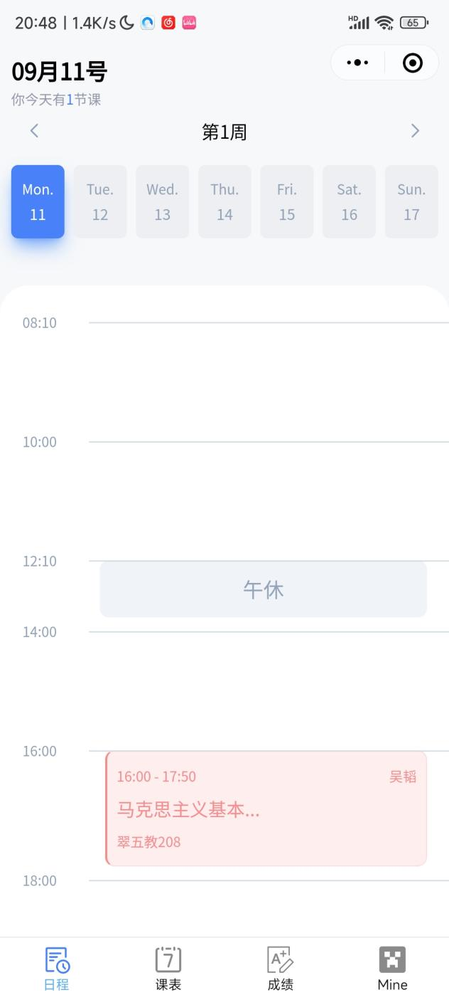
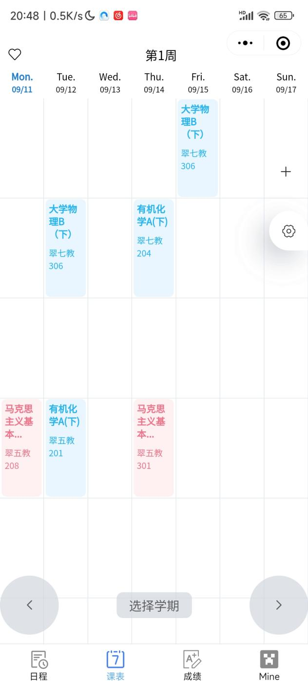
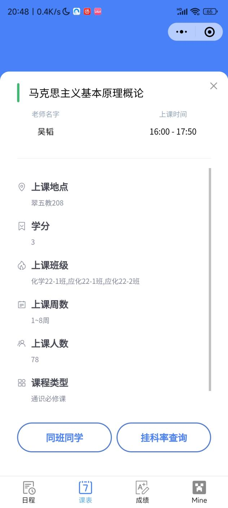
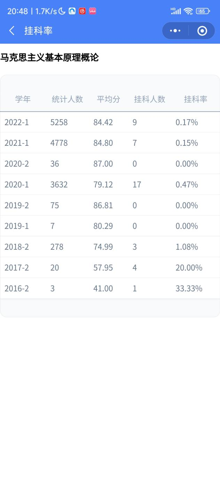
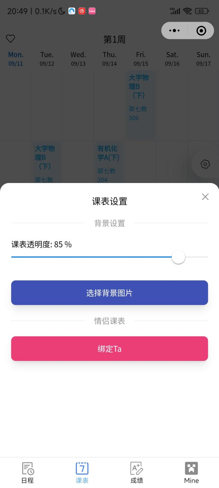
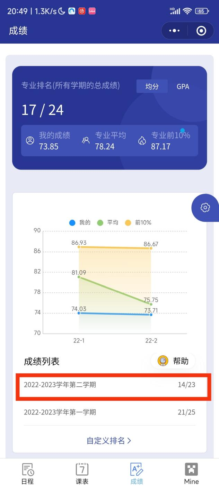
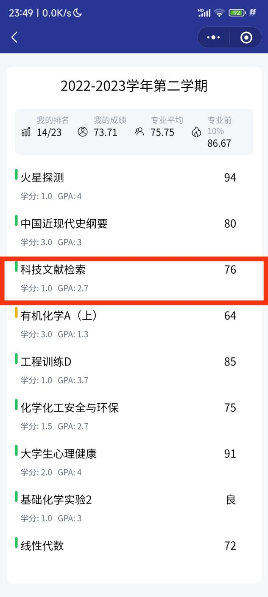
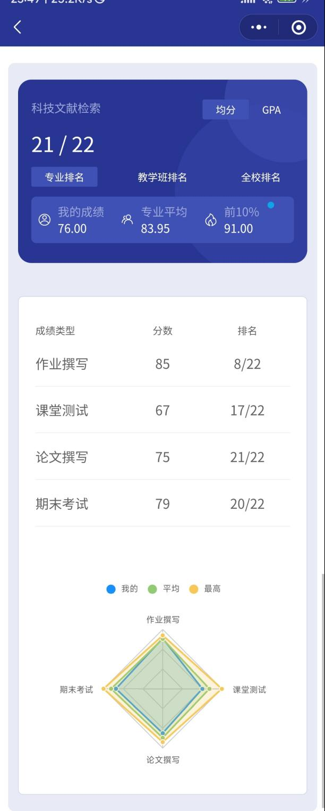
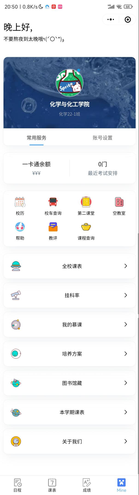

# 必备小程序 / APP

[[toc]]

## 今日校园 <Badge text="App" />

对接[综合信息门户](https://one.hfut.edu.cn/)，主要用于晚自习请假、离宣申请、心理测评等

- [Android](market://details?id=com.wisedu.cpdaily)
- [iOS](https://apps.apple.com/cn/app/id1207509945)

## 慧新易校 <Badge text="App" />

查校园卡流水、宿舍电费充值、宿舍浴室充值、校园网费充值

- [Android](market://details?id=com.synjones.mobilegroup.ECampus)
- [iOS](https://apps.apple.com/cn/app/id1537064222)

## 云运动 <Badge text="App" />

校园跑

- [Android](market://details?id=com.yunzhi.tiyu)
- [iOS](https://apps.apple.com/cn/app/id1563408569)

## EMobile7 <Badge text="App" />

学校 OA 平台，主要给教师使用，不过也可以用来查询校园卡流水、充值网费、电费

登陆时填入学校服务器地址`https://zjgd.hfut.edu.cn:8999`

- [Android](market://details?id=com.weaver.emobile7)
- [iOS](https://apps.apple.com/cn/app/id1437702418)

## 聚在工大 <Badge text="App" />

- GitHub: [Chiu-xaH/HFUT-Schedule](https://github.com/Chiu-xaH/HFUT-Schedule)
- gitee: [chiu-xah/HFUT-Schedule](https://gitee.com/chiu-xah/HFUT-Schedule)
- F-Droid: [com.hfut.schedule](https://f-droid.org/packages/com.hfut.schedule/)

适用于合肥工业大学(HFUT)的学校服务聚合 APP，查询教务、校园卡、网电费等

## HFUTSpace <Badge text="小程序"  type="info"/>

> GitHub: [hfut-soft-ware/hfut-space-app](https://github.com/hfut-soft-ware/hfut-space-app)

学校课表可以在官网查看，但是官网的太过复杂且麻烦，于是就有了学长开发了课表小程序。

课表小程序使用最多的一般是由学长开发的 **HFUTSpace** 。主要功能包括查看课表以及**查看成绩排名**（这个功能官网做不到）。

### 查看课表

在日程页面与课表页面均可以查看开课教室以及上课时间。

:::details 图片

:::

点击课程名称都可以看到更加详细的信息。

在课程信息下还可以查看同班同学或者查询挂科率。

:::details 图片

:::

在课表界面下点击齿轮图标还可以进行一些课表的设置。（不要问我情侣课表怎么搞，自己去找个男/女朋友和 TA 试试）

课表界面下点击选择学期，可以查看不同学期的课表。

### 查看成绩

小程序内可以查看自己的总排名、单科分数以及单科排名。（因为只会计入使用小程序的同学的成绩，所以可能会出现专业人数不够或者排名不准的情况）

:::details 图片

:::

### 其他功能

- **最近考试安排**
  能看到最近考试的数量，点击进去可以看到每门考试的地点，起止时间以及给你剩下的复习时间。
- **校历**
  包含每学年的入学时间、校运动会时间、考试周以及部分节假日信息。不过导员也会发每学年的校历，所以并不一定要在小程序上看。
- **校车查询**
  这个功能对于宣城校区的同学而言大多数情况下是没用的，因为只能查询屯溪路校区与翡翠湖校区之间的校车。当然，如果宣城校区的同学有机会能去合肥校区参与活动的话，也可以乘坐校车在两个校区之间游览游览，特别是要尝尝屯溪路校区的食堂。
- **第二课堂**
  点击后会跳转到合工大的"第二课堂成绩单"小程序。第二课堂事关毕业，不过通常来说学校都巴不得你毕业，所以不用担心。想要达到毕业的标准很简单，但如果要当二课战神想要星星点灯的话就得多多参加各类活动了。

## 肥工小宇宙 <Badge text="App" /> <Badge text="开发中" type="warning"/>

开发 HFUTSpace 小程序的学长现在正在开发一款集成 HFUTSpace 小程序以及论坛社区为一体的 app，目前还处于测试阶段，欢迎各位同学加群了解。

群号为：813152217。

## HFUT+ 小程序 <Badge text="小程序"  type="info"/>

**HFUT+** 是一款服务于合肥工业大学学生的小程序，方便查询教务等信息。其功能包含课表查询、一卡通流水查询、考试成绩查询、空教室查询、挂科率查询等

该小程序完全免费，功能强大，界面简洁
