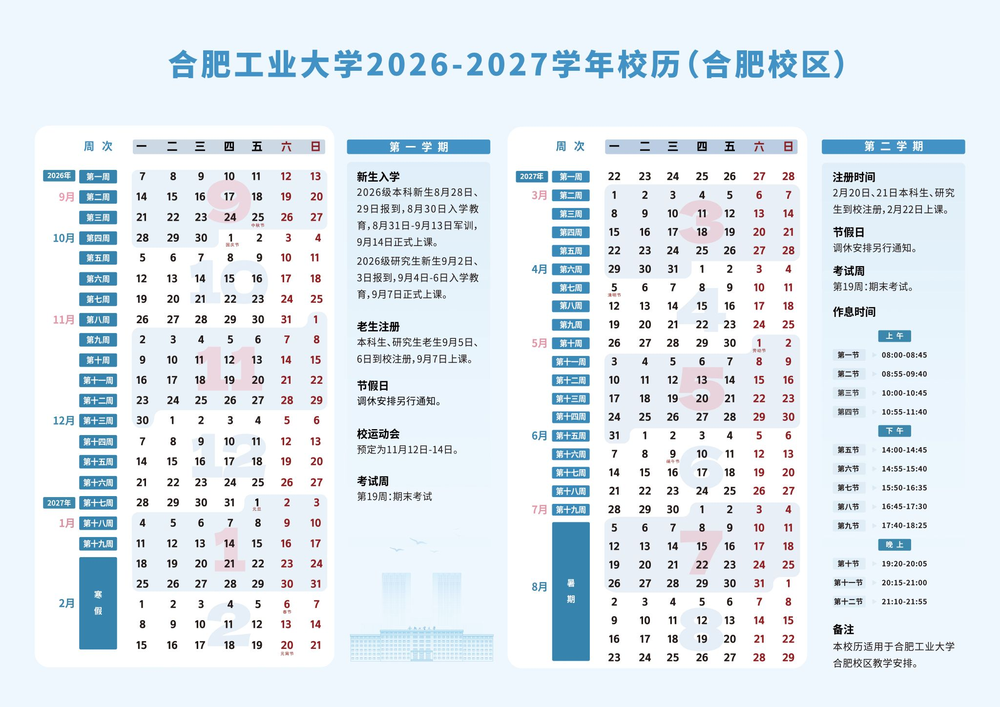
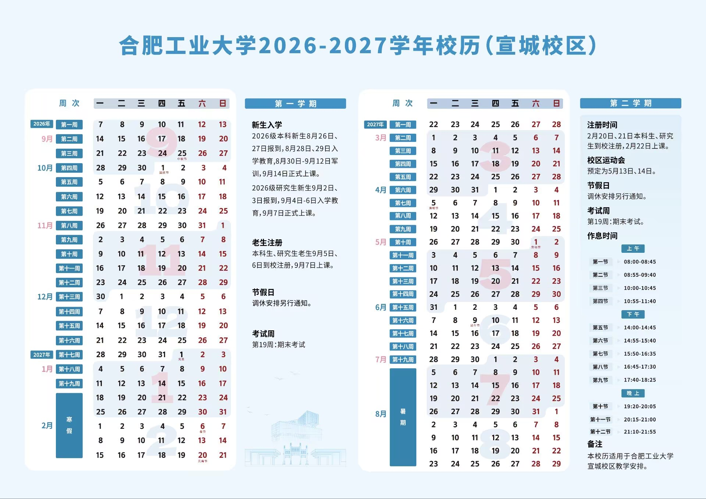

# 校历与作息

## 校历

:::tabs key:campus

== 合肥校区

 [^1]

== 宣城校区

 [^1]

:::

## 作息时间

### 当前学期

:::tabs key:campus

== 屯溪路校区

|    节次     |                 开始时间                 |
| :---------: | :--------------------------------------: |
| 第 1、2 节  |                   8:00                   |
| 第 3、4 节  |                  10:10                   |
| 第 5、6 节  | 14:00（第一学期）  14:30（第二学期） |
| 第 7、8 节  | 16:00（第一学期）  16:30（第二学期） |
| 第 9、10 节 |                  19:00                   |

== 翡翠湖校区

|    节次     | 开始时间 |
| :---------: | :------: |
| 第 1、2 节  |   8:10   |
| 第 3、4 节  |  10:20   |
| 第 5、6 节  |  14:00   |
| 第 7、8 节  |  16:00   |
| 第 9、10 节 |  19:00   |

== 宣城校区

|   节次   |    时间     |
| :------: | :---------: |
| 第 1 节  |  8:00-8:50  |
| 第 2 节  |  9:00-9:50  |
| 第 3 节  | 10:10-11:00 |
| 第 4 节  | 11:10-12:00 |
| 第 5 节  | 14:00-14:50 |
| 第 6 节  | 15:00-15:50 |
| 第 7 节  | 16:00-16:50 |
| 第 8 节  | 17:00-17:50 |
| 第 9 节  | 19:00-19:50 |
| 第 10 节 | 20:00-20:50 |
| 第 11 节 | 21:00-21:50 |

:::

### 下学期

2026-2027 学年第一学期（9 月 7 日至 1 月 17 日，共 19 周）

|   节次   | 时间        |
| :------: | ----------- |
| 第 1 节  | 8:00-8:45   |
| 第 2 节  | 8:55-9:40   |
| 第 3 节  | 10:00-10:45 |
| 第 4 节  | 10:55-11:40 |
| 第 5 节  | 14:00-14:45 |
| 第 6 节  | 14:55-15:40 |
| 第 7 节  | 15:50-16:35 |
| 第 8 节  | 16:45-17:30 |
| 第 9 节  | 17:40-18:25 |
| 第 10 节 | 19:20-20:05 |
| 第 11 节 | 20:15-21:00 |
| 第 12 节 | 21:10-21:55 |

[^1]:
    合肥工业大学.工大校历[DB/OL]. (2025-07-08)\[2026-05-06].  
    <https://www.hfut.edu.cn/gdxl.htm>
