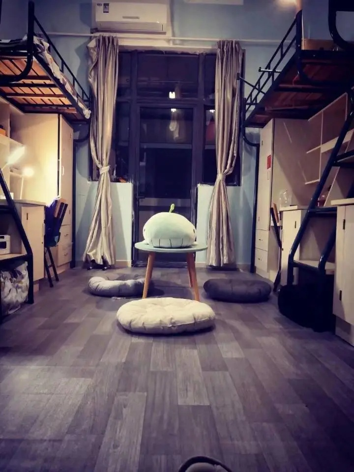

# 宿舍

## 面积

约 20m²

## 人数

均为四人间，上床下桌

## 床位尺寸

1.9m\*0.9m

## 阳台

有，提供脸盆架、洗脸池和洗衣机水龙头接口

## 空调

有，24h 不断电

需要以寝室为单位租赁，以 23&24 年南区宿舍新换 KFR-35GW 型空调为例，价格如下：

| 租赁年限 | 价格（元） |
| -------- | ---------- |
| 半年     | 243        |
| 1 年     | 405        |
| 2 年     | 770        |
| 3 年     | 1029       |
| 4 年     | 1199       |

另需缴纳空调电费，夏季中高强度使用日均 6~8 元

## 用电

学生公寓智能用电管理系统为每宿舍<mark>统一设置功率参数 800W</mark>，会智能识别大功率用电设备，违规使用各类违规电器系统一旦识别将自动断电。

解决办法：停止使用违规用电设备，系统将于 5 分钟后自动送电。

断电时间取决于第二天是否为工作日（需要上课）

- 若第二天为工作日（一般的周日到周四和放假的最后一天）
  - **23:00** - 次日 6:00 断电断网
- 若第二天为非工作日（一般的周五和周六、放假前一天以及放假期间）
  - **00:00** - 6:00 断电**不断网**

:::details

断电后空调插座（16A）仍不断电

:::danger

使用插排取空调电使用**属于违纪行为，造成的一切后果和代价与本页编写者无关**

在宿舍检查时一经发现，则该寝室该次检查记为 0 分，同时还会被上报学校并需要写检讨，发现超过 2 次取消年度评奖评优资格

:::

学生公寓电费采用预付费方式（0.57 元/度），即电费余额为零时，自动停电。空调插座具有单独计费账户，除空调外的所有插座和灯具用电共同计为照明账户。

充值请使用[慧新易校 APP](../life/app#慧新易校)，用校园卡内余额进行充值。

:::info

**缴电费须知**

- 每日 23:00 之前缴费，最迟 23:00 到账，23:00 之后缴费，次日 6 点到账，在 23:01-6:00 时间段，账户如果欠费不会断电。
- 北生活区缴费（1 至 5 栋）：楼宇编号+房间号+南楼或北楼（定义 300110111：3001 代表一栋，101 房间号，11 代表南边，21 代表北边）
- 南生活区缴费（6 至 10 栋）：楼宇编号+房间号+南楼或北楼（定义 3006 101 11，3006 代表 6 栋，101 房间号，11 代表南边照明，12 代表南边空调，21 代表北边照明，22 代表北边空调）[^1]

:::

## 热水、直饮水

:::warning

宿舍内不允许使用热水壶、热得快等大概率加热设备
:::

学校于 2024 年 9 月[^2]更换了新的热水机，有生活开水、直饮开水和直饮常温三种选择

### 取水教程

1. 在支付宝搜索**趣智校园**小程序，首次使用需要注册
2. 在小程序首页点击扫一扫，扫码出水口上的二维码
3. 在手机上点击出水
4. 接水结束后点击结束用水

还可在小程序-我的-卡片绑定内输入卡物理 ID 并绑定，从而实现刷卡开始放水，拿卡停止放水，自动从支付宝扣款。

卡物理 ID 可使用[MifareClassicTool](https://github.com/ikarus23/MifareClassicTool)或[NFCTools](market://details?id=com.wakdev.wdnfc)搭配具有 NFC 功能的 Android 设备获取，但应该有更简单的方式。

#### 计费标准

| 类型     | 价格（元/升） |
| -------- | :-----------: |
| 生活开水 |     0.06      |
| 直饮开水 |     0.15      |
| 直饮常温 |     0.01      |

按每 200ml 计算费用

##### 取整方式

- 使用先充值后取水时（小程序预充值后扫码或绑定校园卡刷卡）不取整而是保留三位小数进行计费
- 使用手机扫码取水结算时向下取整到 0.01 元
  - ~~这意味着可以每次接 0.008 元的直饮常温水，无限畅饮~~

:::info

- **生活开水**
  - 直接将自来水烧开
    - 口感上差和直饮开水差别貌似不是很大（可能因人而异）
- **直饮开水**
  - 自来水过滤后烧开
- **直饮常温**
  - 过滤自来水

:::

## 卫生间&浴室

宿舍**无独立卫浴**，但有公共卫生间和浴室

### 分布

北区位于东西两侧楼梯口旁边，南区位于每层两头和中间，其中中间位置只有卫生间，无浴室

### 浴室

每个浴室有四个淋浴间，目前已于 2024 年 12 月前改造完成[^3]

:::details 使用方法

#### 充值

1. 在微信小程序 呱呱物联 注册
2. 下载[慧新易校 APP](../life/app#慧新易校)，在大厅中选择 宣城浴室充值
3. 输入第一步注册的手机号进行充值

#### 使用

- 手机扫码
  - 打开微信小程序 呱呱物联扫描开关上方的二维码
- 校园卡刷卡
  - 需要预先绑定
- 洗浴码
  - 在呱呱物联小程序上设置好后，在水控机上输入洗浴码即可

:::

:::details 计费标准
预扣款 5 元，按**热水水量**计费，貌似比原来的标准略贵一点点

最热档最大水量 30 秒约 0.1 元^[需要验证]^

标称热水价格：25 元/吨[^4]
:::

:::details 旧的计费标准

刷卡后预扣款 1 元后即可出水，按 **0.03 元/10 秒** 计费，用水结束后再次刷卡即可离开

::::tip
夏天洗澡一般花费 0.6~1.5 元，冬天可能花费 1~4 元。洗澡时间因个人习惯而异，此处仅供参考
::::

### 洗衣机

在每个浴室内有一台洗衣机 or 洗鞋机 or 烘干机

如果嫌弃公的用或有洁癖可以寝室一起买一台洗衣机，放在阳台，可联系安装师傅帮忙更换洗衣机专用水龙头

:::warning
为了宿舍楼内的和睦和健康安全，**不要使用公用洗衣机洗鞋子/内裤/袜子**
:::

### 吹风机

扫码使用，0.01 元/分钟

## 门禁

南区 6~10 栋宿舍楼设有门禁，刷学生卡开门

宿舍楼大门晚上会锁，时间与断电时间基本一致。晚归需登记，可能会被骂一顿，但是总归能回宿舍

宿舍门需刷校园卡开门，若没带卡被锁门外，请前往一楼宿管阿姨处登记借用万能卡开门

## 查寝

以导员要求为定，不同系不同年级均有区别，大部分导员不会亲自来寝室，一般以班长进行人数清点、签字等方式进行

## 宿舍检查

学校会安排每周内固定的一天进行宿舍检查，检查结果按照寝室打分，而不是床位打分

寝室安全卫生检查成绩非常重要：

1. 会记录在第二课堂成绩单里的**劳动实践**模块，后面评奖评优时会折算成成绩。
2. 会记录在评奖学金时的**综合评议成绩**模块
   一学年宿舍生活规范检查，寝室卫生状况全年总分排名位于后 10%且平均分低于 75 分的宿舍，寝室每人减 2 分。寝室卫生全年平均成绩排名位于前 10%，寝室每人加 2 分。（因各院系而异）
3. 会体现在入团和入党答辩时的**寝室卫生**模块。

寝室卫生成绩可以在[这个网站](https://39.106.82.121/query)查询，格式为 1N101，8#201，10S301 等，有的时候会将卫生成绩打印出来公示在宿舍一楼

如果对寝室卫生分数存有疑问的可以[填写申请复核表单](https://f.wps.cn/ksform/w/write/LrDO4WWM)，复核表单每周周三到周六晚 22:00 开放权限，次周周三前会有专人反馈复核结果

:::tip

1. 建议能收起来的东西尽量收起来，最好锁起来
2. 吹风机、电饭煲、热得快、锅碗、油盐酱醋等违规物品，严禁出现在寝室
3. 空调插孔是专用，严禁用作其他用途
4. 严禁私拉乱接电线
5. 人离开宿舍，各种电源应关闭、拔掉，如寝室灯、手机充电器、充电宝等

:::

[^1]:
    缴电费说明 [2025-03-15].  
    <http://172.31.248.26:8088/Category/PageServiceDetails?appid=10000>

[^2]:
    关于学生公寓洗衣机、直饮水机安装的通知 [2024-09-27].  
    <http://xcbwb.hfut.edu.cn/99/fb/c1596a39419/page.htm>

[^3]:
    宣城校区学生公寓洗浴间装修改造施工公告 (2024-09-19)\[2024-09-27].  
    <http://xc.hfut.edu.cn/9a/3f/c1955a39487/page.htm>

[^4]:
    合肥工业大学宣城校区学生公寓洗浴热水、洗衣机、开水机运营维护项目（FS24000007）中标结果公告 (2024-08-23)\[2025-03-15].  
    <https://zb.hfut.edu.cn/provider/#/publish/20M062J7UW32HS9Q>
