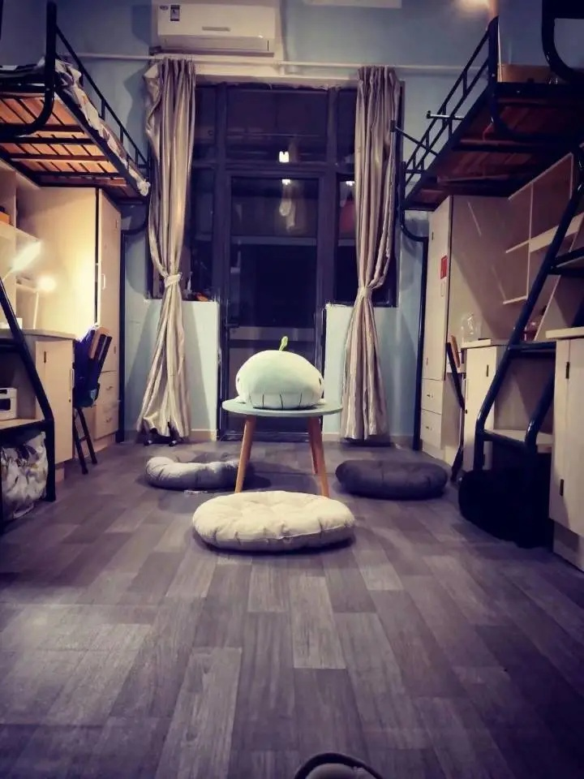

# 宿舍

## 门禁

:::tabs key:campus

== 屯溪路校区

== 翡翠湖校区

== 宣城校区

宿舍楼大门晚上会锁，时间与断电时间基本一致，但是节假日期间可能会更晚一点。晚归需登记，也可能会被骂一顿（但没有实质性影响，不影响评优评先等），但是总归能回宿舍

宿舍门需刷校园卡开门，若没带卡被锁门外，可前往一楼宿管阿姨处登记借用万能卡开门

:::

## 查寝

以导员要求为定，不同系不同年级均有区别，大部分导员不会亲自来寝室，一般以班长进行人数清点、签字等方式进行

:::info

2025-2026 年第二学期宣城校区!!因突发各种原因!!导致查寝频率较高，出现了每周查寝甚至每天查寝的情况，建议做好心理准备

:::

## 卫生检查

学校会安排每周内固定的一天（会提前告知）进行宿舍检查，检查结果按照寝室打分，而不是床位打分

寝室安全卫生检查成绩会在一定程度上影响评优评先或者第二课堂的劳动实践板块分数，但可能因院系不同而有所差异

<!-- 宿舍成绩 -->
<DeeplinkBtn href="hfut_schedule://dormitory" text="通过聚在工大App查询宿舍卫生成绩"/>

:::tip

1. 建议能收起来的东西尽量收起来，最好锁起来
2. 吹风机、电饭煲、热得快、锅碗、油盐酱醋等违规物品，严禁出现在寝室
3. 空调插孔是专用，严禁用作其他用途
4. 严禁私拉乱接电线
5. 人离开宿舍，各种电源应关闭、拔掉，如寝室灯、手机充电器、充电宝等

:::
