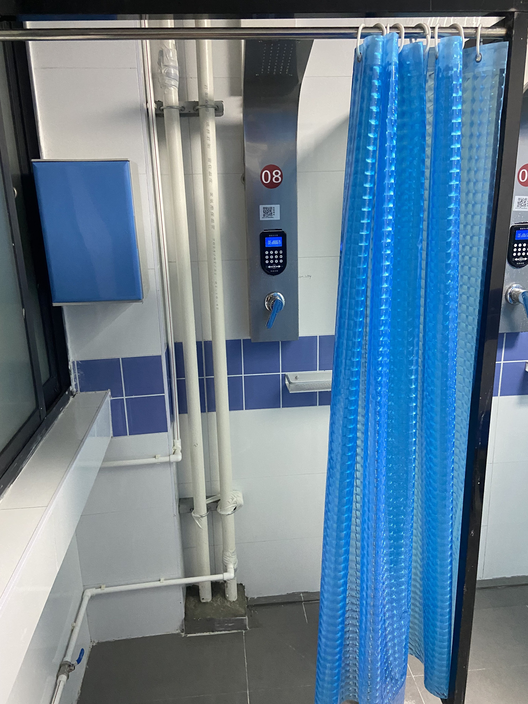

# 卫生间&浴室

宿舍**无独立卫浴**，但有公共卫生间和浴室

## 分布

北区位于东西两侧楼梯口旁边，南区位于每层两头和中间，其中中间位置只有卫生间，无浴室

## 浴室

每个浴室有四个淋浴间，目前已于 2024 年 12 月前改造完成[^1]。与旧的浴室相比，新的浴室内设有储物柜、暖气片和休息凳，有着更好的下水系统和灯光照明

:::details 使用方法

### 充值

1. 在微信小程序 呱呱物联 注册
2. 下载[慧新易校 APP](../../life/app#慧新易校)，在大厅中选择 宣城浴室充值
3. 输入第一步注册的手机号进行充值

### 使用

- 手机扫码
  - 打开微信小程序 呱呱物联扫描开关上方的二维码
- 校园卡刷卡
  - 需要预先绑定
- 洗浴码
  - 在呱呱物联小程序上设置好后，在水控机上输入洗浴码即可

:::

:::details 计费标准
预扣款 5 元，按**热水水量**计费，貌似比原来的标准略贵一点点

最热档最大水量 30 秒约 0.1 元^[需要验证]^

标称热水价格：25 元/吨[^2]
:::

:::details 旧的计费标准

刷卡后预扣款 1 元后即可出水，按 **0.03 元/10 秒** 计费，用水结束后再次刷卡即可离开

::::tip
夏天洗澡一般花费 0.6~1.5 元，冬天可能花费 1~4 元。洗澡时间因个人习惯而异，此处仅供参考
::::

## 洗衣机

在每个浴室内有一台洗衣机 or 洗鞋机 or 烘干机

如果嫌弃公的用或有洁癖可以寝室一起买一台洗衣机，放在阳台，可联系安装师傅帮忙更换洗衣机专用水龙头

:::danger

为了宿舍楼内的和睦和健康安全，**不要使用公用洗衣机洗鞋子/内裤/袜子**

:::

## 吹风机

扫码使用，0.01 元/分钟

[^1]:
    宣城校区学生公寓洗浴间装修改造施工公告 (2024-09-19)\[2024-09-27].  
    <http://xc.hfut.edu.cn/9a/3f/c1955a39487/page.htm>

[^2]:
    合肥工业大学宣城校区学生公寓洗浴热水、洗衣机、开水机运营维护项目（FS24000007）中标结果公告 (2024-08-23)\[2025-03-15].  
    <https://zb.hfut.edu.cn/provider/#/publish/20M062J7UW32HS9Q>
