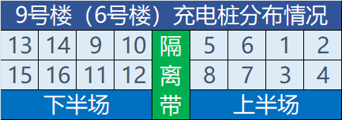

# 校内交通工具

由于宣城校区比较大（大概 1.8km\*1km ）且教学楼和操场均相对靠近北区，因此拥有一辆电动车或者买一个骑行卡对于每天上课需要徒步跨越大半个校区的南区同学来说是一个不错的选择

## 共享单车

校内有共享单车，目前合肥校区与宣城校区的供应品牌均为哈啰单车

目前套餐价格如下[^1][^7]：

::::tabs key:campus
== 宣城校区

- 学期卡（120 天）
  - 16.69 元/学期
- 月卡
  - 6.49 元/月

实际收费远高于此价格（月卡约 20-30 元）。七天不限次骑行卡 和 120 天单单 0.5 元卡 的性价比均远高于此月卡

:::tip

据说可以通过与客服联系解绑学生认证，然后在学生认证时将学校名称由**合肥工业大学宣城校区**改为**合肥工业大学**即可享受合肥校区同款的超低价格套餐

:::

== 合肥校区

- 学期卡（120 天）
  - 2.99 元/学期
  - 每天不限次数骑行，单笔抵 120 分钟
- 月卡
  - 0.59 元/月
  - 每天不限次数骑行，单笔抵 120 分钟

::::

## 自行车

购买学长的二手自行车时，一定要仔细看一下，不要有什么暗病。

不要把自行车停放在禁止停放的区域，很有可能被拉走捏。

每年学校都会清理一些废弃自行车，大家小心别把自己车给清了，如果还在使用的自行车被贴了“拟清理车辆”标签，请及时撕掉。[^2]

## 电动车

### 充电点位

宣城校区内有多处充电点位，主要是 2 处停车场与 3 处停车棚:

| 充电点位所在位置                           | 充电位数量 |
| ------------------------------------------ | ---------- |
| 北区四号楼、五号楼与新安学堂包围区域停车场 | 140        |
| 南区六号楼、九号楼与南门包围区域停车场     | 160        |
| 行政楼竹园后停车棚                         | 60         |
| 北区景文楼教师公寓正门前停车棚             | 30         |
| 南区景贤楼教师公寓入口前停车棚             | 16         |

采用扫码收费方式充电，每次充电预付 2 元，按实际使用时长扣费，单价为 0.19 元/小时，结束充电时自动退还余额[^3]

#### 9 号楼充电桩

### 牌照

根据宣城市人民政府的相关通告，2025 年 7 月 1 日起，电动自行车、电动两（三）轮摩托车应经公安交管部门登记后 _（俗称挂牌）_，方可上道路行驶；其中驾驶电动两（三）轮摩托车需要年满 16 周岁且获得相应的机动车驾驶证。已办理并悬挂临时通行标识（红色号牌）的，只能临时行驶至 2026 年 2 月 28 日。[^4] [^5]

宣城校区即将面向校区师生及相关工作人员开展电动自行车、电动两（三）轮摩托车、燃油摩托车电子识别牌申办预约登记。

宣城校区拟于 2025 年 8 月 20 日开始，启用电动自行车、电动摩托车、燃油摩托车出入门禁，并对校园电动自行车、电动摩托车、燃油摩托车进出校园、违规停放、违规行驶等进行规范管理。[^6]

[^1]:
    合肥工业大学招标与采购管理中心.合肥工业大学宣城校区共享单车运营服务采购 成交结果公告[DB/OL]. (2025-03-18)\[2025-05-09].  
    <https://zb.hfut.edu.cn/provider/#/publish/20M8E5MPZJE8YJ8R>

[^2]:
    合肥工业大学宣城校区后勤综合管理办公室.关于清理校园废弃车辆的通知[DB/OL]. (2024-07-09)\[2025-03-15].  
    <https://xcbwb.hfut.edu.cn/99/5e/c1596a39262/page.htm>

[^3]:
    合肥工业大学招标与采购管理中心.合肥工业大学宣城校区新能源汽车及电瓶车充电桩建设运营项目中标公告[DB/OL]. (2024-08-20)\[2025-05-09].  
    <https://zb.hfut.edu.cn/provider/#/publish/20M028QP2D0ZBQXG>

[^4]:
    宣城市人民政府.关于规范电动自行车、电动两（三）轮摩托车管理的通告[DB/OL]. (2025-05-29)\[2025-06-29].  
    <https://www.xuancheng.gov.cn/OpennessContent/show/3547469.htm>

[^5]:
    合肥工业大学宣城校区后勤综合管理办公室.关于宣城市加强电动车管理的温馨提示[DB/OL]. (2025-06-26)\[2025-06-29].  
    <https://xcbwb.hfut.edu.cn/9e/af/c1596a40623/page.htm>

[^6]:
    合肥工业大学宣城校区.关于申办宣城校区电动自行车、电动两（三）轮摩托车、燃油摩托车电子识别牌预约登记的通知[DB/OL]. (2025-07-03)\[2025-07-09].
    <http://xc.hfut.edu.cn/9e/c2/c1955a40642/page.htm>

[^7]:
    合肥工业大学党委保卫部.合肥校区哈啰单车使用说明[DB/OL]. (2025-07-28)\[2026-01-23].
    <https://bwzx.hfut.edu.cn/info/1003/3428.htm>
