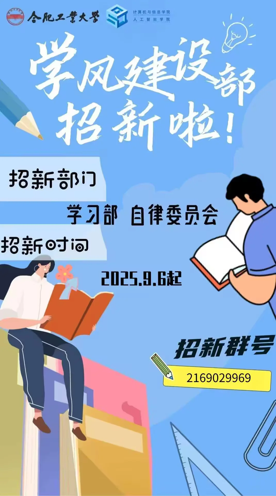

# 学风建设部

:::info

以下内容根据 2025 年学院学生组织招新材料整理，具体职责以学院当年安排为准。

:::

学风建设部隶属于计算机与信息学院（人工智能学院）学生会，下设学习部和自律委员会，主要围绕学习支持、学风建设和日常自律管理开展工作。

## 学习部

主要负责组织讲座、知识竞赛、学习交流等活动，也会协助学院开展学风建设相关工作。部分活动会结合专业发展、就业方向和竞赛经验等内容展开。

## 自律委员会

主要负责晚自习、寝室等日常学习生活秩序相关工作，并配合学院开展自律教育和习惯养成类活动。具体检查安排可能随年级、专业和学院要求调整。
