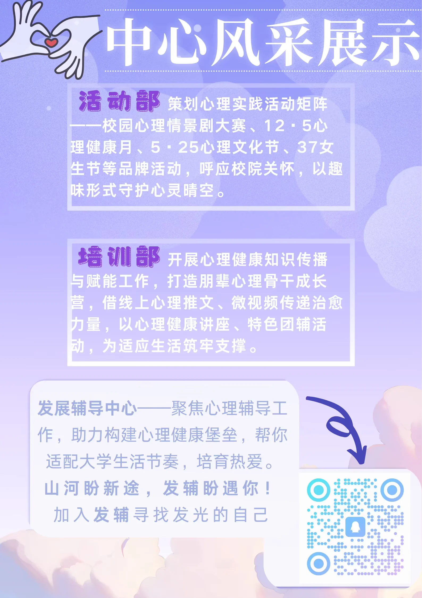

# 大学生发展辅导中心

:::info

以下内容根据 2025 年学院学生组织招新材料整理，具体职责以学院当年安排为准。

:::

大学生发展辅导中心主要聚焦计算机与信息学院（人工智能学院）的心理健康教育和学生成长支持工作。

## 活动部

主要负责心理实践活动的策划和组织，例如校园心理情景剧大赛、12·5 心理健康月、5·25 心理文化节等。

## 培训部

主要负责心理健康知识宣传和培训活动，例如朋辈心理骨干成长营、心理健康讲座、线上心理推文和特色团体辅导活动等。
