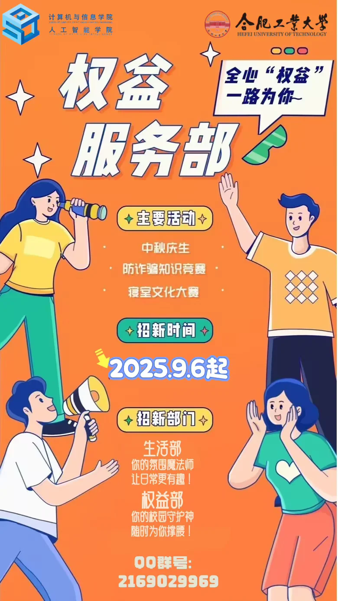

# 权益服务部

:::info

以下内容根据 2025 年学院学生组织招新材料整理，具体职责以学院当年安排为准。

:::

权益服务部隶属于计算机与信息学院（人工智能学院）学生会，下设权益部和生活部，主要围绕权益反馈、生活服务和寝室文化建设开展工作。

## 权益部

主要负责收集和反馈同学在学习、生活中的权益诉求，也会组织 3·15 维权月、网络安全宣传周、防电信诈骗等主题活动。

## 生活部

主要关注校园生活环境和寝室氛围建设，参与生活类意见反馈、节日特色活动和寝室文化大赛等工作。
