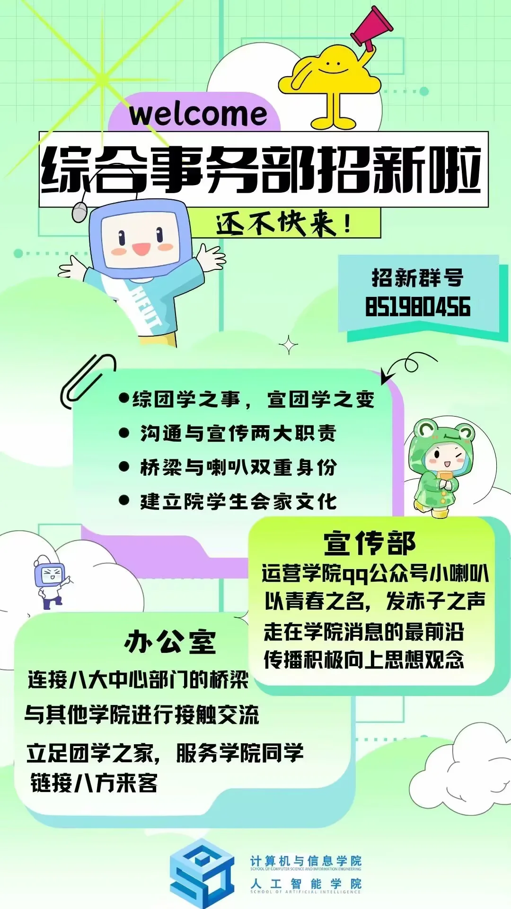

# 综合事务部

:::info

以下内容根据 2025 年学院学生组织招新材料整理，具体职责以学院当年安排为准。

:::

综合事务部隶属于计算机与信息学院（人工智能学院）学生会，主要承担学院学生会和团学组织之间的联络、统筹和日常管理工作。

## 办公室

主要负责部门联络、物资管理、值班安排和内部资料整理等事务，也会参与团学骨干培训、总结大会等活动的组织。

## 宣传部

主要负责学院学生组织活动的宣传工作，包括“计算机小喇叭”日常管理、海报制作、文稿撰写和班级风采展示等活动。
