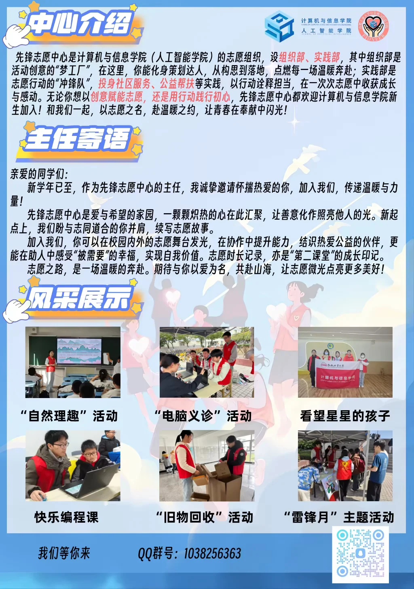

# 先锋志愿中心

:::info

以下内容根据 2025 年学院学生组织招新材料整理，具体职责以学院当年安排为准。

:::

先锋志愿中心是计算机与信息学院（人工智能学院）的志愿服务组织，围绕学院志愿服务开展工作，也会协助处理学生志愿服务相关事务。中心通常参与志愿活动策划、志愿者招募培训、服务记录整理和特色志愿项目建设等。

志愿服务活动的报名方式、服务时长记录和第二课堂认定要求可能随活动变化，参加前建议以学院通知和第二课堂系统要求为准。

## 组织部

主要负责志愿活动的前期策划和组织协调，包括活动方案构思、流程设计、物资准备和现场协同等工作。

## 实践部

主要负责志愿活动的实践执行，活动类型可能包括社区服务、公益帮扶等。实践部通常需要参与志愿者招募、活动现场服务和后续材料整理。
