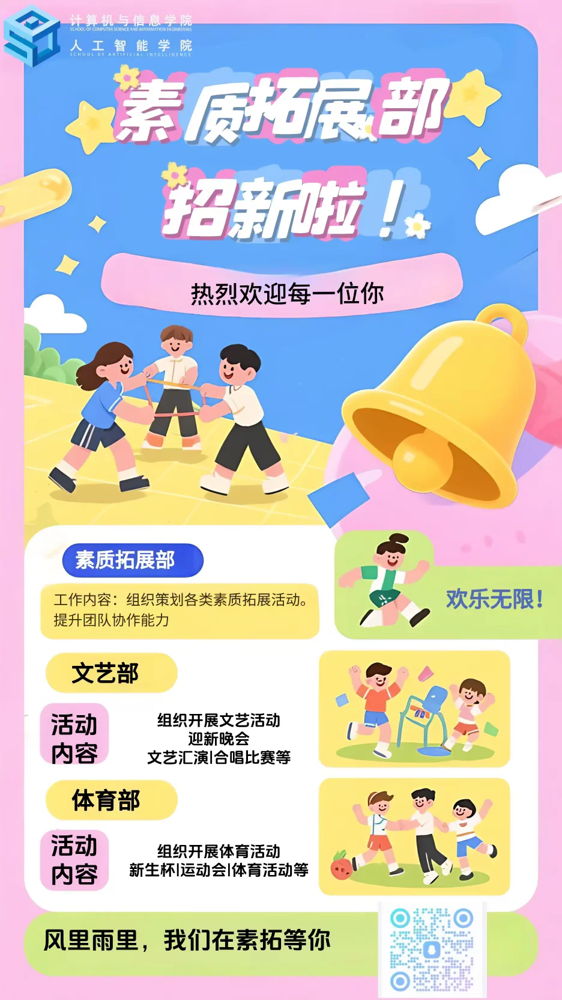

# 素质拓展部

:::info

以下内容根据 2025 年学院学生组织招新材料整理，具体职责以学院当年安排为准。

:::

素质拓展部隶属于计算机与信息学院（人工智能学院）学生会，主要负责学院文艺、体育类活动的策划和组织。

## 文艺部

主要负责迎新晚会、十佳歌手大赛、艺术节等文艺活动的策划、筹备和执行。

## 体育部

主要负责校运会、篮球联赛、趣味运动会等体育活动的组织，也会参与学院体育氛围建设和赛事服务。
