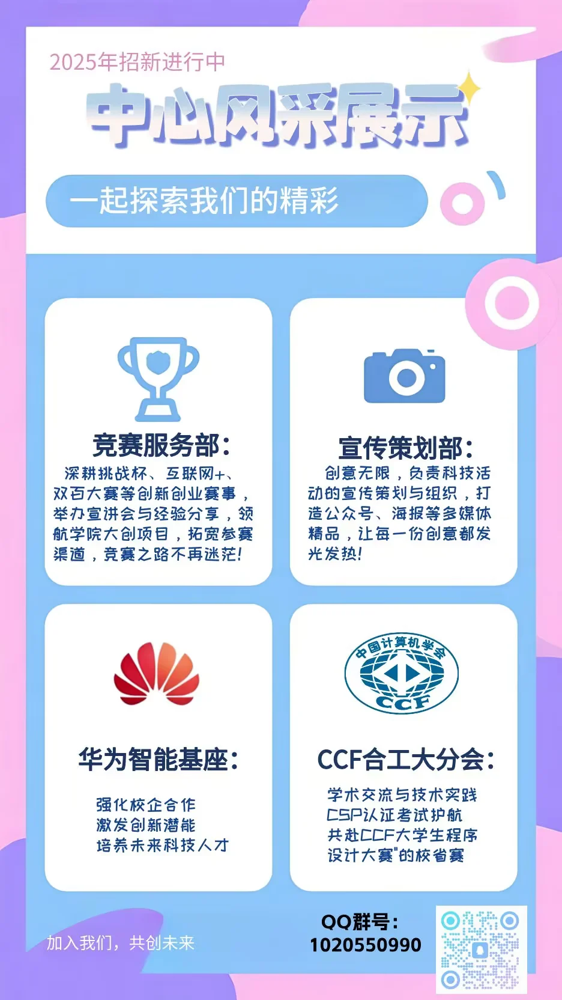

# 科技创新中心

:::info

以下内容根据 2025 年学院学生组织招新材料整理，具体职责以学院当年安排为准。

:::

科技创新中心主要围绕学科竞赛、创新创业活动和技术社群建设开展工作。

## 竞赛服务部

主要负责“挑战杯”“互联网+”、大学生创新创业训练计划等竞赛的信息整理、宣传解读和培训组织。

## 宣传策划部

主要负责科技活动的宣传策划，包括视频、海报、推文等多媒体内容制作。

## 华为智能基座社团

主要围绕华为云生态、技术学习和开发实践开展活动，具体内容以社团当年安排为准。

## CCF 学生分会组织委员会

主要围绕程序设计竞赛、CSP 认证等内容开展组织和服务工作。
