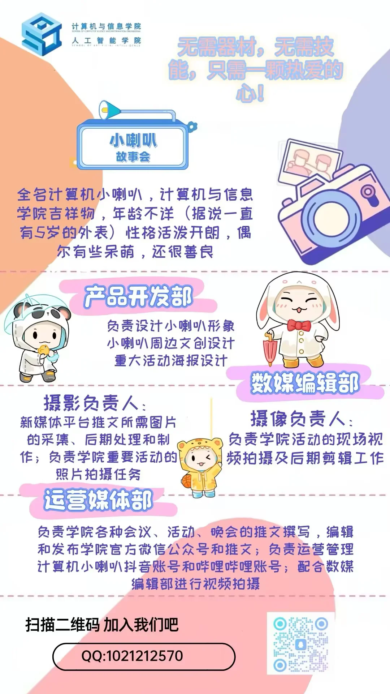

# 青年新媒体中心

:::info

以下内容根据 2025 年学院学生组织招新材料整理，具体职责以学院当年安排为准。

:::

青年新媒体中心主要负责学院学生组织的新媒体宣传和内容生产，常见工作包括摄影摄像、视频剪辑、海报设计、文案撰写和平台运营等。

如果想参与学院活动宣传，或希望在实践中熟悉新媒体内容制作流程，可以关注该组织的招新通知。

## 产品开发部

主要负责“计算机小喇叭”相关视觉形象和文创设计，也会参与学院重大活动海报设计等工作。

## 数媒编辑部

主要负责图片、视频等视觉素材的采集、处理和制作。

### 摄影

主要负责新媒体平台推文所需图片的采集、后期处理和制作，也会承担学院重要活动的照片拍摄任务。

### 摄像

主要负责学院活动的现场视频拍摄和后期剪辑。

## 运营媒体部

主要负责学院会议、活动、晚会等内容的推文撰写、编辑和发布，也会运营“计算机小喇叭”抖音账号、哔哩哔哩账号，并配合数媒编辑部完成视频拍摄等工作。
