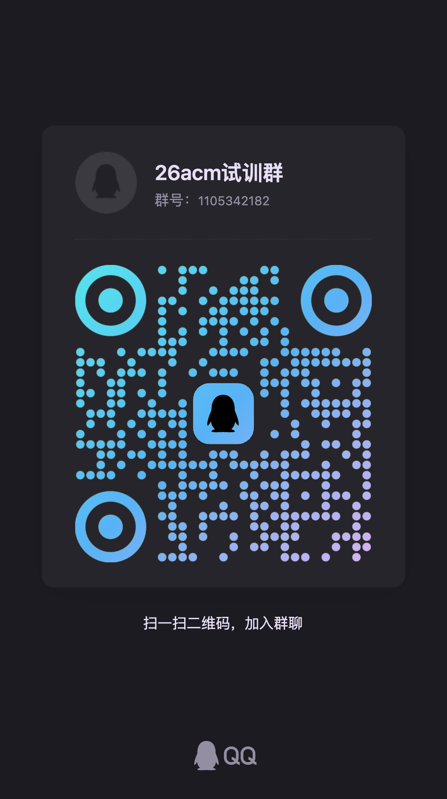
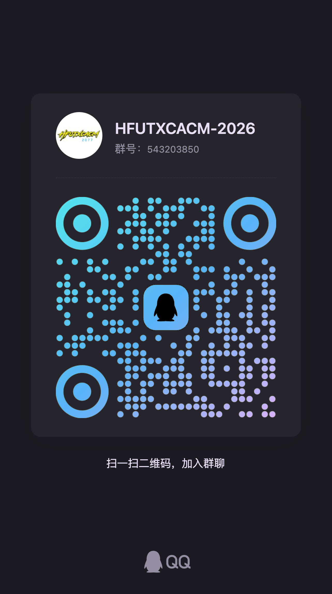

# ACM 实验室

ACM 实验室（全名为程序设计创新实验室）主要面向程序设计与算法竞赛，学习常见算法与数据结构，并参加 ICPC、CCPC、团体程序设计天梯赛、安徽省机器人大赛算法设计等相关比赛

想进入实验室的话，建议提前在 Codeforces、牛客、Atcoder、洛谷等平台保持一定训练量，建议熟练掌握 C++ 的基本语法和 STL，了解 Python 在算法竞赛的一些技巧（高精度和打表可用），以通过实验室面试。

## 招新时间

通常分为三批：提前批约在 9 月，第一次招新约在 12 月，第二次招新约在次年 4 月，一般会安排在程序设计校赛举行之后

具体时间和考核形式以通知为准，地点在计算中心 308

## 相关 QQ 群

- 26acm 试训群（正式训练进这个群）：1105342182
- HFUTXCACM-2026（ACM 大群）：543203850

