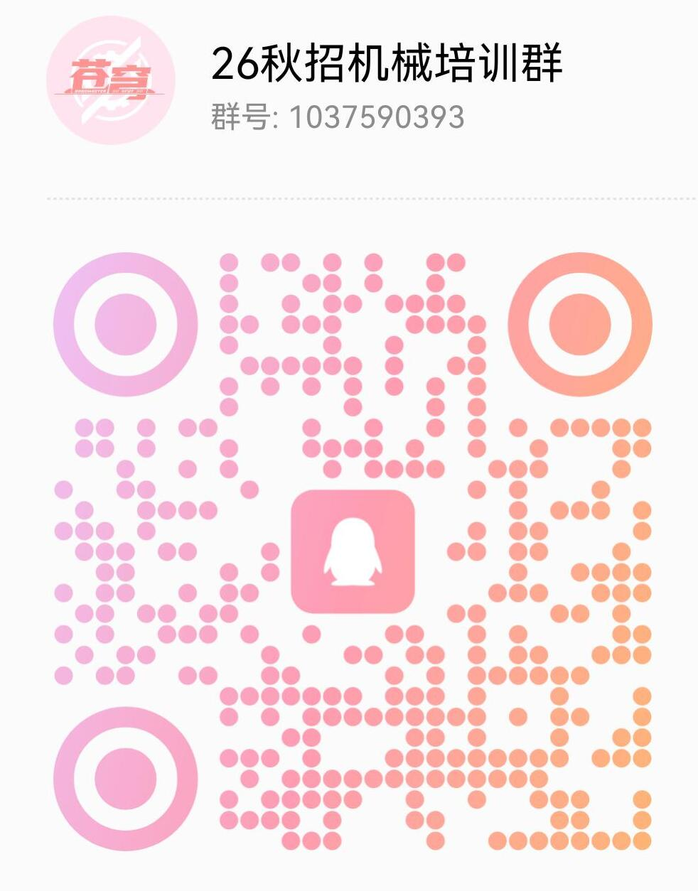
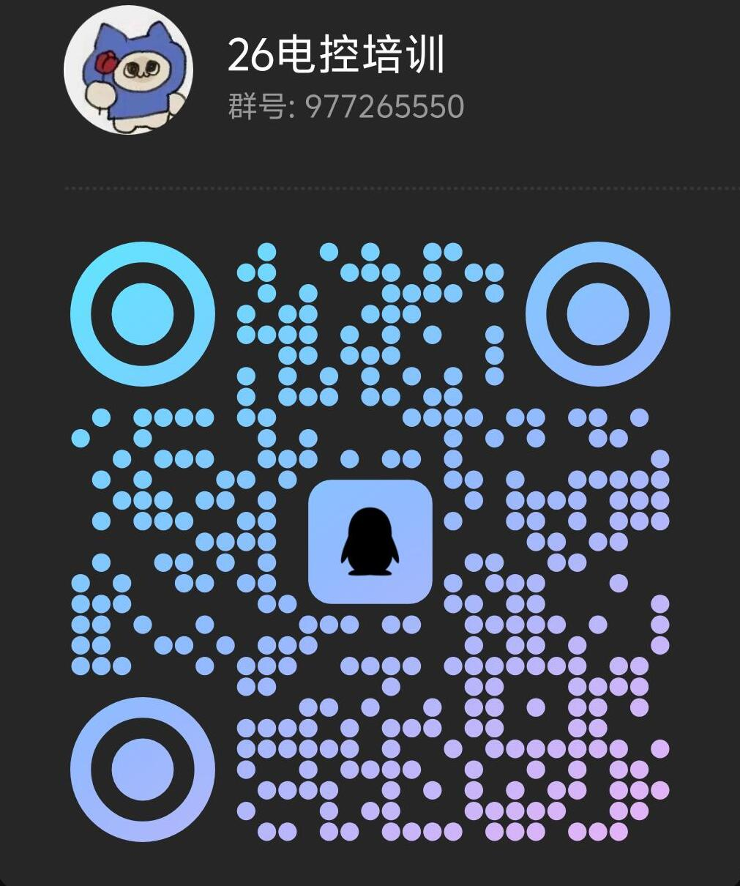
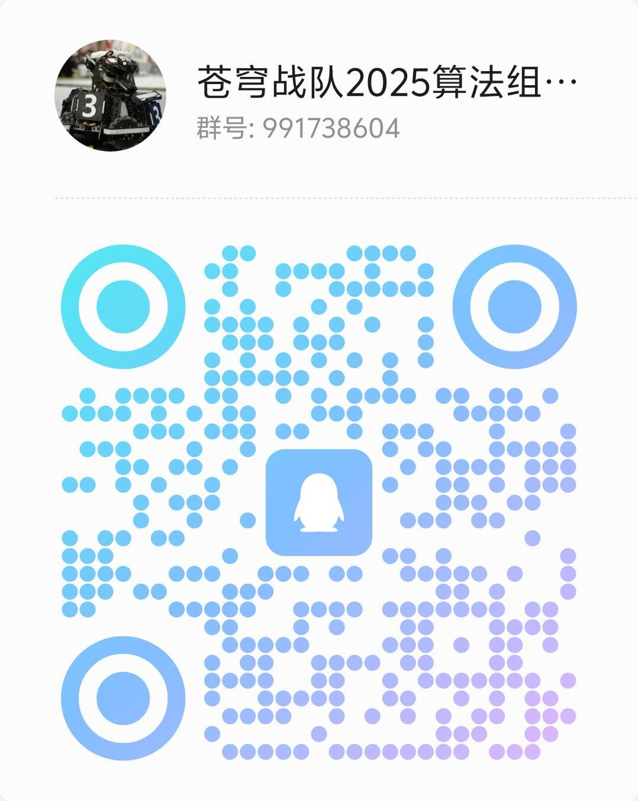
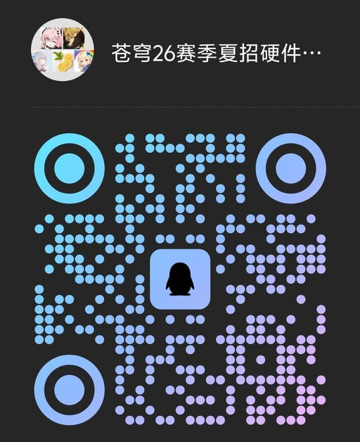
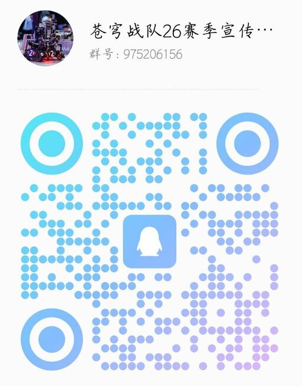

# Robomaster 苍穹战队

RoboMaster 机甲大师高校系列赛是全国大学生机器人大赛旗下赛事之一。苍穹战队下设机械、电控、视觉、硬件和宣传五个组。

:::info

以下招新方向介绍均为[苍穹战队招新页](https://robo.tinywang.space/recruitment)原文[^1]

:::

## 招新方向

### 机械组 (Mechanical Team)

给我一个支点，我能撬动整个赛场！我们是赋予机器人“钢筋铁骨”的工匠，是战车的“构架师”。每一次画图，都是在勾勒英雄的轮廓；每一次拧螺丝，都是在注入不屈的灵魂。从轻巧灵动的步兵，到坚不可摧的英雄，再到势大力沉的哨兵，所有机器人的物理形态都由我们定义。如果你想亲手锻造出属于自己的“机甲”，这里就是你的神圣工坊！

#### 最终能力要求

- 独立设计能力：能够独立使用 SolidWorks 等软件完成复杂机械结构（如云台、底盘、发射机构）的设计、仿真与工程图绘制。
- 加工制造能力：熟练操作 3D 打印机、钻台等常用设备，并了解车、铣等高级加工工艺，能够为自己的设计选择合适的加工方案。
- 装配调试能力：能够独立完成一个机器人模块的精密装配与调试，确保其机械性能达标。

#### 你将学到

- 想法到现实：学习使用 SolidWorks 等专业软件，将你脑海中天马行空的创意，绘制成精准酷炫的 3D 模型。
- 硬核动手能力：你将亲手操作 3D 打印机、激光切割机、车床等设备，体验从一张图纸到一个真实零件的创造快感。
- 系统的工程思维：掌握从设计、仿真到加工、装配的全链路技能，让你不仅仅是个“玩家”，更是个真正的“造物主”。

#### 招新群

26 秋招机械培训群：`1037590393`

### 电控组 (Electrical Team)

我们是驾驭电流的“魔法师”，用代码和精密的布线为冰冷的机械注入灵魂。当第一行代码烧入芯片，当第一个 LED 被成功点亮，当电机在我们指令下精准转动，这就是赋予机械生命”的瞬间。我们亲手为机器人编织“神经网络”（线路），让它听从指令、感知世界。如果你渴望看到自己的代码驱动庞大的机器，感受电流在指尖跳动的脉搏，那就加入我们，一起掌控这“电与火之歌”。

#### 最终能力要求

- 嵌入式编程：能够独立使用 C/C++ 及 HAL/LL 库，为 STM32 等单片机编写稳定、规范的控制代码，实现对机器人各模块的精准控制。
- 电机控制精通：深刻理解 PID 控制算法，并能够独立完成对多种电机（直流、无刷）的速度环、位置环调试。
- 系统布线与维护：能够为整台机器人设计并实施一套规范、可靠、易于维护的电气布线方案。

#### 你将学到

- 搭建机器“神经网络”：学习规范、可靠的机器人布线技巧，亲手连接每一个电子模块，让电流与信号精准无误地流淌在它的“血管”之中。
- 核心嵌入式开发：掌握 STM32 等主流单片机的编程，学会用代码直接控制电机、读取传感器数据，成为机器人行动的“指挥官”。
- 非凡的成就感：亲身体验你的代码让庞大机械从静止到疾驰的震撼，感受亲手连接的线路成功点亮整个机器人的喜悦。

#### 招新群

26 电控培训：`977265550`

### 视觉组 (Vision Team)

视觉组是机器人的“大脑”与“眼睛”。我们专注于机器视觉（OpenCV）、人工智能、运动控制算法与决策规划。通过 C++、Python 等语言，我们让机器人能够自动识别并锁定敌人，规划最优的运动轨迹，并在复杂的战场环境中自主决策。你将接触到 ROS（机器人操作系统）、深度学习、SLAM 等前沿技术，亲手为机器人编写智慧。

#### 最终能力要求

- 算法实现能力：能够独立使用 C++/Python 及 OpenCV 库，实现一套完整的机器人视觉识别算法（如装甲板识别、能量机关预测）。
- 模型部署与优化：能够将深度学习模型部署到 ROS 等机器人平台上，并进行性能优化，使其满足实时性要求。
- 多传感器融合：对多传感器（如摄像头、IMU）数据融合有基本理解，并能够进行初步的应用。

#### 你将学到

- 编程技能：学习 C++ 与 Python 编程，掌握算法的核心思想，这是通往人工智能世界的第一把钥匙。
- 深入 AI 领域：探索当下最热门的机器视觉 (OpenCV) 与深度学习，你将亲手教会机器人如何“看见”和“思考”。
- 开发“智慧大脑”：接触 ROS（机器人操作系统）等先进平台，将你的算法部署到真实的机器人上，打造一颗能够驰骋赛场的“超级大脑”。

#### 招新群

苍穹战队 2025 算法组：`991738604`

### 硬件组 (Hardware Team)

我们是战队硬件的“守护神”，负责机器人的“健康”与“稳定”。从电路板的焊接、调试，到元器件的选型、测试，我们确保每一个电子模块都能在严酷的赛场环境中稳定发挥。我们是连接电控与机械的桥梁，是机器人可靠运行的基石。如果你对动手实践充满热情，享受用烙铁和示波器创造的乐趣，这里将是你的舞台。

#### 最终能力要求

- 独立 PCB 设计：能够独立完成中等复杂度 PCB 的设计、绘制、打样与焊接调试（如自定义的电源管理板、传感器转接板）。
- 元器件选型：能够根据项目需求，合理选择 MCU、电源芯片、传感器等关键电子元器件。
- 调试与排错：能够熟练使用万用表、示波器、逻辑分析仪等工具，对硬件电路进行问题定位与修复。

#### 你将学到

- 精湛的焊接技术：学习 PCB 板的焊接与调试，掌握从零到一打造一块功能电路板的硬核技能。
- 深入的硬件知识：掌握各种电子元器件的选型与应用，学会使用万用表、示波器等工具进行硬件调试与故障排查。
- 严谨的工程素养：培养规范的硬件开发流程与文档编写习惯，为机器人的稳定运行提供最可靠的保障。

#### 招新群

苍穹 26 赛季夏招硬件群，扫码加入

### 宣传组 (Promotion Team)

我们是战队的“故事家”与“形象设计师”。我们用镜头捕捉赛场内外的每一个精彩瞬间，用文字记录战队的成长与荣耀。我们负责战队的品牌建设、媒体运营、活动策划，让更多的人了解我们，加入我们。如果你热爱摄影、摄像、写作，或者对新媒体运营有浓厚的兴趣，这里将是你施展才华的广阔天地。

#### 最终能力要求

- 高质量内容产出：能够独立策划并稳定产出高质量的图文或视频内容，完成从创意、拍摄到后期包装的全流程。
- 商务拓展能力：能够独立撰写并向企业投递赞助方案，主导对外联络与商务谈判，成功为战队获取资金或物资支持。
- 公共关系维护：能够策划并执行各类宣传活动，并负责维护与媒体、赞助商及合作伙伴的长期良好关系。

#### 你将学到

- 专业的宣传技能：学习摄影、摄像、视频剪辑、文案撰写等全方位的宣传技能，成为一名出色的“媒体人”。
- 丰富的实践经验：参与战队各类活动的策划与执行，负责微信公众号、B 站等新媒体平台的运营，积累宝贵的实践经验。
- 开阔的视野格局：与校内外媒体、赞助商等进行沟通与合作，锻炼你的沟通与协调能力，拓展你的视野与人脉。

#### 招新群

苍穹战队 26 赛季宣传组：`975206156`

[^1]:
    Robomaster 苍穹战队.战队招新[EB/OL]. \[2026-08-28].  
    <https://robo.tinywang.space/recruitment>
