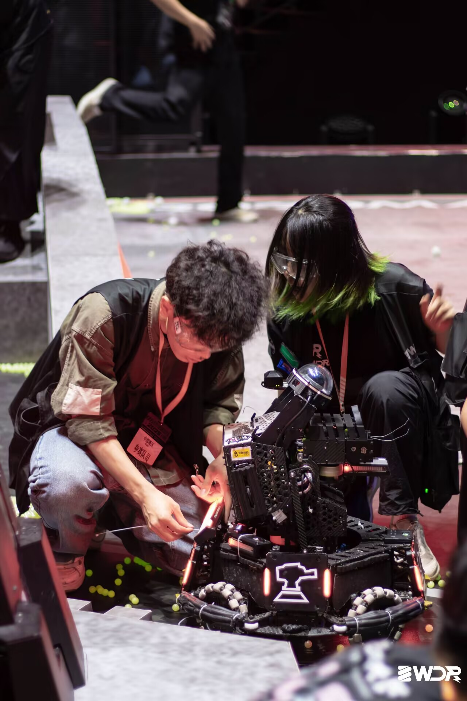
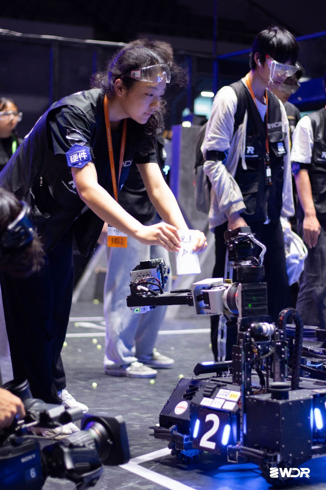
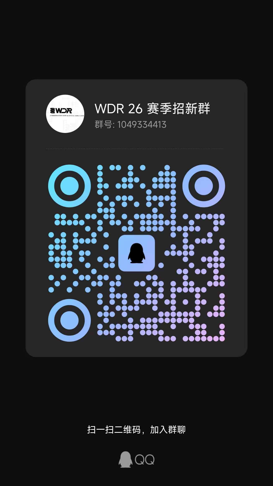
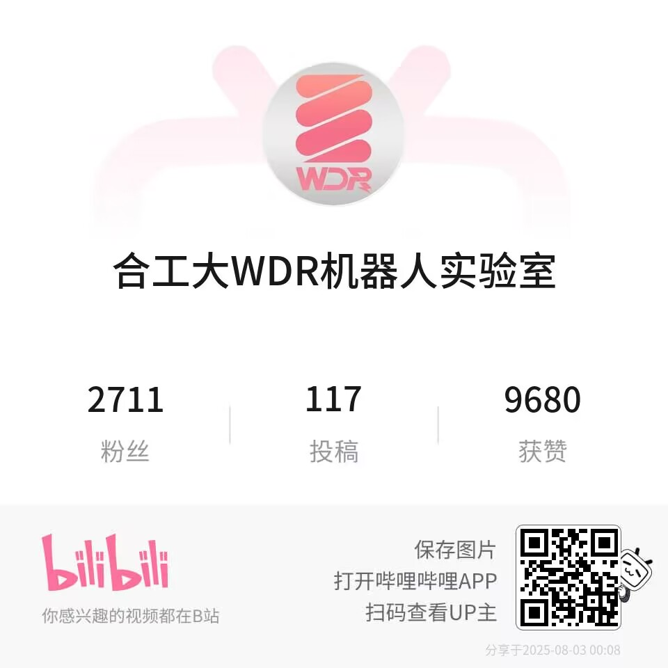

# WDR 战队机器人技术实验室

## 了解我们

RoboMaster 机甲大师高校系列赛，作为全国大学生机器人大赛旗下赛事之一，是专为全球科技爱好者打造的机器人竞技与学术交流平台。合肥工业大学宣城校区 WDR 战队自创立以来一直积极参与相关比赛，横跨机械、电子、算法等多学科领域，打造步兵/工程/英雄/哨兵等机器人军团。你想创作的，我们一起实现，这里是你将想法变为现实的绝佳实验室！

## 招新方向

- 电控组
  - 负责参赛机器人各类电子元件的选型与驱动，进行机器人控制算法的开发。成员需掌握 STM32 开发、各类控制算法与机器人的电气连接口通讯协议，拥有与硬件设计能力者为佳。
- 机械组
  - 负责机器人的结构设计、仿真优化、零件加工、后期维护等工作，成员有机会接触到数字孪生、增材制造、智能制造等先进制造技术，~~学习到非标零件设计选型和高端打螺丝手法等技能。~~
- 算法组
  - 下设自瞄、导航、雷达三技术组。分别负责目标锁定、跟踪与预测，哨兵机器人的自主导航与决策，赛场整体信息的识别与预测。成员需有稳固 C++/Python 编程能力。踏实肯干，对计算机视觉、机器学习有兴趣者为佳。
- 宣传管理组
  - 负责战队对外宣传与公共形象的建立。要求成员有较好的审美意识，擅长摄影、视频制作、平面设计、绘画等相关技术或有推文编写、公众号运营经验文笔较好者优先。

