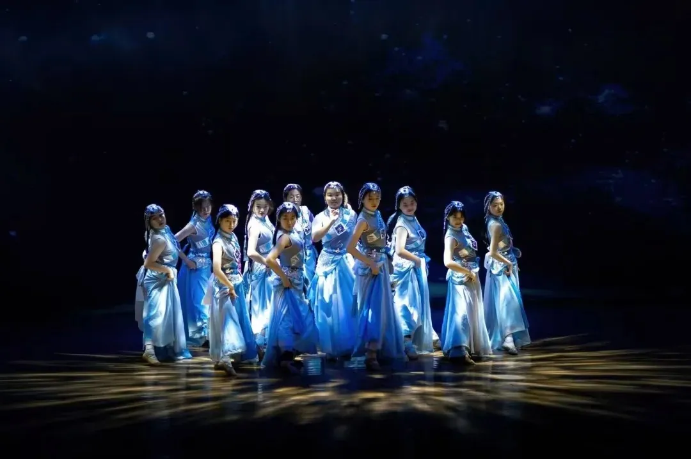
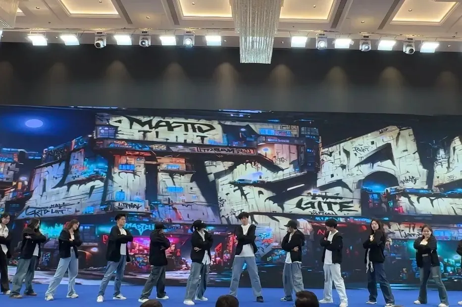
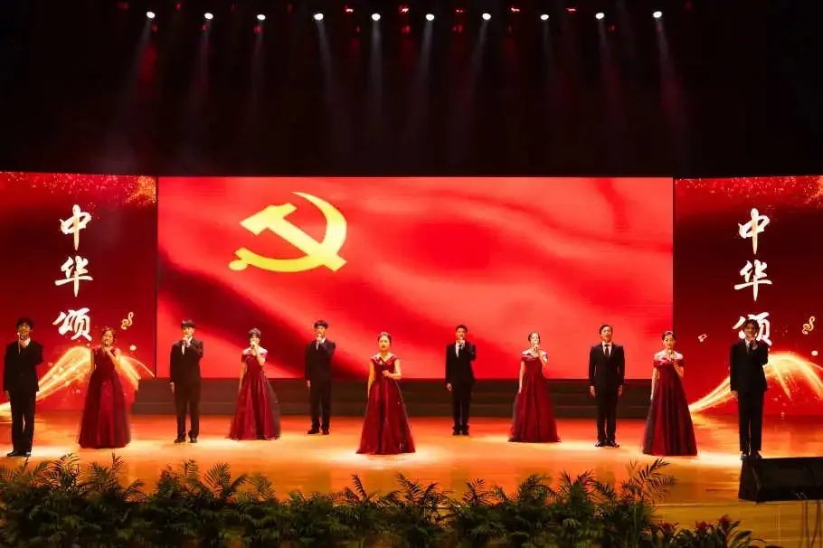
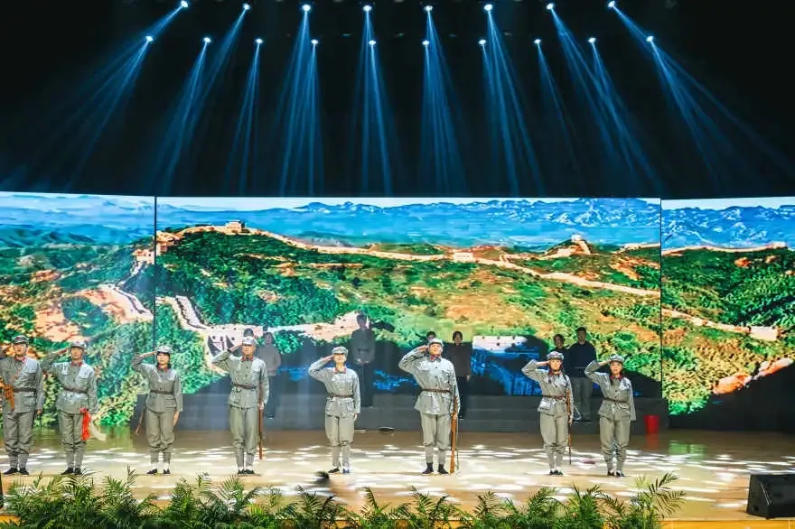
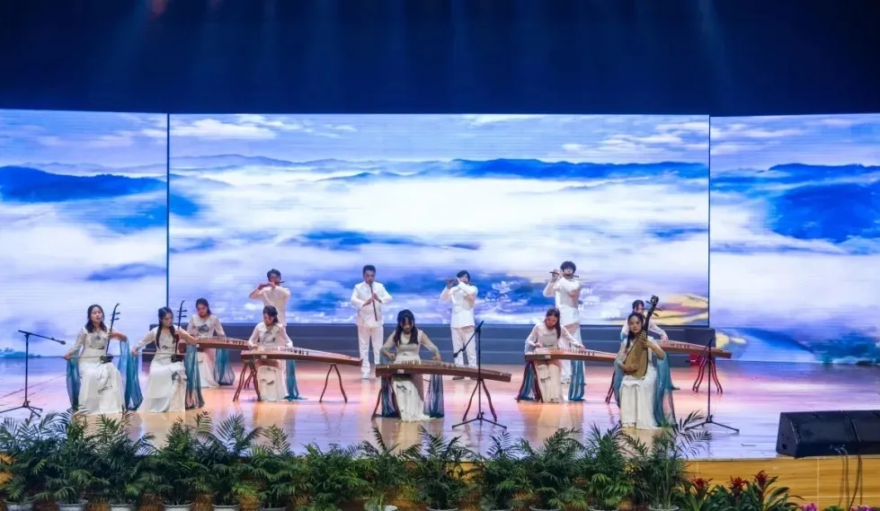
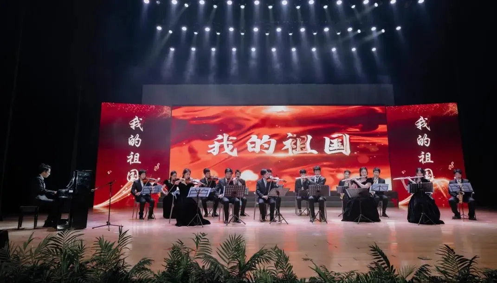
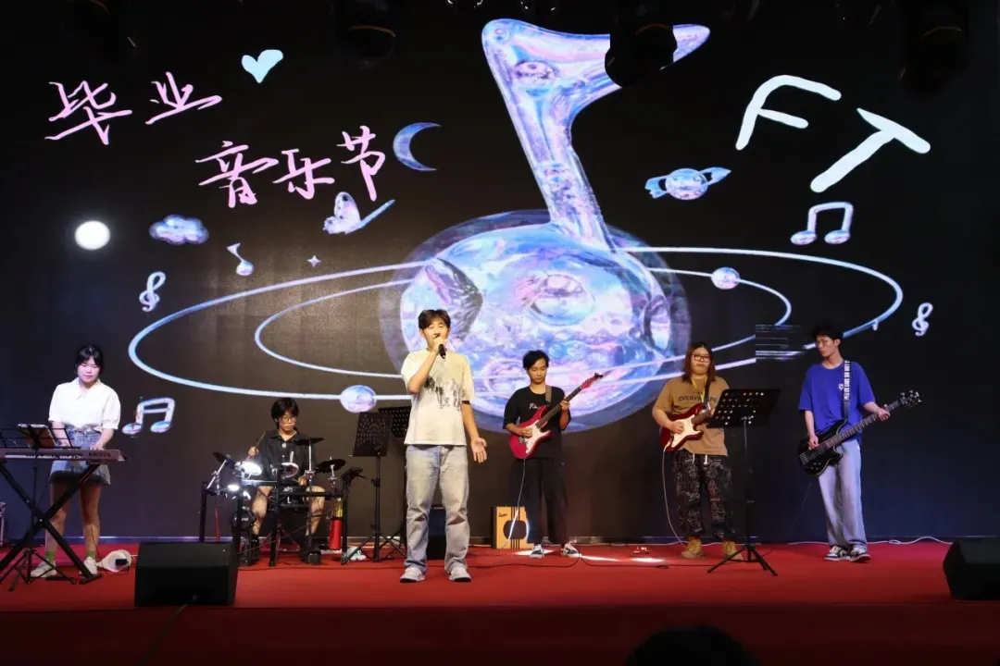

# 大学生艺术团

:::note

通常简称为**大艺团**

:::

合肥工业大学宣城校区大学生艺术团以繁荣校园文化、提高大学生文化艺术素质为宗旨，在学生工作办公室/团委指导下开展活动。艺术团下设合唱队、民舞队、街舞队、主持队、戏剧队、民乐队、流行乐队、西洋乐队、流行乐队，是助力校园文化建设的重要学生组织

## 合唱队

合唱队通过训练能全方位的提升声乐水平，乐理水平，乃至对艺术的理解力感受力。在合唱队中可以与热爱艺术的浪漫主义者群体朝夕相处，一定会得到全方位的艺术素养的提升。学会与人融合自己的声音，学会诗意的歌唱

## 民舞队

民舞队的宗旨着力于对同学舞蹈兴趣的培养， 给予有艺术特长的同学一个展示的舞台， 丰富大学生的校园生活，提升舞蹈综合艺术教育素养

## 街舞队

## 主持队

## 戏剧队

## 民乐队

民乐队旨在宣扬我国传统文化、吸引广大热爱民乐和中国传统音乐的同学们进行艺术交流，队伍由中国汉族乐器组成，主要由吹管乐器、打击乐器、拨弦乐器和弓弦乐器组成，在经过专业老师指导训练后参加一些重大演出活动

## 西洋乐队

西洋乐队由不同西洋乐器演奏者混合编成，专门演泰交响乐曲与其它管弦乐曲，在经过专业老师指导训练后参加一些校级演出活动

## 流行乐队

流行乐队旨在吸引广大热爱流行音乐的同学们进行艺术交流，主要由电子琴、吉他、架子鼓、主唱组成在经过专业老师指导训练后参加一些校级演出活动

