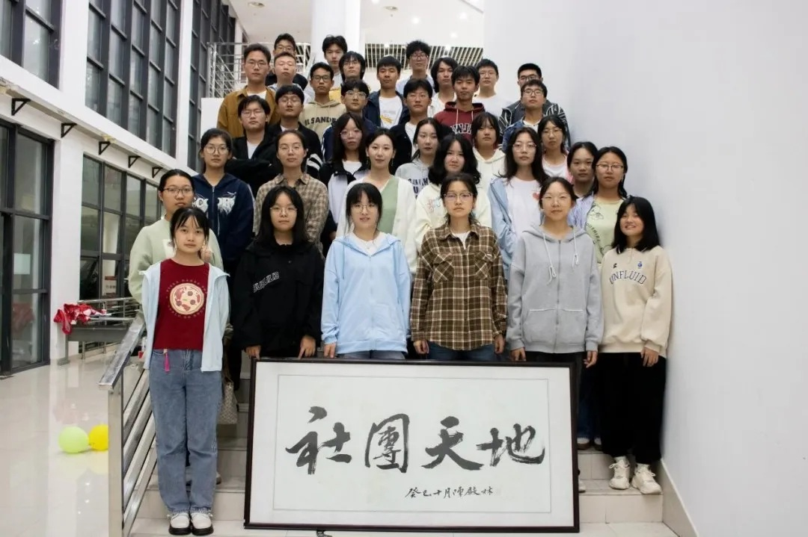

# 社团管理服务中心

社团管理服务中心是在学生工作办公室/团委的指导下，联系、服务学生社团的校级学生组织。部门以"科学管理、协调发展、高效服务、携手并进"为宗旨，以打造"校园精品学生社团”为目标，为社团活动的顺利开展提供便利条件，为社团的蓬勃发展贡献力量，助力学生综合素质的全面提升，下设综合事务部、项目规划部、财务服务部。

## 综合事务部

负责社团管理服务中心及社团相关文件制定、会务安排、办公室值班、工作人员考核等工作，负责社团管理服务中心与社团的宣传工作

## 项目规划部

负责和社团进行对接、收集社团信息、传达相关通知，做好社团活动的审核与考核，策划并执行各类创新项目

## 财务服务部

负责活动物资的征集、采购、管理等，做好物资报销，完成交办的其它工作
