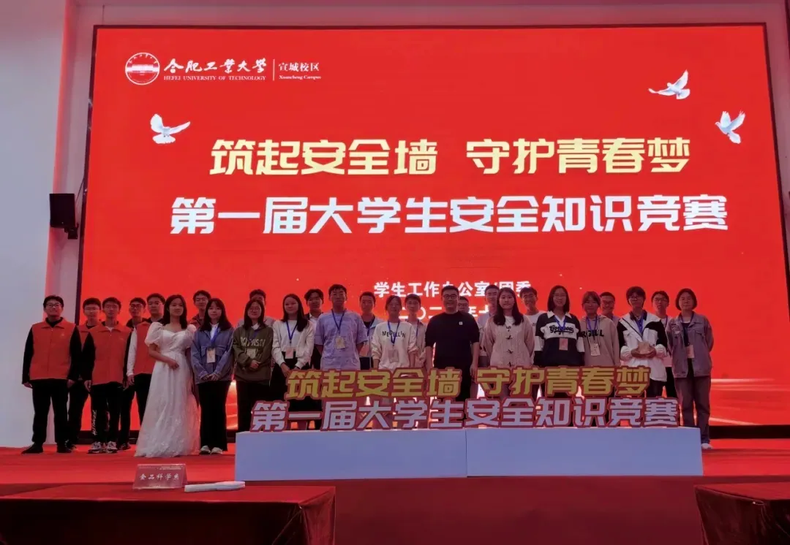

# 学风建设中心

学风建设中心在学生工作办公室/团委指导下开展活动，主要协助校风学风建设、学生安全教育、学生日常管理等工作，提升学生自我教育、自我管理、自我服务的能力。活动内容具体包括：学生晨曦计划、晚自习、课堂、寝室卫生的检查与反馈，精心开展各类学业辅导活动、考风考纪宣传教育，用心组织大学生安全知识竞赛、安全宣讲比赛、校纪校规集中学习、民警说安全课、旧衣回收等活动，助力创造一个勤奋学习、健康生活、全面发展的校园环境。该组织由日常工作部、宣传教育部、学风管理部、队伍建设部四个部门组成。

## 日常工作部

负责协助物业做好寝室安全卫生检查工作，包括制定寝室卫生检查的工作方案，招募、培训志愿者，统计并上报志愿者工作时长，协助做好寝室自习室管理与旧衣回收工作。

## 宣传教育部

负责做好中心各项活动的宣传工作，运营学风建设中心的官方账号，协助开展各类学生安全、学风建设方面宣传教育活动，主动挖掘和宣传校园学生中的先进典型和优秀事迹。

## 学风管理部

负责开展校区课堂、晨曦计划、晚自习等学风检查工作，做好各项学风数据统计和整理工作，实施每周学风检查与安全情况通报。

## 队伍建设部

负责中心各项活动的统筹规划，组织日常考核、整理工作记录、撰写通知文件、组织团队建设、进行财务报销等
