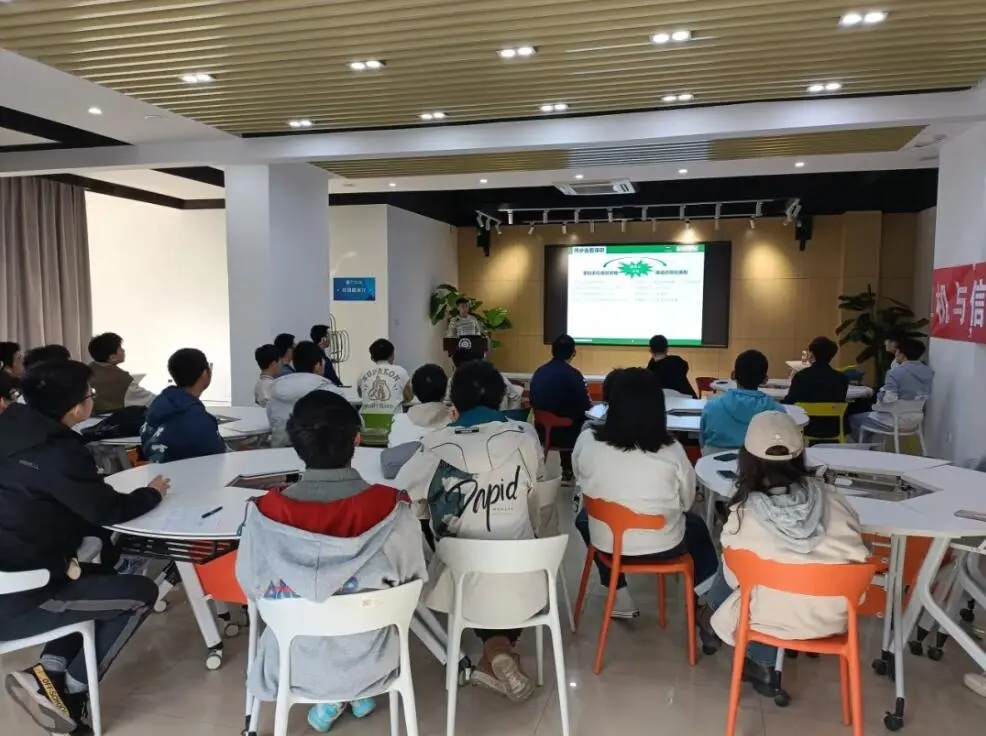

# 大学生创新创业联合会

:::info

通常简称为**创协**

:::

合肥工业大学宣城校区大学生创新创业联合会是在学生工作办公室/团委指导下开展大学生创新创业活动的学生组织，致力于策划开展科创沙龙、创赛模拟创客空间开放日等丰富多彩的创新创业活动，帮助学生更加了解创新创业及竞赛相关知识，以提高大学生创新活力、增强大学生创业信心，营造校园浓厚的创新创业氛围

## 创新协作部

主要负责对挑战杯、互联网+、大创等安徽省乃至全国 AB 类赛事的宣传解读及培训工作。以学术沙龙、创赛模拟等形式为同学们介绍相关信息、传授相关经验。旨在使同学们消除信息差的阻碍、拓宽竞赛渠道、丰富校园生活、筑牢创新创业基础

## 实践活动部

部门旨在为同学搭建一个展示创新创业成果、学习交流学长学姐成功经验的平台；服务于合工大学子，丰富大家对科创竞赛项目，保研活动的认知见解，提升各位组织沟通，动手实践的能力；在与其他部门合作的过程中，主要负责组织科创沙龙等一系列活动的筹备工作

## 宣发部

主要负责活动的文案撰写与宣传、档案的留存整理及各项宣发工作，旨在通过部门宣发工作，帮助有创新创业意愿的同学们了解科创沙龙等相关活动信息，获取相关创新创业活动经验
