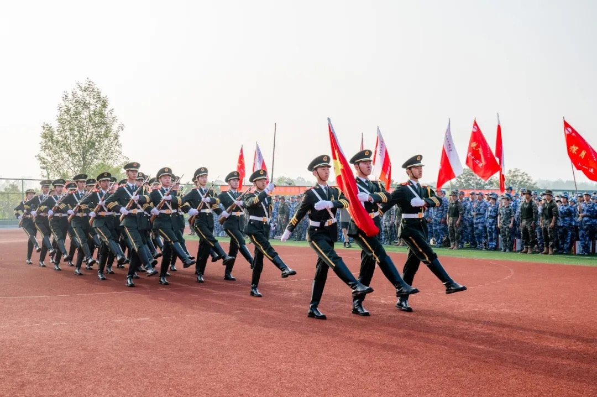

# 国旗护卫队

:::info

通常简称为**国护**

:::

合肥工业大学宣城校区国旗护卫队，自 2013 年 11 月成立以来，始终秉承着对国旗的崇高敬意，肩负着校区升旗、降旗、爱旗、护旗的重要使命。作为校区唯一拥有独立党支部的校级组织，我们致力于爱国主义教育活动的深入开展，引导青年学生坚定爱国信念，磨砺强国意志，践行报国之行动[^1]

合肥工业大学宣城校区国旗护卫队党支部成立于 2017 年 4 月，是宣城校区党委依托学生社团组织建立党组织的探索实践。2023 年 6 月，国旗护卫队党支部获批第二批“安徽省新时代党建工作样板支部”。2024 年 5 月，被列为 2023 年度省级质量工程项目立项建设项目。国旗护卫队党支部连续四年获批学校特色党支部活动项目立项，连续两年荣获校区“先进党支部”。教育部主题教育第四巡回指导组对 2023 年 5 月开展的“传承五四精神，争做时代新人”国旗下的思政课暨国旗护卫队党支部主题党日活动给予肯定，活动在“全国高校思想政治工作网”“学习强国”平台进行了报道

## 相关宣传

- [爱国润童心，国旗伴成长 | 校区国旗护卫队受邀前往宣城市第三小学、第九小学开展爱国主义教育活动](https://mp.weixin.qq.com/s?__biz=MzI5ODI3NzE2Mw==&mid=2247523372&idx=1&sn=05be56b8585538f7ce5f0c899beac984&chksm=ed4d410b73a191f1049785465814f262c6541ec882bf11667db577ae0a5932bcc18485e1f1bc&mpshare=1&scene=23&srcid=0930fM2cRQinOHzGxV8sjRNv&sharer_shareinfo=6c13ce76d0dbc9003e8c97044e7a53c3&sharer_shareinfo_first=6c13ce76d0dbc9003e8c97044e7a53c3#rd)
- [我爱你，中国 | “我和祖国共成长”国旗下的思政课](http://mp.weixin.qq.com/s?__biz=MzI5ODI3NzE2Mw==&mid=2247523389&idx=1&sn=cc9bd86eb5619212bf432a5040372600&chksm=ed7184f259e5dd6e7529e047513a2a213d888dc918e4a43190e5fa3a32a56917bef1e37d3d63&mpshare=1&scene=23&srcid=1003AALX16jyCcAr3aF0ReBm&sharer_shareinfo=b4d6d22795830b5131ca6dee0082f6a4&sharer_shareinfo_first=b4d6d22795830b5131ca6dee0082f6a4#rd)

<iframe src="//player.bilibili.com/player.html?isOutside=true&aid=113232534573164&bvid=BV1Py4PeCEbL&cid=26096306074&p=1" scrolling="no" border="0" frameborder="no" framespacing="0" allowfullscreen="true" style="width: 100%; min-height: 300px; max-height: 400px; height: 50vh"></iframe>

[^1]: 合工大宣城校区学生工作.国旗护卫队招新 | 矢志护卫国旗红，勠力弘扬爱国情 (2023-09-04)\[2024-10-03].  
<https://mp.weixin.qq.com/s/TFCNMLZpSoX4hg01CzWUnA>
