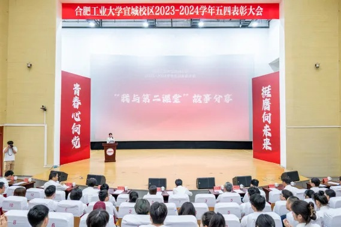

# 基层组织建设中心

基层组织建设中心在学生工作办公室/团委指导下开展活动，致力于打造一个专属校区团员青年温馨的“家”，增强全体团员青年归属感和成就感，协助校区团委进一步夯实基层团组织规范化建设

## 基础团务部

负责基础团务管理，落实“三会两制一课”制度，加强基层团支部的交流、考核工作，提升基层团支部活力，协助校区团委开展对各系团委的年度考核及评优工作，重点推进过程考核与评价，组织开展校区五四表彰评优相关工作

## 团务培训部

负责组织、指导和协调各系团委相关部门开展活动，校区大型主题团日活动的策划、落实、监督和总结工作，团支部特色活动立项、评审、检查和验收工作，协助完成校区团校的规划和组织等相关事务，协助做好各级团校的培训统计、管理工作
