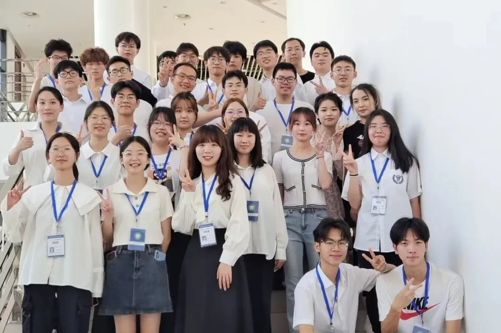

# 心理健康协会

合肥工业大学宣城校区大学生心理健康协会于 2014 年正式成立，协会在学生工作办公室/团委指导下开展活动，活动包括情景剧大赛、解忧游园会、心理健康知识宣传、团体心理辅导、心理骨干素质拓展训练等，取得了丰硕的成果，反响热烈。

我们致力于提升校园内的心理健康水平，通过策划多样化的活动和服务，关注每一位同学的心理健康。协会下设策划部、活动部、宣传部和综管部四个部门，各具特色，相互配合，共同推进校园心理健康工作

## 策划部

负责策划和统筹心协各项活动，如“525 心理情景剧大赛”和“125 解忧游园会”等，并撰写相关的官网通知及新闻稿

## 活动部

负责采访及相关工作，包括活动照片拍摄等。同时该部门还负责活动场地和物资借用与整理，以及“心心港湾”栏目的运营，帮助大家树立良好心态，积极面对生活

## 宣发部

主要负责活动前期及后期的宣传、总结工作，包括海报设计、海报展内容制作、校心协公众号宣传性或科普性推文撰写，并管理心协公众号的运营

## 综管部

负责协会的日常开支，物资采购与核对，发票整理与报销及其他内部行政事务。总管经费预算，同时协调各部门的职能，加强各部门的合作
