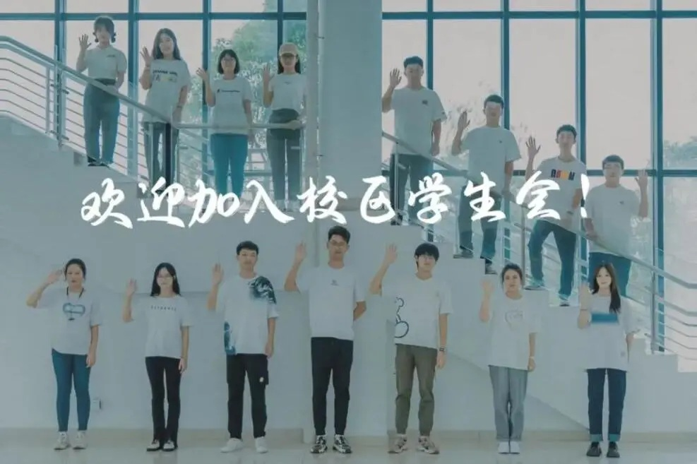

# 学生会

合肥工业大学宣城校区学生会在学生工作办公室/团委指导下开展活动。校区学生会秉承“厚德、笃学、崇实、尚新”的校训精神，坚持“务实高效、开拓创新”的工作作风，脚踏实地、锐意进取、全心全意为广大同学服务，为美好校园生活保驾护航

## 综合办公部

:::info

通常简称为**综办**

:::

负责校区学生各项规章制度、文件、通告的起草、审核、发布工作，监督规章制度的贯彻和执行；组织开展学生会工作人员述职评议、系级学生会达标评比等工作

## 素质拓展部

:::info

通常简称为**素拓**

:::

负责组织开展讲座、辩论会等学术活动，促进优良学习氛围的营造；协助开展大型文体活动，丰富校园文化氛围，传播青春正能量

## 权益服务部

负责联系校区有关部门及各系学生会权益部，促进校系间权益工作交流；运营“工大小宣”QQ 公众号，帮助同学们及时解决相关问题；结合 3·15、法制宣传日等，开展法制知识普及活动，提升学生维权意识

## 宣传推广部

负责“合工大宣城校区学生会” *（3107961334）* QQ 公众号的日常维护和更新；负责学生会大型活动的采访、海报设计和后期宣传等工作；结合重大节日和重大事件开展主题活动
