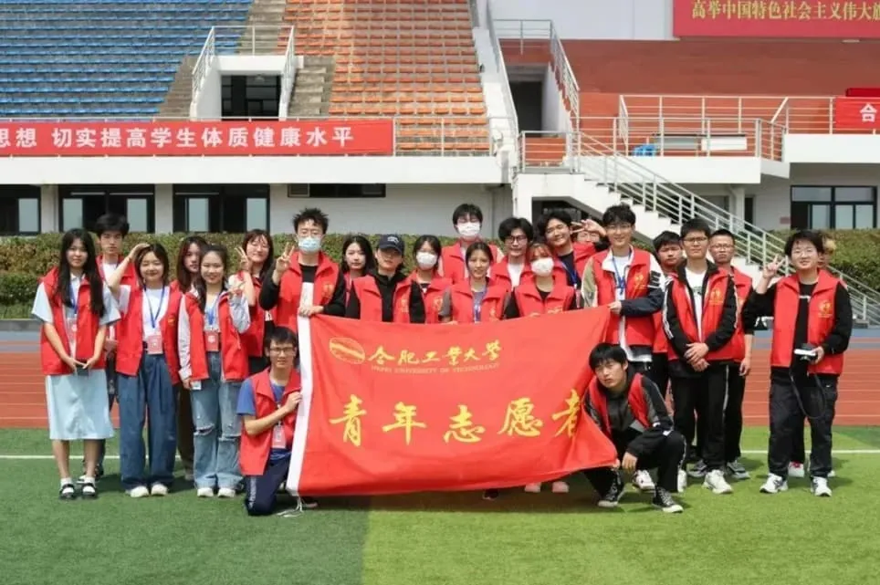

# 青年志愿者联合会

:::note

通常简称为**青志联**

:::

合肥工业大学宣城校区青年志愿者联合会成立于2012年10月，是在学生工作办公室/团委指导下，由热心志愿服务事业的校内青年教师与学生自愿结成的全校性的非营利性群众团体。现设综合管理部、实践服务部、招募培训部三大部门。青志联秉承“奉献、友爱、互助、进步”的志愿服务精神，坚持“但行好事，莫问前程；不忘初心，方得始终”的会训，凝聚宣城校区志愿者组织力量，深入地开展青年志愿者活动，为校园、社会的可持续和谐发展添力

## 招募培训部

主要负责志愿活动的招募、校区第二课堂的管理、志愿者培训、管理以及监督等工作

## 综合管理部

主要负责组织内部建设，包括办公宣传、小青公众号运营、资料整理等工作

## 实践服务部

管理青志联直属服务队、承接校内外各项志愿活动、打造志愿服务项目品牌、组织暑期“三下乡”、寒假“返家乡等社会实践活动、指导专项经验服务交流会、外联公益组织、志愿者团体共同开展活动
