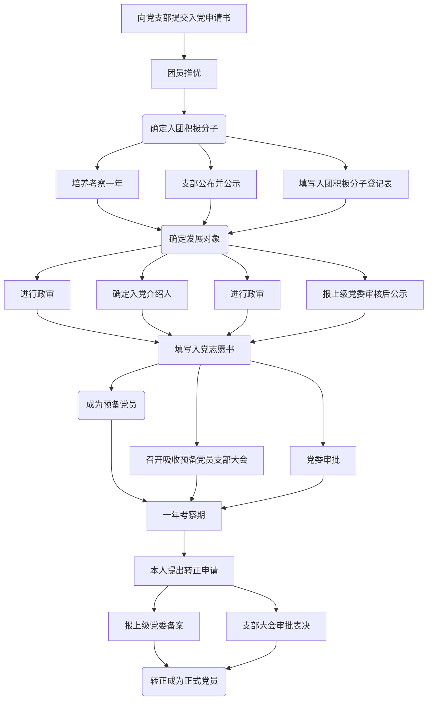

# 入党入团

## 入党

:::info

更多关于发展党员的 5 个阶段 25 个步骤的详细信息，请参考共产党员网官方专题：[发展党员流程及步骤](https://www.12371.cn/special/fzdylc/)

:::

- 班干部在入党时还是有一些优势（还有国旗护卫队，他们入党有单独的名额，相较之下比较容易）。
- 大学里通常一年进行两次推优工作，且只有团员才能在大学里推优入党。
- 成为入党积极分子后，需经过**一年以上**的培养教育和考察，才可参加发展对象推荐。
- 整个过程耗时较长（成为正式党员最快也需要两年），建议有入党想法的同学尽早在**大一**时就提交入党申请书并争取竞选积极分子。

### 党校培训

入党入团通常会被要求参加党校学习。党校培训每学期开设一次，分为线下培训与线上学习，二者通常同步进行。

#### 线下培训

主要包含以下环节：

- 开班典礼
- 开班第一讲
- 集中授课
- 研讨交流
- 主题实践
- 培训心得
- 结业考核

#### 线上学习

- 平台：
  - [合肥工业大学党校在线](http://cas.hfut.edu.cn/cas/login?service=http://wsdx.hfut.edu.cn/user/cas_login/login)
  - [信息门户](https://one.hfut.edu.cn/)→业务系统→党校在线
- 环节：
  - 理论学习：需按要求完成选修和必修课时
  - 心得体会：字数阈值通常为 800 字，且会进行自建库查重，请务必原创
  - 结业测试：完成理论学习环节后方可参加结业测试

:::details 入党申请书的写作要求
根据党章规定，要求入党的同志必须亲自向党组织提出书面申请。要求入党申请书必须由本人手写，不能用电脑打字。党组织接到入党申请书后，要对入党申请书的格式、内容进行审核把关。

### 入党申请书的格式和内容

1. 标题：入党申请书；
2. 称谓：在标题下的第一行，顶格写上“敬爱的党支部”，加冒号。
3. 正文：
   1. 对党的认识、入党动机及对党的态度；
   2. 本人的基本情况(主要写自己成长的经历、政治历史问题、受过何种奖励和处分，以及思想、工作、学习和作风等方面的情况)；
   3. 今后努力方向及如何以实际行动争取早日加入党组织。（注意：**入党申请书不要出现“我志愿加入中国共产党”，可以写“我申请加入中国共产党”**）。
4. 结尾：正文写完后，一般另起一行，用“请党组织在实践中考验我”或“请党组织看我的实际行动”为结束语，并加上“此致、敬礼”等用语结束全文。
5. 署名和注明日期：在结尾的右下方要写上“申请人×××”，下面写上“××年×月×日”。

### 在写入党申请书时要注意以下几个问题

1. 要认真学习党章，掌握基本精神，加深对党的性质、宗旨、任务、党员的权利和义务等基本认识的理解。
2. 要联系自己的思想实际谈对党的认识和入党动机，不要以旁观者身份一味评价别人。
3. 对党忠诚老实，向党组织反映真实思想情况。
4. 申请书要写得朴实、庄重，对于正文中各部分的内容可根据自己的实际情况掌握。

:::

## 入团

大学的名额非常有限（通常大一每 5 个班约 1 个名额，大二每 10 个班约 1 个名额），且仅在在大一、大二阶段开放（主要为入党做准备）。

如果你目前还不是团员，想要在大学期间完成入团并最终入党，需要表现得极其优秀。
